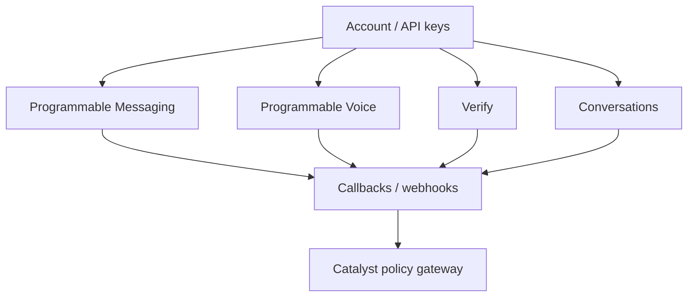
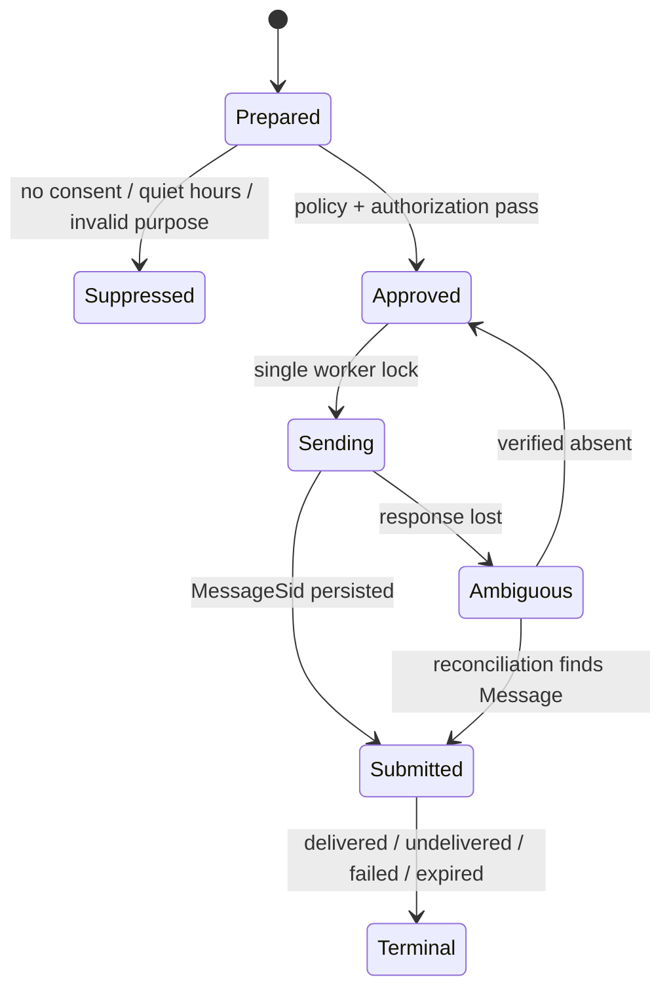
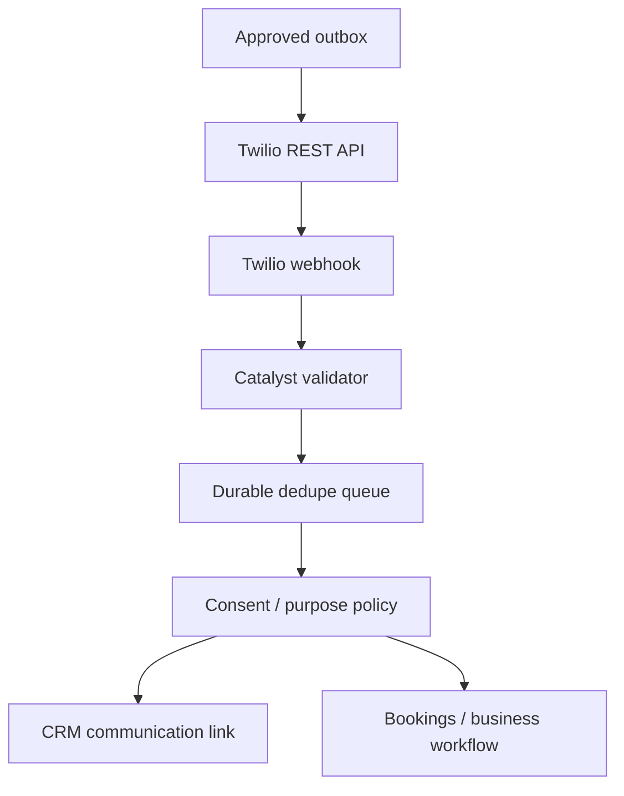

# Twilio — Messaging, Voice, Verify, Conversations, Webhooks, and Zoho Automation Knowledge Base

**Document ID:** GH-TWILIO-KB  
**Research cutoff:** 2026-07-20  
**Audience:** ChatGPT, Codex, solution architects, Zoho Catalyst/Deluge developers, security owners, and GH Real Estate / Sylvara operations  
**Evidence policy:** Official Twilio documentation and policy pages only. Account configuration, regions, number capabilities, sender registration, throughput, fees, availability, regulatory requirements, and product lifecycle must be revalidated at implementation time.

## AI execution contract

1. **Twilio is a communications transport, not the customer/tenant master, consent ledger, appointment authority, or legal record of a lease.** CRM/Creator and the applicable business system retain those truths.
2. **Never send a message or place a call merely because code can.** Require an approved business purpose, recipient, channel consent/permission, template or script, sending identity, quiet-hours rule, and user/workflow authorization.
3. **Validate every Twilio webhook with the official Twilio SDK using the exact public URL and complete received parameters/body.** Reject invalid signatures; never maintain a hand-picked parameter allowlist for signature computation because Twilio may add fields.
4. **Treat delivery as at-least-once and event order as non-deterministic.** Deduplicate by Twilio resource/event identity and process state transitions monotonically.
5. **Do not blindly retry a create-Message/create-Call POST after an ambiguous timeout.** The core create APIs do not document a universal application-supplied idempotency key; maintain a durable outbox and reconcile before retransmission.
6. **Never expose the Account Auth Token, API-key secret, OAuth material, webhook signature secrets, message/call content, phone numbers, recording URLs, or live SIDs in prompts, Git, PDFs, client code, or general logs.** Use managed secrets and synthetic placeholders.
7. **Use API keys in production, scoped/separated by subsystem and environment.** Account SID/Auth Token is appropriate only where Twilio requires it, including webhook signature validation, and for constrained local testing per Twilio guidance.
8. **Do not present this document as legal advice.** Twilio policies and US A2P registration are vendor/platform requirements; counsel/compliance must approve consent, fair-housing, debt-collection, call-recording, privacy, retention, and jurisdiction-specific practices.
9. **Prefer live official docs and console metadata over this snapshot.** Number capabilities, A2P/toll-free requirements, rates, queues, regions, beta/classic product status, and policy text are volatile.

### Evidence labels

| Label | Meaning |
|---|---|
| `[OFFICIAL]` | Directly documented by Twilio in a cited source. |
| `[INFERENCE]` | Architecture or control recommendation derived from documented behavior; not a Twilio guarantee. |
| `[LIVE-METADATA REQUIRED]` | Must be retrieved from the target Twilio account/console/API or current official documentation before implementation. |
| `[VOLATILE]` | Fees, throughput, queues, policy, availability, limits, or lifecycle can change. |
| `[BETA/CLASSIC]` | Prerelease, limited, or classic/transitioning product surface; validate roadmap and support. |

## 1. Role in the GH / Sylvara architecture

| Concern | Authority | Twilio role |
|---|---|---|
| Person, lead, applicant, tenant, owner, vendor, and property relationship | Zoho CRM | Deliver/receive communications using a CRM-resolved, approved contact point. |
| Communication consent, suppression, purpose, and source evidence | CRM or a dedicated governed consent registry in Creator | Enforce Twilio/network opt-outs immediately and feed them to the authoritative registry. Twilio’s opt-out state is an additional enforcement layer, not the only business record. |
| Appointment | Zoho Bookings | Send approved reminders/links and receive replies; never infer appointment mutation solely from free-text SMS. |
| Contracts/signature | Zoho Contracts / Sign | Send approved links/notices; the message does not prove execution. |
| Accounting/payment | Zoho Books/Billing/Checkout | Send approved notice/link; a reply or call does not change ledger status. |
| Communication transport and provider status | Twilio | Own Message/Call/Verification/Conversation resources and transport delivery events. |
| Integration gateway | Zoho Catalyst | Validate webhooks, protect secrets, queue events, dedupe, correlate to CRM, enforce policy, and audit decisions. |

`[INFERENCE]` Maintain one CRM communication-intent record before any outbound contact. It should reference the canonical party, approved E.164 phone in restricted form, channel, purpose, consent basis/source, template revision, sender/Messaging Service, scheduled window, outbox key, Twilio SID after creation, and outcome. Do not store full SMS body or recording transcript in broadly visible CRM fields by default.

## 2. Product map



| Twilio surface | Use | Primary identifiers |
|---|---|---|
| Account / subaccount | Billing, resource, and operational boundary | Account SID, typically `AC...` |
| API Key | REST authentication | Key SID plus secret; secret shown once at creation |
| Incoming Phone Number | Owned number and voice/SMS/MMS routing/capabilities | Incoming phone number SID, E.164 `phone_number` |
| Messaging Service | Sender pool and messaging policy/configuration for a use case | Service SID, typically `MG...` |
| Message | One inbound/outbound message and delivery state | Message SID such as `SM...` or channel-dependent `MM...` |
| Media | Message attachment | Media SID / URL under parent Message |
| Call | Inbound/outbound voice call | Call SID, typically `CA...` |
| Recording | Call recording | Recording SID; content is highly sensitive |
| Verify Service | Verification policy/brand/configuration | Service SID, typically `VA...` |
| Verification / Check | Challenge lifecycle and submitted code result | Verification SID where exposed; destination and status |
| Conversation Orchestrator v2 | Current cross-channel conversation grouping/observation | v2 identifiers from live API; do not infer Classic prefixes |
| Conversations Classic v1 | Classic multi-party/channel interaction | Classic Conversation `CH...`; Service `IS...` |
| Classic Participant / Message | Classic conversation membership and content | Classic opaque SIDs such as `MB...` and `IM...`, scoped by the v1 contract |
| Event Streams sink/subscription | Asynchronous event export | Sink/subscription identifiers |

Treat all prefix examples as diagnostic hints, not validation. Validate values through Twilio’s SDK/API, not a regular expression alone.

## 3. Authentication, keys, accounts, regions, and edges

### REST authentication

Twilio REST APIs use HTTP Basic authentication. For production, Twilio recommends an API Key SID as username and API-key secret as password. The Account SID remains in request paths where required. The Account SID/Auth Token pair is broader and should be limited to local testing or operations that specifically require the Auth Token.

Key types documented by Twilio include:

| Key type | Capability | Use |
|---|---|---|
| Main | Broad/full access | Avoid for routine services; emergency/admin only under strong controls. |
| Standard | Broad API access except specified Accounts/Keys management | Separate by application/environment; still high impact. |
| Restricted | Fine-grained access where supported | Preferred when the required product/API is available for restricted keys. |

`[LIVE-METADATA REQUIRED]` Confirm key type availability, region, allowed products/actions, owning account/subaccount, creation date, last-used evidence, and rotation procedure. Key secrets are displayed only at creation; store immediately in an approved secret manager.

### Region and edge hostnames

Twilio’s global infrastructure distinguishes **edge** (network ingress) from **region** (processing/data locality for supported products). Default REST requests commonly use product hosts such as `api.twilio.com`; current non-default patterns include product, edge, and region labels in the hostname.

Twilio warns that older `api.<region>.twilio.com` hostname patterns—other than the default US1 behavior—cease working on 2026-04-28. Use the current documented `PRODUCT.EDGE.REGION.twilio.com` form where a non-default edge/region is required.

`[LIVE-METADATA REQUIRED]` Not every product/resource is available in every region, and API keys can be region-specific. Record the exact product base, region, edge, account/subaccount, and failover posture. Never silently fail over across a data-residency boundary.

### Account/subaccount boundary

`[INFERENCE]` Separate production from test and potentially separate GH from Sylvara or distinct legal/use-case boundaries with accounts/subaccounts only after billing, support, key management, A2P registration, sender ownership, and reporting implications are reviewed. Subaccounts isolate resources but do not eliminate parent-account responsibility. Avoid proliferating accounts as a substitute for authorization design.

Main-account API keys cannot authenticate directly against subaccount resources; create and use credentials owned by the subaccount. The main Account SID/Auth Token can access supported 2010 API subaccount resources, while separate-domain products may require subaccount-specific credentials. Closing a subaccount is permanent, releases its phone numbers, and can lead to data deletion; suspension does not stop recurring number charges. Treat close/release as an explicitly approved destructive operation with an inventory and migration plan.

## 4. Webhook security and delivery semantics

### Signature validation

Twilio signs webhook requests in the `X-Twilio-Signature` header. Twilio documents HMAC-SHA1 using the Auth Token over the request URL and request parameters/body rules. Use the maintained Twilio SDK validator rather than implementing the algorithm manually.

Validation checklist:

- use the exact externally visible HTTPS URL, including scheme, host, path, query, port rules, and trailing slash;
- account for reverse-proxy/load-balancer rewriting through trusted configuration, not untrusted forwarded headers;
- pass every received form parameter to the validator; Twilio can add parameters without notice;
- for JSON webhooks, preserve the exact raw, unmodified request body and validate it with the SDK's body-aware validator against the `bodySHA256` value carried in the signed URL; middleware parsing, whitespace normalization, URL rewriting, or substituting an internal proxy URL can break validation;
- select the Auth Token for the Account SID that generated the webhook;
- never substitute an API-key secret for webhook validation; Twilio signs with the applicable Account Auth Token;
- compare signatures in constant time via the SDK;
- reject invalid signatures before CRM lookup, logging content, or side effects;
- rotate Auth Tokens with a planned overlap/validation strategy and immediate revocation after the transition.

Signature validation authenticates Twilio transport; it does not prove the human sender’s identity or authorization to act on a lease, payment, or appointment.

### Connection overrides and retries

Twilio documents URL-fragment connection overrides for webhook callback URLs. Current parameters include:

| Override | Current documented range/default |
|---|---|
| Connect timeout `ct` | 100–10,000 ms; default 5,000 ms |
| Read timeout `rt` | 100–15,000 ms; default 15,000 ms |
| Total timeout `tt` | Maximum 15,000 ms |
| Retry count `rc` | 0–5; default 1 |
| Retry policy `rp` | Select among connection timeout, read timeout, 4xx, 5xx, or combined policies as documented |
| Edge | Select ingress edge(s) where supported |

Values are `[VOLATILE]`; voice has a hard upper timeout constraint. URL fragments are not sent as normal HTTP request material and are excluded from signature computation according to the cited connection-overrides page. Current documentation excludes Conversations and Frontline from connection overrides, so do not apply this contract to every Twilio webhook product.

For retry attempts covered by the connection-overrides contract, Twilio documents an `I-Twilio-Idempotency-Token` header. Use that token plus the resource SID/event type as a dedupe aid, but do not assume the header exists for an unrelated product or callback. Do not assume one delivery. Acknowledge quickly and enqueue; keep synchronous voice/TwiML logic within Twilio’s deadline.

### Receiver pattern

```text
receive exact public request
select account Auth Token from allowlisted AccountSid/route
validate X-Twilio-Signature with official SDK
validate content type, size, required resource SID, and allowed event family
acquire dedupe key (resource SID + event + provider token/version)
persist minimal sanitized envelope
enqueue durable work
return required empty response or TwiML immediately
```

Never return stack traces, secret values, or CRM data to Twilio.

## 5. Programmable Messaging

### Message resource

The core Message resource uses the 2010-04-01 API:

```text
POST https://api.twilio.com/2010-04-01/Accounts/{AccountSid}/Messages.json
GET  https://api.twilio.com/2010-04-01/Accounts/{AccountSid}/Messages/{MessageSid}.json
GET  https://api.twilio.com/2010-04-01/Accounts/{AccountSid}/Messages.json
```

Create requests are form-encoded. Each create requires `To`, one sender selector (`From` or `MessagingServiceSid`), and content through `Body`, `MediaUrl`, or `ContentSid`. Key fields:

| Field | Meaning / rule |
|---|---|
| `To` | Destination in the channel’s accepted format; SMS/voice numbers normally E.164. Validate against the approved CRM contact. |
| `From` | Twilio sender when not using sender selection through a Messaging Service. Must be owned/authorized/capable for the route. |
| `MessagingServiceSid` | Preferred for a configured use case; allows service sender-pool/configuration. Omit `From` when relying on service sender selection. |
| `Body` | Text content, currently limited to 1,600 characters. SMS segmentation depends on GSM-7 versus UCS-2 encoding and carrier/channel rules. |
| `MediaUrl` | One or more public media URLs Twilio can retrieve; never use an unauthenticated URL for private tenant documents. |
| `ContentSid` and content variables | Content/template messaging where supported; validate channel/template approval and product requirements. |
| `StatusCallback` | HTTPS endpoint for asynchronous status changes; validate signatures there. A per-Message value overrides the Messaging Service callback. |
| `ValidityPeriod` | Current accepted range is 1–36,000 seconds, default 36,000; verify before use. |
| `ScheduleType`, `SendAt` | Scheduling requires a Messaging Service, `ScheduleType=fixed`, and an ISO-8601 `SendAt` under the current scheduling contract. |
| `MaxPrice` | Obsolete; do not generate it in new integrations. |

Important Message response fields include `sid`, `account_sid`, `messaging_service_sid`, `from`, `to`, `body`, `status`, `error_code`, `error_message`, `num_segments`, `num_media`, `price`, `price_unit`, direction, and timestamps.

Twilio explicitly warns that error code/message coverage can evolve; do not make irreversible business decisions by matching the text of `error_message`. Use status, documented code categories, reconciliation, and a review queue.

### Message statuses

Depending on direction/channel, documented statuses include:

```text
accepted, scheduled, canceled, queued, sending, sent, failed,
delivered, undelivered, receiving, received, read
```

Not every channel produces every status. `sent` generally means Twilio/carrier handoff, not confirmed end-device delivery. `delivered` remains a provider/network receipt, not proof the intended human read or authorized an action.

### Status callback

Twilio sends form-encoded status callbacks to `StatusCallback`, including `MessageSid`, `MessageStatus`, and sometimes `ErrorCode`, with channel-specific or future fields possible. Validate the full webhook signature, accept unknown fields, and use a monotonic state model. Do not assume callbacks arrive in lifecycle order.

Twilio does not send a callback for a Message's initial state. Under the current contract, an immediate send commonly starts `queued` without a Messaging Service or `accepted` with one, while a scheduled Message starts `scheduled`. Persist the create response and reconcile it; do not wait for an initial callback that will never arrive.

`[INFERENCE]` Preserve an append-only event row and derive current status by allowed transitions/provider timestamp/receipt time. Never downgrade a terminal `delivered` result to an earlier `sent` solely because a late callback arrived.

### List and pagination

The Message list supports filters such as `To`, `From`, and sent date. The current docs state a default page size of 50 and maximum of 1,000. Use Twilio’s `next_page_uri`/SDK page iterator rather than constructing page tokens manually. Active traffic can shift pages; deduplicate by Message SID and use a bounded overlapping time window for reconciliation.

### Media

Current Message resource documentation lists up to 10 media URLs and example size limits of 5 MB for JPEG/JPG/PNG/GIF and 500 KB for other accepted types, with channel/carrier behavior varying. These are `[VOLATILE]`.

For GH/Sylvara:

- do not send leases, identity documents, screening reports, bank details, door codes, or sensitive property evidence via MMS;
- host only approved short-lived content with access controls compatible with Twilio fetch behavior;
- scan inbound media before storage;
- record content type/size/hash and restricted reference, not public URL, in CRM;
- expire transient copies under policy.

## 6. Incoming SMS/MMS and TwiML

An incoming-message webhook is form-encoded and can include:

| Parameter | Meaning |
|---|---|
| `MessageSid` / `SmsSid` | Opaque message identity; use current field and tolerate aliases documented by Twilio. |
| `AccountSid` | Twilio account context. Allowlist and use to select validation secret. |
| `MessagingServiceSid` | Service context, if routed through a Messaging Service. |
| `From`, `To` | Channel addresses / E.164 numbers. Treat as sensitive. |
| `Body` | User-supplied content; untrusted and sensitive. |
| `NumMedia`, `MediaUrl{N}`, `MediaContentType{N}` | Attachment count and indexed media metadata. |
| `NumSegments` | Segment information where supplied. |
| geographic/channel-specific fields | Optional; never require unless documented for the channel. |

The schema can grow. Include every parameter in signature validation, then pass only allowlisted normalized fields to business logic.

Return TwiML if a synchronous reply is intended:

```xml
<?xml version="1.0" encoding="UTF-8"?>
<Response>
  <Message>Approved response text</Message>
</Response>
```

TwiML `<Message>` supports body/media and callback/action configuration according to current docs. Avoid a synchronous CRM/API chain before returning. For most business workflows, return an empty response promptly, enqueue, then send an approved asynchronous message only if policy permits.

### Free-text command boundary

Never let text like “cancel,” “approve,” “paid,” or “yes” directly mutate a booking, contract, applicant status, payment, or access control. Resolve identity/relationship, use a constrained command grammar, show the exact action, require secondary confirmation where risk warrants, and write an audit record. Ambiguous free text goes to a human queue.

## 7. Messaging Services and sender pools

A Messaging Service bundles senders and messaging configuration for a use case. Documented capabilities include:

- sender pool and sender selection;
- common inbound request URL or routing behavior;
- status callback;
- sticky sender;
- geographic/area matching;
- fallback behavior;
- Smart Encoding;
- MMS conversion;
- opt-out management;
- association with US A2P campaign registration where applicable.

REST management is under `https://messaging.twilio.com/v1`, with Service and subresources such as PhoneNumbers, ShortCodes, and AlphaSenders. `[BETA/CLASSIC]` The official Service resource page has labeled portions of Messaging Services configuration API as Public Beta while sending through a service is generally available. Revalidate before automating production configuration.

`[INFERENCE]` Use separate Messaging Services for materially different traffic such as:

- appointment reminders;
- operational tenant notices;
- maintenance/vendor coordination;
- identity verification (prefer Verify, not a custom OTP service);
- marketing, only if separately approved and compliant.

Separation improves templates, consent, opt-out behavior, sender pool, throughput/queue isolation, reporting, and A2P campaign alignment. Do not split merely to evade limits.

Twilio currently advises against placing more than one toll-free number in a single Messaging Service sender pool because doing so can contribute to carrier blocking or filtering. Sender-selection order and geographic behavior remain `[VOLATILE]`; verify the current service configuration guidance before changing a production pool.

## 8. Consent, opt-out, and messaging policy

### Twilio Messaging Policy

Twilio’s current Messaging Policy (effective page current as of the research date) requires appropriate consent and clear opt-out behavior. The current text includes requirements for STOP language or equivalent in the initial message, simple opt-out handling, a final confirmation, and no further messages after opt-out without new consent.

This is a provider policy summary, not legal advice. `[LIVE-METADATA REQUIRED]` Obtain counsel/compliance approval for the actual message purpose, jurisdiction, customer relationship, record retention, quiet hours, fair-housing/debt-collection implications, and re-consent design.

### Standard and Advanced Opt-Out

Twilio handles recognized keywords for supported messaging. Current documented default English keyword groups are:

| Group | Default keywords |
|---|---|
| Opt-out | `STOP`, `STOPALL`, `UNSUBSCRIBE`, `CANCEL`, `END`, `QUIT` |
| Opt-in | `START`, `UNSTOP`, `YES` |
| Help | `HELP`, `INFO` |

Keywords are case-insensitive, and country, sender, carrier/network, and configured Advanced Opt-Out behavior can differ. Do not claim `REVOKE` or `OPTOUT` is a universal default. With Advanced Opt-Out on a Messaging Service, keywords and responses can be configured; inbound webhooks include `OptOutType` values such as `STOP`, `START`, or `HELP`. Twilio has already sent the configured response when `OptOutType` is present—do not send a duplicate acknowledgment.

After opt-out, outbound attempts can fail with error `21610`. Fail closed: update the authoritative suppression/consent state, block queued messages for that use case, and require a documented re-opt-in. Do not edit spelling/case to bypass platform blocking. Toll-free and other sender types can have additional network behavior; verify live docs.

Advanced Opt-Out is currently documented as disabled by default, and disabling after enablement may require Support. Treat configuration changes as production change control.

### Consent Management API

Twilio documents a Consent Management API for Programmable Messaging channels such as SMS/MMS/RCS, with opt-in/out/re-opt-in operations and a current rate limit of 100 requests/minute and 3-second timeout. Availability/access/support details are `[VOLATILE]`.

The documented re-opt-in override does not apply to US toll-free messaging. Access, enablement, Compliance Toolkit configuration, and pricing can also vary by account; verify the exact sender/use case before relying on the API.

`[INFERENCE]` CRM/Creator remains the business consent ledger with source, timestamp, purpose, disclosure/template version, channel, contact point, actor, expiration if applicable, and proof reference. Synchronize enforceable suppression to Twilio; reconcile regularly. Never infer consent from successful delivery or a CRM phone field.

## 9. US A2P 10DLC and sender compliance

Twilio documents that application-to-person SMS/MMS sent to US recipients over 10-digit long-code numbers must use registered A2P 10DLC traffic. Registration concepts include:

- **Brand:** the sending business identity;
- **Campaign:** the messaging use case, sample messages, opt-in/opt-out/help behavior, and related attributes;
- association of campaign and sending numbers/Messaging Service.

Toll-free verification and short-code programs are separate. Verify is designed for one-time-password use rather than sending homemade OTP messages through a generic campaign.

`[VOLATILE]` Registration paths, campaign classes, vetting, reviews, fees, throughput, carrier filtering, sample requirements, and processing times change. Retrieve current console/API status before launch; do not rely on this snapshot or promise approval timing.

A2P readiness record should contain:

- exact legal business identity and tax/business registration data approved for submission;
- website and privacy/terms URLs;
- use-case description and prohibited-content review;
- opt-in user journey, disclosure, checkbox/text, and evidence capture;
- sample messages with brand identity and opt-out/help instructions;
- expected volume and number pool;
- campaign/service/number SIDs in restricted configuration;
- registration status, rejection reason, approver, renewal/change owner;
- production test evidence.

Do not copy one campaign across unrelated GH/Sylvara purposes or use a property manager’s brand for a different entity without approved alignment.

## 10. Messaging queues, throughput, latency, and errors

Twilio queues messages above available sender/campaign capacity. The current scaling guide describes a default validity/queue period of 10 hours (`36,000` seconds) for applicable messages and recommends separate Messaging Services by use case plus shorter validity for time-sensitive traffic. Exact throughput is determined by sender type, campaign, country, carrier, number, content, and account state.

`[LIVE-METADATA REQUIRED]` Retrieve actual approved MPS/throughput, sender pool, queue depth/age, validity configuration, and destination mix. Do not hard-code a generic “one message per second” or assume purchased numbers add linear throughput.

Potential queue overflow is associated with error `30001` in the cited guide. HTTP `429` / Twilio error `20429` indicates too many concurrent requests; Twilio states an unprocessed request can be retried with exponential backoff. Monitor the `Twilio-Concurrent-Requests` response header where available.

### Error strategy

| Category | Example | Response |
|---|---|---|
| Auth/signature | REST 401/403 or invalid webhook signature | Stop; rotate/correct credentials or routing. Never retry invalid webhooks into business logic. |
| Request validation | Invalid To/From/content | Do not retry unchanged. Sanitize error for operator. |
| Consent/suppression | `21610` | Block immediately and reconcile authoritative consent. |
| Concurrency | `20429` | Exponential backoff with jitter and bounded concurrency. |
| Queue capacity | `30001` | Halt/buffer low-priority work, investigate service/campaign/sender capacity and validity. |
| Carrier/delivery | `failed`/`undelivered` plus ErrorCode | Update communication result; do not assume permanent invalidity without documented code handling/review. |
| Ambiguous POST | Timeout/disconnect after create | Reconcile outbox/Twilio resources before retry. |

Twilio’s error dictionary is authoritative. Error messages/codes may evolve, so keep a current category map and send unknown codes to review. Do not expose provider diagnostics to customers.

## 11. Durable outbound messaging pattern

`[INFERENCE]` The create-Message endpoint does not document a general client idempotency key. Use a database constraint on:

```text
channel | business purpose | canonical CRM record | template revision | scheduled window | destination version
```



Store the intent and request hash before POST. Persist Message SID and initial status atomically before publishing downstream work. Status callbacks update the same record. A scheduled job scans `Ambiguous` and reconciles by a narrow time/destination/sender correlation without logging the full destination.

Cancellation of a queued/scheduled message is a separate authorized state transition; do not assume deleting the CRM task cancels Twilio delivery.

## 12. Incoming Phone Numbers

The IncomingPhoneNumber resource represents a Twilio number and includes:

- E.164 `phone_number` and friendly name;
- capabilities such as voice, SMS, MMS, and fax where documented;
- inbound SMS URL/method/fallback and status callback configuration;
- voice URL/method/fallback and call status callback configuration;
- associations such as application/service SIDs;
- regulatory Address, Identity, or Bundle references where required.

`[LIVE-METADATA REQUIRED]` Retrieve number capabilities, country/type, ownership, regulatory status, Messaging Service membership, voice/SMS routing, emergency/address configuration if applicable, and production purpose. Do not assume a number supports SMS because it supports Voice.

Configuration precedence can shift when a number is associated with a TwiML App or Messaging Service. Change one routing layer at a time, export before/after configuration, and test inbound/outbound SMS and voice.

Number purchase/release is a billable/destructive external action. Require explicit approval and dependency scan. Releasing a number can cause permanent loss and future reassignment; never automate as “cleanup.”

## 13. Verify

Twilio Verify provides managed verification through channels documented as SMS, Voice, WhatsApp, email, TOTP, push/silent approval, passkeys, Silent Network Auth, and automatic channel selection, depending on product/region/account.

Channel values continue to expand (current resources include newer options such as RCS), so retrieve the live accepted list rather than hard-coding this summary.

Base:

```text
https://verify.twilio.com/v2/
```

Typical lifecycle:

1. Create/configure a Verify Service.
2. Start a Verification under `/v2/Services/{ServiceSid}/Verifications` with `To` and `Channel` plus approved options.
3. Customer enters/returns the challenge code or completes the channel action.
4. Submit a Verification Check under the same Service with destination/code as documented.
5. Accept only an explicit approved result for the current business session.

Documented statuses include `pending`, `approved`, `canceled`, `max_attempts_reached`, `deleted`, `failed`, and `expired`. The Verification Check docs state the Verification resource is deleted after approval, expiration (currently 10 minutes), or maximum checks and subsequent retrieval can return 404.

The default token validity is currently 10 minutes. Resends during that window generally reuse the same token until a successful verification. Current Verification Check service limits are 60 requests/minute, 180/hour, and 250/day; all are `[VOLATILE]` and do not replace application-level abuse controls.

Error `60203` currently represents maximum send attempts exceeded (more than five within the lifecycle) and returns 429; complete the check, cancel, or wait for the lifecycle window rather than hammering resend.

### Verify controls

- Bind a verification to a server-side session, CRM party, purpose, and operation—not merely a phone number.
- A successful OTP proves control of a channel at that moment, not legal identity, tenancy, consent to marketing, or authority over a property/company.
- Do not store plaintext codes or send them to a model.
- Rate-limit by destination plus additional keys such as IP, session, account, country, or user-agent using Verify programmable rate limits.
- Use an immutable non-PII Entity identity when using Verify Entities; the current docs require 8–64 alphanumeric/dash characters.
- Hide account-enumeration differences and defend against SIM swap/social engineering according to risk.
- Verification Attempts API is documented as Public Beta, with a current 30-day view, 100 requests/minute, and 15-second timeout. Treat it as diagnostic, not a permanent audit store.

## 14. Programmable Voice

### Call resource

Outbound calls are created under:

```text
POST /2010-04-01/Accounts/{AccountSid}/Calls
```

An outbound create must supply call instructions through `Url`, inline `Twiml`, or `ApplicationSid`. When `ApplicationSid` is used, current documentation says several directly supplied URL/method/fallback/status-callback parameters are ignored in favor of the TwiML App configuration. Inline TwiML is currently limited to 4,000 characters.

Call resource statuses are `queued`, `ringing`, `in-progress`, `canceled`, `completed`, `busy`, `failed`, and `no-answer`. `initiated` is a progress-callback event, not a Call resource status. A `completed` call only proves an audio connection occurred; the other endpoint could have been a person, IVR, or voicemail, so it is not a successful business outcome by itself.

API-created outbound calls are subject to account-specific calls-per-second limits; excess calls can queue. The create response's `queue_time` provides an estimate. Retrieve the account's live CPS and design scheduling, monitoring, and expiry around it.

Call progress events can be requested for `initiated`, `ringing`, `answered`, and `completed`. The event `SequenceNumber` reflects firing order, but callbacks can arrive out of order. Deduplicate and order using Call SID/event/sequence while retaining receipt time.

### TwiML

Common Voice TwiML verbs include:

| Verb | Purpose | Caution |
|---|---|---|
| `<Say>` | Text-to-speech | Script must be approved and identify the business/purpose. |
| `<Play>` | Play audio | Host securely and respect rights/retention. |
| `<Dial>` | Connect another party/endpoint | Protect personal staff numbers; configure status/fallback. |
| `<Gather>` | Collect DTMF or speech as configured | Treat speech/keys as untrusted; do not collect payment/identity secrets outside an approved flow. |
| `<Record>` | Record audio | High privacy/legal risk; obtain approved consent/disclosure and retention. |
| `<Hangup>`, `<Reject>`, `<Redirect>`, `<Pause>`, `<Enqueue>`, `<Leave>`, `<Refer>` | Call control | Test loops, timeout, queue, and failure paths. |

### Recording

Twilio documents Recording resources and callbacks. Recordings are not PCI compliant by default; Twilio provides PCI Mode for applicable configurations. That does not make every call compliant.

Current Recording documentation states that metadata can remain for 40 days after deletion. Treat deletion as a workflow that requires provider-state verification and downstream-copy reconciliation, not proof of immediate erasure of every metadata trace.

Before recording:

- counsel/compliance approves jurisdiction-specific notice/consent and use;
- the caller hears the approved disclosure at the correct time;
- recording can be stopped/excluded for sensitive segments;
- access, encryption, download, transcription, retention, hold, and deletion are defined;
- recording URLs/tokens and transcripts are restricted;
- CRM stores only a controlled reference and metadata unless broader access is approved.

Do not record SSNs, payment-card details, passwords, access codes, or identity-document data through a generic flow.

## 15. Conversations: Orchestrator v2 and Classic v1

### 15.1 Current Conversations layer and Conversation Orchestrator v2

Twilio now distinguishes the current Conversations product layer and **Conversation Orchestrator v2** from **Conversations (Classic) v1**. Orchestrator observes or programmatically groups voice, SMS, and WhatsApp communications into conversations and exposes configurations, conversations, actions, participants, communications, and asynchronous operations under the v2 API.

```text
https://conversations.twilio.com/v2
```

`[LIVE-METADATA REQUIRED]` Confirm new-console access, configuration/capture rules, channel coverage, profile strategy, ingestion mode, billing, asynchronous operation status, and webhook contract. Do not apply Classic SID prefixes or Classic resource semantics to v2 objects.

> Current official documentation states that Conversation Orchestrator is not a HIPAA Eligible Service and is not PCI compliant. Do not enable it in a workflow subject to HIPAA or PCI requirements. It may use AI/ML technologies and is subject to Twilio's applicable AI/ML terms; privacy, data-use, and human-oversight review are required before adoption.

### 15.2 Conversations Classic v1

The older API remains documented explicitly as **Conversations (Classic)**. Its Conversation, Message, Participant, Service, delivery, and webhook resources use the v1 contract and Classic identifiers such as `CH...`, `MB...`, and `IM...`. `[BETA/CLASSIC]` Confirm lifecycle, migration/successor plan, pricing, region availability, and support before starting a new implementation.

The Classic API uses:

```text
https://conversations.twilio.com/v1
```

Conversation resources include a Conversation SID, Service SID, optional Messaging Service association, `friendly_name`, `unique_name`, `attributes`, state, timers, and subresource links for participants, messages, and webhooks. States documented include `initializing`, `active`, `inactive`, and `closed`; timers currently have minimums of one minute for inactive and ten minutes for closed.

Avoid PII in `friendly_name`, `unique_name`, and `attributes`; Twilio resource docs flag fields with PII retention considerations. Use opaque CRM correlation IDs.

### 15.3 Classic Conversation webhooks

Conversation webhooks include pre-action and post-action events for conversation/message/participant/user behavior, plus state/delivery events. Current docs specify a maximum five-second webhook timeout.

- A pre-action webhook can allow/modify/reject behavior according to HTTP response; timeout can allow the unmodified action after five seconds.
- REST-originated actions can echo events when `X-Twilio-Webhook-Enabled: true` is used.
- Post-action events are notifications and should be processed idempotently.
- Payload includes evolving fields such as `RetryCount`; validate signature and tolerate additions.
- Twilio recommends Event Streams for monitoring/logging because it queues and retries asynchronously.

Do not make a slow CRM/AI decision in a pre-action webhook. Cache a small policy set or fail according to a documented risk posture.

## 16. Event Streams, monitoring, logs, and alarms

### Event Streams

Twilio Event Streams provides asynchronous events to configured sinks/subscriptions. Current documentation states:

- at-least-once delivery;
- duplicates and out-of-order events are possible;
- queue/retry up to four hours;
- up to 100 sinks and 100 subscriptions per account (current documented limit);
- event-delivery logs retained seven days and account errors 23 days;
- one subscription cannot automatically cover all subaccounts.

Values are `[VOLATILE]`. Deduplicate with event ID where supplied, retain source/resource time and receipt time, and run API reconciliation for critical communications.

### Debugger and Monitor Events

The Debugger exposes error details and Request Inspector in supported regions; the current documentation describes 30-day searchable debugging history and region-specific differences. Treat request/response samples as sensitive.

Monitor Events tracks account configuration changes. Current retention is documented as 30 days for free accounts and 13 months for Admin/Security/Enterprise editions, with filter/page constraints including one filter field per request and page size up to 1,000. `[LIVE-METADATA REQUIRED]` Confirm entitlement/region and export security-relevant configuration events under policy.

Use alarms/alerts for signature failures, error spikes, queue age, opt-outs, delivery degradation, Verify abuse, call failures, key changes, number routing changes, and A2P status changes. Alerts supplement—not replace—daily reconciliation.

## 17. Test credentials and synthetic test values

Twilio test credentials can exercise selected APIs without charges, persistent state, or real calls/messages. Current support includes phone-number purchase, SMS, Calls, and Lookup; unsupported products return 403, and test operations do not invoke callbacks.

Messaging tests with test credentials do not support `MessagingServiceSid`, and Verify is not supported by the test-credential environment. Magic values work only with test credentials. Message and Call test requests do not generate status callbacks, so callback behavior requires separately signed fixtures/local tooling and a controlled live canary.

Never put production Account Auth Token in CI. Use Twilio test Account SID/Auth Token or environment-specific restricted credentials and synthetic numbers.

### Documented magic values

| API | Field/value | Expected test behavior / code |
|---|---|---|
| Buy phone number | `+15005550000` | Number unavailable, `21422` |
| Buy phone number | `+15005550001` | Invalid phone number, `21421` |
| Buy phone number | `+15005550006` | Valid test number |
| Send SMS | From `+15005550001` | Invalid From, `21212` |
| Send SMS | From `+15005550007` | Not owned / not SMS-capable, `21606` |
| Send SMS | From `+15005550008` | Queue full, `21611` |
| Send SMS | From `+15005550006` | Valid test sender |
| Send SMS | To `+15005550001` | Invalid To, `21211` |
| Send SMS | To `+15005550002` | Cannot route, `21612` |
| Send SMS | To `+15005550003` | Geographic permissions, `21408` |
| Send SMS | To `+15005550004` | Blocked, `21610` |
| Send SMS | To `+15005550009` | Not SMS-capable, `21614` |
| Create Call | From `+15005550001` | Invalid From, `21212` |
| Create Call | From `+15005550006` | Valid test caller |
| Create Call | To `+15005550001` | Invalid To, `21217` |
| Create Call | To `+15005550002` | Cannot route, `21214` |
| Create Call | To `+15005550003` | Geographic permissions, `21215` |
| Create Call | To `+15005550004` | Blocked, `21216` |

Revalidate magic values against the official page before automated assertions. Because callbacks are not sent for test-credential requests, separately test webhook validation with signed fixtures or Twilio’s documented local-development tooling, and run a tightly controlled production canary for end-to-end carrier behavior.

## 18. Catalyst + Zoho reference architecture



### Inbound SMS

1. Catalyst receives the exact request and validates `X-Twilio-Signature` with the account Auth Token.
2. Apply size/content-type/resource/account allowlists and a replay/dedupe key using Message SID and `I-Twilio-Idempotency-Token` when present.
3. If `OptOutType` indicates STOP/START/HELP, do not duplicate Twilio’s response. Update the authoritative consent queue immediately.
4. Normalize E.164 only for matching; preserve the provider value in restricted storage.
5. Resolve candidate CRM records. Shared/recycled/colliding numbers go to human review.
6. Store minimal message metadata and a restricted reference. Body/media are retained only under an approved purpose.
7. Free-text appointment/payment/contract instructions become review tasks unless a constrained verified command flow exists.
8. Return TwiML/empty response promptly; send any asynchronous reply through the approved outbox.

### Outbound reminder

1. Bookings/CRM emits an idempotent approved event.
2. Catalyst checks consent, suppression, relationship, local timezone, quiet hours, A2P/Messaging Service, and template revision.
3. Reserve a unique intent record.
4. Create one Message using `MessagingServiceSid` and `StatusCallback`.
5. Persist Message SID and initial status atomically.
6. Process callbacks idempotently and update the CRM communication-link record.
7. On cancellation/reschedule, cancel only messages that are still cancelable and suppress obsolete reminders.

### Identity verification

Use Verify, not custom random codes sent through generic Messaging. Bind the verification session to the exact approved operation. On `approved`, issue a short-lived server-side grant for that operation. Never turn phone verification into general CRM identity proof.

### Voice coordination

Use TwiML or a TwiML App with a short deterministic route, status callbacks, and human escalation. Keep property access instructions and personal staff numbers out of call metadata. If recording is enabled, apply approved disclosure and retention before connection.

## 19. GH / Sylvara use-case controls

### Appointment reminders

- Bookings is appointment truth; CRM is party/relationship truth.
- Include organization identity, purpose, local appointment time/timezone, and a safe reschedule/cancel route.
- Do not include applicant screening outcome, tenant balance, access code, unit occupancy, or contract details.
- A reply “CANCEL” must respect Twilio opt-out semantics first; appointment cancellation requires an authenticated/confirmed business flow.

### Maintenance/vendor coordination

- Use a work-order correlation ID, not the full resident narrative.
- Verify the vendor/tenant/property relationship before revealing address or access information.
- Do not send lockbox/door codes by standard SMS.
- After-hours automation must follow emergency escalation policy, not an LLM’s severity guess.

### Rent/payment notices

- Books owns balance and payment status.
- Counsel/compliance approves content, timing, consent and collections rules.
- Send a secure portal link, not bank/card data or detailed balances where avoidable.
- A message response never posts a payment, waives a fee, or changes the ledger.

### Applicant/leasing communications

- Use neutral approved templates and auditable rules to reduce fair-housing discrimination risk.
- Do not use inferred protected characteristics, neighborhood profiling, or LLM scoring to decide who receives showings/messages.
- Keep campaign/purpose separation and suppression consistent.

## 20. Security, privacy, and records controls

- Tokenize phone numbers in broad logs; restrict reversible lookup.
- Keep Message/Call/Recording SIDs and URLs access-controlled.
- Do not store message bodies in operational logs or analytics.
- Store Auth Token separately from API keys; webhook validators need the correct account token.
- Rotate keys per application/environment and alert on key/account/number routing changes.
- Apply SSRF controls to any media/TwiML URL handling; allowlist schemes/hosts or proxy approved content.
- Sanitize TwiML/XML and generated text; models must not generate arbitrary `<Dial>` destinations or callback URLs.
- Define retention separately for metadata, message content, media, call recordings, transcripts, Verify results, logs, and consent evidence.
- Respect legal holds and deletion obligations; provider deletion is not proof every downstream copy was removed.
- Never publish live SIDs/numbers/message samples in GitHub fixtures; use Twilio magic values and opaque placeholders.

## 21. Deployment and test checklist

### Live metadata discovery

- [ ] Account/subaccount and environment boundary.
- [ ] Region/edge/product hostname and regional API key.
- [ ] API key type/scopes, secret owner, rotation, and Auth Token mapping for webhook validation.
- [ ] Owned numbers, capabilities, regulatory bundles, voice/SMS routing, Messaging Service membership.
- [ ] Messaging Service use case, sender pool, callbacks, opt-out config, A2P/toll-free/short-code registration status.
- [ ] Actual throughput/MPS, queue/validity, geographic permissions, spending and fraud controls.
- [ ] Verify Services/channels/rate limits and the explicit Conversations choice: Orchestrator v2 versus Classic v1, with privacy/PCI/HIPAA eligibility review if used.

### Functional and failure tests

- [ ] Valid/invalid webhook signature, exact URL behind proxy, new unknown parameter, wrong Account SID, replay/duplicate.
- [ ] Inbound/outbound SMS, MMS limits, status callbacks, callbacks out of order, opt-out/START/HELP, blocked destination.
- [ ] Outbox ambiguous POST, 429/`20429`, queue overflow/`30001`, carrier failure, delayed callback, unknown error code.
- [ ] Quiet hours/timezone/daylight-saving boundary and scheduled-message cancellation.
- [ ] Verify valid, invalid, expired, approved/deleted, max attempts/`60203`, session mismatch, abuse rate limits.
- [ ] Voice initiated/ringing/answered/completed out of order, busy/no-answer/failure, TwiML timeout, fallback.
- [ ] Recording disclosure, access, callback, retention, deletion, and no sensitive collection.
- [ ] Event Streams duplicate/out-of-order/4-hour retry and API reconciliation.

### Business/security tests

- [ ] CRM number collision, shared household phone, recycled number, changed contact, unauthorized relationship.
- [ ] No message/call changes accounting, appointment, contract, or access rights from unverified free text.
- [ ] Approved templates identify business/purpose and contain required opt-out/help language.
- [ ] A2P/consent records match exact production use case and entity.
- [ ] No secrets, PII, live numbers/SIDs, bodies, recordings, or media in Git/logs/model prompts.
- [ ] Monitoring alerts and manual support runbook tested.

### Rollout and rollback

- [ ] Unit tests with official test credentials/magic values.
- [ ] Signed webhook fixtures and proxy URL validation.
- [ ] Controlled canary with approved real test recipients/numbers and explicit consent.
- [ ] One Messaging Service/use case at a time; monitor delivery, opt-outs, errors, queue age, duplicates, and spend.
- [ ] Rollback stops outbox workers and detaches/changes callbacks only through approved configuration; it does not release numbers or erase audit evidence.

## 22. Anti-patterns

- Putting Account Auth Token or API-key secret in Deluge source, CRM, Creator, GitHub, browser JavaScript, or a model prompt.
- Implementing signature validation from memory or excluding unknown webhook parameters.
- Trusting an inbound phone number as identity or authorization.
- Retrying create Message/Call blindly after timeout.
- Using generic SMS for OTP instead of Verify.
- Treating `sent`/`delivered` as proof the customer read or agreed.
- Ignoring STOP because CRM still says “consented.”
- Sending from one Messaging Service for unrelated legal entities/use cases.
- Changing phone routing, sender pools, or opt-out configuration without versioned change control.
- Putting PII in Twilio friendly names, attributes, URLs, logs, or callback query strings.
- Sending private documents or property access codes through MMS.
- Recording calls by default without approved notice, purpose, access, and retention.
- Mixing Conversation Orchestrator v2 with Conversations Classic v1 resources, SID assumptions, webhooks, or lifecycle behavior.
- Assuming webhooks arrive once or in order.
- Using more numbers/accounts to evade throughput, consent, or compliance controls.

## 23. AI/Codex task recipe

Before producing runnable Twilio code, the model must answer:

1. What canonical CRM record, business purpose, entity/brand, and consent evidence authorize the communication?
2. What account/subaccount, region, edge, environment, product host, and key type apply?
3. Which sender/number/Messaging Service/Verify Service is approved, and what are its live capabilities/registration status?
4. Is the action SMS/MMS, Verify, Voice, or Conversations, and why is that product appropriate?
5. What customer-visible template/script, timezone, quiet-hours, opt-out, and localization rules apply?
6. What exact webhook URL will Twilio sign, and how will the official SDK select the correct Auth Token?
7. What are the idempotency/dedupe keys and ambiguous-outcome reconciliation path?
8. Which content may be stored/logged/sent to an AI, and for how long?
9. What current throughput/queue/error/region limits and vendor policy were retrieved?
10. What synthetic test, controlled canary, approval, monitoring, and rollback evidence is required?

If any answer is missing, create a read-only inventory or configuration worksheet—not a production send, call, number purchase/release, opt-out change, or guessed credential setup.

## 24. Official source registry

All sources accessed 2026-07-20.

### Authentication, keys, security, and infrastructure

- [Make HTTP Requests to Twilio](https://www.twilio.com/docs/usage/requests-to-twilio)
- [Twilio API Keys](https://www.twilio.com/docs/iam/api-keys)
- [Create and Manage API Keys in Console](https://www.twilio.com/docs/iam/api-keys/keys-in-console)
- [API Key Resource — IAM v1](https://www.twilio.com/docs/iam/api-keys/key-resource-v1)
- [Subaccounts API](https://www.twilio.com/docs/iam/api/subaccounts)
- [Account Resource](https://www.twilio.com/docs/iam/api/account)
- [Twilio Webhook Security](https://www.twilio.com/docs/usage/security)
- [Webhooks Connection Overrides](https://www.twilio.com/docs/usage/webhooks/webhooks-connection-overrides)
- [Understanding Edge Locations](https://www.twilio.com/docs/global-infrastructure/understanding-edge-locations)

### Messaging, numbers, consent, and compliance

- [Programmable Messaging API](https://www.twilio.com/docs/messaging/api)
- [Message Resource](https://www.twilio.com/docs/messaging/api/message-resource)
- [Outbound Message Status in Status Callbacks](https://www.twilio.com/docs/messaging/guides/outbound-message-status-in-status-callbacks)
- [Track Outbound Message Status](https://www.twilio.com/docs/messaging/guides/track-outbound-message-status)
- [Messaging Webhook Request](https://www.twilio.com/docs/messaging/guides/webhook-request)
- [Receive and Reply to Incoming Messages](https://www.twilio.com/docs/messaging/tutorials/how-to-receive-and-reply/python)
- [TwiML Message](https://www.twilio.com/docs/messaging/twiml/message)
- [Messaging Services](https://www.twilio.com/docs/messaging/services)
- [Messaging Service Resource](https://www.twilio.com/docs/messaging/api/service-resource)
- [IncomingPhoneNumber Resource](https://www.twilio.com/docs/phone-numbers/api/incomingphonenumber-resource)
- [Advanced Opt-Out](https://www.twilio.com/docs/messaging/tutorials/advanced-opt-out)
- [Consent Management API](https://www.twilio.com/docs/messaging/features/consent-api)
- [Twilio Messaging Policy](https://www.twilio.com/en-us/legal/messaging-policy)
- [A2P 10DLC Overview](https://www.twilio.com/docs/messaging/compliance/a2p-10dlc)
- [Direct Standard A2P 10DLC Onboarding](https://www.twilio.com/docs/messaging/compliance/a2p-10dlc/direct-standard-onboarding)
- [Collect Business Information for A2P 10DLC](https://www.twilio.com/docs/messaging/compliance/a2p-10dlc/collect-business-info)
- [A2P 10DLC Quickstart](https://www.twilio.com/docs/messaging/compliance/a2p-10dlc/quickstart)
- [Scaling, Queueing, and Messaging Latency](https://www.twilio.com/docs/messaging/guides/scaling-queueing-latency)
- [Twilio Error 20429: Too Many Requests](https://www.twilio.com/docs/api/errors/20429)
- [Twilio Error and Warning Dictionary](https://www.twilio.com/docs/api/errors)

### Verify

- [Twilio Verify API](https://www.twilio.com/docs/verify/api)
- [Verify Service Resource](https://www.twilio.com/docs/verify/api/service)
- [Verification Resource](https://www.twilio.com/docs/verify/api/verification)
- [Verification Check Resource](https://www.twilio.com/docs/verify/api/verification-check)
- [Twilio Error 60203: Max Send Attempts Reached](https://www.twilio.com/docs/api/errors/60203)
- [Programmable Rate Limits for Verify](https://www.twilio.com/docs/verify/api/programmable-rate-limits)
- [Verify Service Rate Limits](https://www.twilio.com/docs/verify/api/service-rate-limits)
- [Verify Rate Limits and Timeouts](https://www.twilio.com/docs/verify/api/rate-limits-and-timeouts)
- [Verification Attempts API](https://www.twilio.com/docs/verify/api/attempts)
- [Verify Entity Resource](https://www.twilio.com/docs/verify/api/entity)

### Voice and recordings

- [Call Resource](https://www.twilio.com/docs/voice/api/call-resource)
- [TwiML for Programmable Voice](https://www.twilio.com/docs/voice/twiml)
- [TwiML Gather](https://www.twilio.com/docs/voice/twiml/gather)
- [TwiML Dial](https://www.twilio.com/docs/voice/twiml/dial)
- [TwiML Record](https://www.twilio.com/docs/voice/twiml/record)
- [Recording Resource](https://www.twilio.com/docs/voice/api/recording)

### Conversations and events

- [Twilio Conversations](https://www.twilio.com/docs/conversations)
- [Conversation Orchestrator](https://www.twilio.com/docs/conversations/orchestrator)
- [Conversations API v2](https://www.twilio.com/docs/api/conversations/v2)
- [Twilio Conversations Classic](https://www.twilio.com/docs/conversations-classic)
- [Conversation Resource — Conversations Classic](https://www.twilio.com/docs/conversations-classic/api/conversation-resource)
- [Conversation Message Resource — Conversations Classic](https://www.twilio.com/docs/conversations-classic/api/conversation-message-resource)
- [Conversations Webhooks — Conversations Classic](https://www.twilio.com/docs/conversations-classic/conversations-webhooks)
- [Twilio Event Streams](https://www.twilio.com/docs/events)

### Testing and monitoring

- [Twilio Test Credentials and Magic Phone Numbers](https://www.twilio.com/docs/iam/test-credentials)
- [Debugging Your Twilio Application](https://www.twilio.com/docs/usage/troubleshooting/debugging-your-application)
- [Monitor Events](https://www.twilio.com/docs/usage/monitor-events)
- [What Is a Twilio Subaccount?](https://help.twilio.com/articles/223136587-What-is-a-subaccount-)

---

**Maintenance rule:** Revalidate account/region/key metadata, number/service capability and routing, opt-out/consent configuration, A2P or sender registration, queue/throughput, product lifecycle, and current policy before every material deployment. Record the retrieval date and approver in the change ticket.
