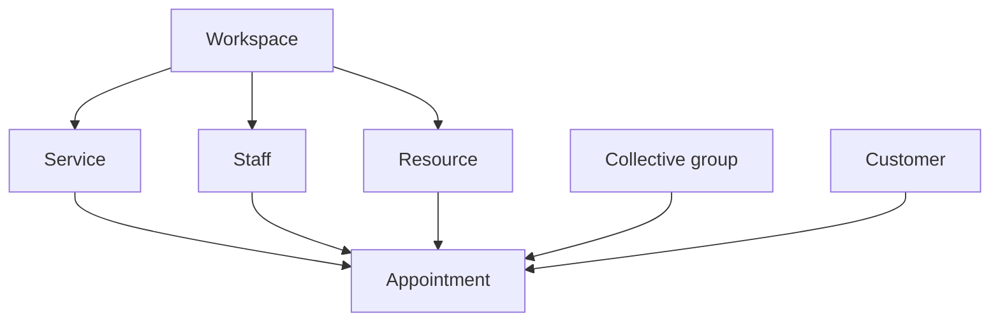
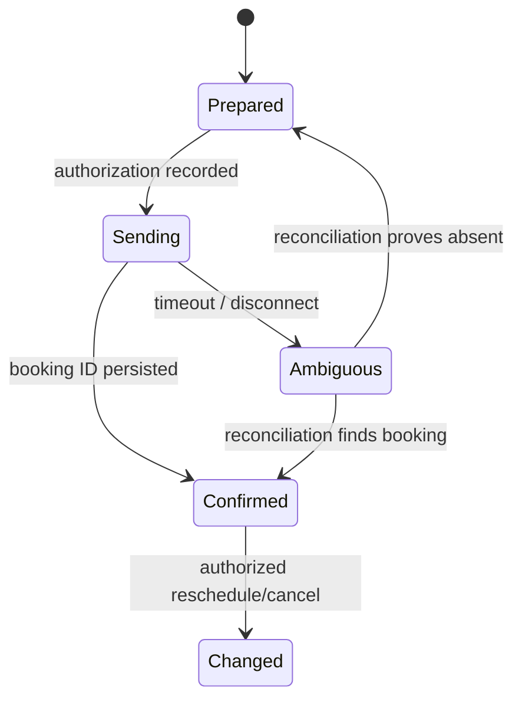

# Zoho Bookings — Automation and API Engineering Knowledge Base

**Document ID:** GH-ZOHO-BOOKINGS-KB  
**Research cutoff:** 2026-07-20  
**Audience:** ChatGPT, Codex, solution architects, Deluge developers, Catalyst developers, and GH Real Estate / Sylvara system owners  
**Evidence policy:** Official Zoho documentation only. Exact tenant behavior, subscriptions, permissions, IDs, field labels, notification templates, and regional endpoints must be discovered at implementation time.

## AI execution contract

Treat this document as a design and navigation aid, not as live tenant metadata.

1. **Never invent IDs or field labels.** Discover the workspace, service, staff, resource, group, customer, and booking identifiers from the live organization before generating runnable code.
2. **Treat every identifier as an opaque string.** Do not infer type or length. For example, appointment responses may expose display-like values such as `#AN-00014`, while other Bookings objects use long numeric-looking IDs.
3. **Use the organization’s data center.** Examples below use the US host. Resolve the correct Zoho Accounts and API domain for the authorized organization.
4. **Request least-privilege OAuth scopes.** The current Bookings v1 pages commonly document `zohobookings.data.CREATE`, including for some reads. Verify the exact accepted scope in the live OAuth consent flow; do not broaden scope merely to avoid diagnosing a permission error.
5. **Do not expose credentials, tokens, booking links containing private context, customer details, or live record IDs in code, prompts, logs, Git, or PDFs.** Use placeholders and a managed secret store.
6. **Assume writes can be duplicated.** Put appointment creation, rescheduling, cancellation, and downstream financial actions behind an application idempotency ledger.
7. **Recheck availability immediately before booking.** A returned slot is a point-in-time view, not a reservation.
8. **Require explicit authorization for customer-facing messages, appointment changes, destructive actions, and payment/accounting side effects.** A model may prepare the payload; an approved workflow performs the mutation.
9. **Prefer live official docs and tenant configuration over this snapshot.** Product UI, plan names, quotas, integrations, and Bookings 2.0 behavior are volatile.

### Evidence labels

| Label | Meaning |
|---|---|
| `[OFFICIAL]` | Directly described in a cited Zoho source. |
| `[INFERENCE]` | Recommended architecture derived from official behavior; not a Zoho guarantee. |
| `[LIVE-METADATA REQUIRED]` | Must be discovered in the target organization or current documentation before implementation. |
| `[VOLATILE]` | Plan, quota, feature availability, UI, or pricing can change. |
| `[LEGACY/BETA]` | Older surface or prerelease/transitioning capability; validate before new use. |

## 1. Product role in the GH / Sylvara architecture

Zoho Bookings is the appointment-scheduling system: it publishes booking pages, models bookable services and resources, calculates slots, collects customer booking inputs, sends appointment notifications, and records appointment state. It should not become a second customer master, consent master, property/tenant system of record, or accounting ledger.

Recommended authority boundaries:

| Concern | Authoritative system | Bookings responsibility |
|---|---|---|
| Lead, applicant, tenant, owner, vendor, and property identity | Zoho CRM | Resolve or link the customer to the canonical CRM record. |
| Portal experience and richer business workflow | Zoho Creator | Launch or consume a scheduling flow, then retain the canonical business-process status. |
| Appointment slot and appointment lifecycle | Zoho Bookings | Own service availability, appointment time, assigned provider/resource, and Bookings status. |
| Accounting, invoice, payment, and refund truth | Zoho Books / Billing as applicable | Surface payment context only; never overwrite accounting truth. |
| Contracts and signatures | Zoho Contracts / Zoho Sign | A booking may trigger an approved contract/sign flow, but does not prove execution. |
| Files and evidence | WorkDrive | Store approved files and immutable references, not raw file duplication in Bookings notes. |
| SMS and voice transport | Twilio or the approved Zoho notification channel | Trigger only approved, consent-aware reminders and status notices. |
| Integration ingress, secrets, queues, retries | Zoho Catalyst | Validate events, deduplicate work, call downstream APIs, and write an audit trail. |

`[INFERENCE]` Use Bookings for leasing consultations, showing appointments, owner onboarding calls, maintenance/vendor coordination, move-in/move-out inspections, document-review sessions, and Sylvara customer consultations. Do not use a single generic service for every business process: separate services where duration, intake questions, staff pool, compliance text, reminder policy, or reporting ownership differs.

## 2. Object model and identifiers



| Object | Purpose | Important identifiers / fields | Engineering cautions |
|---|---|---|---|
| Workspace | Business area that contains services, staff/resources, policies, notifications, and booking pages | `workspace_id`, name, status, description, mail notification rules, scheduling policy | Workspace deletion is constrained by appointments and group services. Plan workspace limits are volatile. |
| Service | Bookable offering | `service_id`, name, duration, buffer time, price, currency, `service_type`, assigned staff/groups/workspace, embed URL | Service types documented in fetch results include `APPOINTMENT`, `RESOURCE`, `CLASS`, and `COLLECTIVE`. Only documented service types and fields should be sent. |
| Staff | Human provider | `staff_id`, name, email/contact data, role, assigned services/workspaces, embed URL | `staff_email` filtering is documented as a contains search, not strict equality. Normalize and verify exact match in application code. |
| Resource | Non-human capacity such as a room or property/showing slot | `resource_id`, associated workspace/service data | Resource endpoints and entitlements are plan-sensitive. Deletion is blocked while assigned or when future appointments exist. |
| Collective group | Multi-staff group for collective service | `group_id` | A group ID is mandatory for collective booking. Do not substitute an arbitrary staff ID. |
| Customer | Booking customer / guest | customer identifier plus name, email, phone and other profile fields | A Bookings customer is not the CRM identity master. Deduplicate/match under an explicit CRM policy. |
| Appointment | Scheduled booking | `booking_id`, service/workspace/staff/resource/group context, start/end, status, cost/currency, summary URL | Treat booking IDs as opaque. Appointments can be changed by staff, customer, workflows, and integrations; reconcile events. |
| Additional field | Service-specific intake input | Field label/value pairs in `additional_fields` | API examples use labels. Labels can be renamed/localized; maintain a versioned label map and validate at deployment. |

### Metadata strategy

The public v1 documentation does not expose a universal metadata/schema endpoint comparable to CRM Fields Metadata. Therefore:

1. Fetch workspaces.
2. For each approved workspace, fetch services.
3. Fetch staff and resources using workspace/service filters.
4. Keep a sanitized deployment-time manifest of opaque IDs, service type, allowed workflow purpose, timezone, and expected intake labels.
5. Re-run discovery after admins rename/reassign services, migrate Bookings versions, or change workspaces.
6. Never commit live customer IDs, booking IDs, emails, phone numbers, summary links, or OAuth material.

`[INFERENCE]` Additional-field definitions should be maintained as configuration with a label, expected type, required flag, validation rule, and effective date. Before enabling a write workflow, make a test booking in a nonproduction service and verify the response plus Bookings UI.

## 3. Availability, editions, and version boundary

`[VOLATILE]` The current pricing page and API quota page use different plan nomenclature. The pricing page currently presents a “Forever Free” offering and FLEX, while the API limits page lists Free, Basic, Premium, and Zoho One. Do not infer API entitlement from a marketing plan name. Confirm the subscribed edition, add-ons, number of workspaces/users, payment features, audit-log availability, integrations, and API access in the live account.

Zoho has a Bookings 2.0 user interface and migration guidance, while the documented public API paths remain under `bookings/v1/json`. `[LIVE-METADATA REQUIRED]` Do not rename API versions based on the UI. Validate whether a feature in a Bookings 2.0 help article has an API surface and whether an older Bookings v1 page still reflects current behavior.

Documented daily API limits are counted per user from 00:00 to 23:59 in the applicable timezone; authorization requests do not count. The cited API-limit page currently states:

| Edition label in API documentation | Calls per user per day |
|---|---:|
| Free | 250 |
| Basic | 1,000 |
| Premium | 3,000 |
| Zoho One | 3,000 |

These values are `[VOLATILE]`. Cache metadata, avoid polling every service/staff repeatedly, and budget quota across automation, support, and batch jobs.

## 4. Authentication, regional hosts, and request conventions

### OAuth 2.0

- Use Zoho OAuth 2.0 and the user/organization authorized for Bookings.
- Send `Authorization: Zoho-oauthtoken <access-token>`.
- The current Bookings API pages frequently list `zohobookings.data.CREATE`, including read examples. `[LIVE-METADATA REQUIRED]` Test exact scopes against the target operation; keep an endpoint-to-scope matrix and rotate consent if Zoho updates scopes.
- Store client secrets and refresh tokens only in Catalyst secrets or another approved secret manager.
- Never pass access tokens in URLs.
- A token’s organization, user privileges, service access, and data center all matter. A valid token can still be unauthorized for a workspace.

### Base URL

US examples use:

```text
https://www.zohoapis.com/bookings/v1/json/{operation}
```

`[LIVE-METADATA REQUIRED]` Resolve the correct regional Zoho API domain from the OAuth organization. Do not hard-code `.com` for organizations in another data center. Keep the region as deployment configuration, not user input.

### Transport and encoding

Many Bookings v1 examples submit `multipart/form-data` or form parameters, with JSON objects serialized inside fields such as `customer_details`, `additional_fields`, `payment_info`, or `dataMap`. Avoid sending an arbitrary JSON body when the endpoint documents form data.

Responses commonly contain a wrapper like:

```json
{
  "response": {
    "returnvalue": {
      "status": "success"
    },
    "status": "success"
  }
}
```

`[INFERENCE]` Check both the HTTP status and the documented response-level status/error payload. Do not treat HTTP 200 alone as proof of a successful booking. Preserve the raw response only in access-controlled diagnostic storage, redact customer data, and translate it into a stable internal result type.

## 5. Endpoint catalog

All paths below are relative to the regional Bookings API base. Parameter names and required combinations must be revalidated against the cited endpoint page.

### Appointments and availability

| Operation | Method and path | Key request data | Important response / behavior |
|---|---|---|---|
| Book appointment | `POST /bookings/v1/json/appointment` | Required `service_id`, `from_time`, `customer_details`; one of `staff_id`, `resource_id`, or `group_id` as appropriate. Optional `to_time`, `timezone`, `notes`, `additional_fields`, `payment_info`. | Returns appointment/service/workspace/provider context, cost/currency, start/end/status, `booking_id`, and a summary URL. Collective service requires group ID; resource service may use end time. |
| Get one appointment | `GET /bookings/v1/json/getappointment` | `booking_id` | Returns the appointment details visible to the authorized context. |
| Fetch appointments | `GET /bookings/v1/json/fetchappointment` | Date-range and filters such as staff/service/status per current docs | Use for reconciliation and reporting, not high-frequency polling. Normalize timezone before comparing timestamps. |
| Update appointment | `POST /bookings/v1/json/updateappointment` | Booking ID plus documented update fields | Patch only intended fields; log prior/current values. Confirm notifications produced by the update. |
| Reschedule appointment | `POST /bookings/v1/json/rescheduleappointment` | Required `booking_id`; documented request requires a new scheduling selector such as `staff_id`, `group_id`, and/or `start_time` according to service | Rescheduling can change staff/slot and cause notices. Use an idempotent command and reconcile returned state. |
| Cancel appointment | Documented Bookings v1 cancellation operation; verify current path and parameters before use | Booking ID plus reason/notification options if documented | Customer-facing, potentially financial and operational. Never guess the path or reason field; require approval policy. |
| Fetch availability | `GET /bookings/v1/json/availableslots` | `service_id`, selected date, and one of `staff_id`, `group_id`, or `resource_id` | Returns available slot values and timezone. Display format follows the Bookings account time-format setting; it is not guaranteed to be a fixed 24-hour wire format. |

Appointment timestamps in documented examples use `dd-MMM-yyyy HH:mm:ss`. Supply `timezone` where supported and store an internal UTC instant plus IANA timezone and local display value. Never silently assume the server, property, customer, or browser timezone.

### Workspaces

| Operation | Method and path | Notes |
|---|---|---|
| Fetch workspaces | Current fetch-workspaces endpoint in the v1 reference | Discover allowed workspace IDs and configuration rather than copying IDs from a URL or screenshot. |
| Create workspace | `POST /bookings/v1/json/createworkspace` | Workspace name is documented as 2–50 characters with excluded characters; organization plan limits apply. Creation is an admin/configuration action, not a runtime shortcut. |
| Update workspace | `POST /bookings/v1/json/updateworkspace` | Uses `workspaceId` and `dataMap`. Documented fields include name, status, description, mail notification maps, policies/preferences, language, prefix, invoice-digit settings, notices, terms, and cancel settings. |
| Delete workspace | `POST /bookings/v1/json/deleteworkspace` | Uses `workspaceId` and `ignorePastAppointment`. Deletion can be blocked by future appointments or booked group services. Export/reconcile before any deletion. |

Selected documented workspace policy fields:

| Field | Meaning / constraints in current reference |
|---|---|
| `status` | Values shown include `active` and `in_active`; use only the current documented spelling. |
| `description` | Up to 2,000 characters in the current endpoint page. |
| `mail_notifications` | Customer/staff sender, reply-to, and CC maps. Approved sender choices include Bookings, super admin, staff, business, or workspace depending on field. |
| `scheduling_interval` | Multiple of 5, documented range 5–1,435 minutes. |
| `customer_select_staff` | Whether customers can select staff. |
| `auto_assign_staff` | Automatic staff assignment behavior. |
| `minimum_booking_notice` / maximum-notice setting | Enforces how soon/far out customers can book. Verify unit and field name in live reference. |
| `cancel_reschedule_notice` / `enable_cancel` | Controls customer change policy. Align with contract and operational policy. |
| prefix / maximum invoice digits | Display-number configuration; not a replacement for Books invoice numbering. |

### Services

| Operation | Method / path | Notes |
|---|---|---|
| Fetch services | `GET /bookings/v1/json/services` | Requires `workspace_id`; can filter by `service_id` or `staff_id`. Returned fields include duration, buffer time, embed URL, service type, price, currency, assigned staff/groups, staff-selection setting, name, ID, and workspace. |
| Create service | `POST` current create-service endpoint | Validate service type, duration, staffing/resources, price, notices, and intake fields in a sandbox workspace. |
| Update service | `POST` current update-service endpoint | Configuration mutation; version the intended state and diff before applying. |
| Delete service | `POST` current delete-service endpoint | The current page notes deletion support for a one-on-one service. Reconcile future appointments and dependencies first. |

### Staff

| Operation | Method / path | Notes |
|---|---|---|
| Fetch staff | `GET /bookings/v1/json/staffs` | Optional filters include `staff_id`, `service_id`, `staff_email`, and `workspace_id`. Email filtering is documented as “contains”; verify the exact returned email before selection. |
| Add staff | `POST` current add-staff endpoint | Requires appropriate admin entitlement and available plan seats. Provision identity separately under a controlled joiner/mover/leaver workflow. |
| Update / remove staff | Use only the current documented endpoint if exposed for the account | Reassign future appointments and services first. Do not infer an endpoint from naming patterns. |

### Resources

| Operation | Method and path | Notes |
|---|---|---|
| Create resources | `POST /bookings/v1/json/addresource` | Current docs allow a bulk addition of up to 10 and note plan restrictions. Use stable internal resource keys outside customer-facing names. |
| Fetch resources | Current v1 fetch-resources endpoint | Resolve resources by approved workspace/service relationships. |
| Update resource | `POST /bookings/v1/json/updateresource` | Current docs support one resource per request. Use a bounded queue for bulk changes. |
| Delete resource | Current v1 delete-resource endpoint | One per request; blocked when assigned to services or when it has upcoming appointments. |

### Customers

| Operation | Method and path | Notes |
|---|---|---|
| Create customer | `POST /bookings/v1/json/addcustomer` | Current documentation creates customers as guests by default. Use CRM match policy before creating a second person identity. |
| Update customer | Current v1 update-customer endpoint, if available for the tenant | Keep Bookings profile minimal and synchronize only approved fields from the CRM master. |
| Delete customer | `POST /bookings/v1/json/deletecustomer` | Takes a customer map/ID, one customer per request; blocked for upcoming appointments. Deletion must respect retention/legal policy and downstream links. |

The absence of a listed endpoint here is not proof the capability does not exist. It means the workflow must consult the live official index rather than synthesize an undocumented route.

## 6. Appointment field contract

### Booking request fields

| Field | Type / form | Rule |
|---|---|---|
| `service_id` | Opaque string | Required. Resolve from the approved deployment manifest. |
| `staff_id` | Opaque string | Use for a specific provider when the service allows it. Do not combine with incompatible selector fields. |
| `resource_id` | Opaque string | Use for resource services. Confirm resource belongs to service/workspace. |
| `group_id` | Opaque string | Required for collective service. |
| `from_time` | Formatted datetime string | Required; examples use `dd-MMM-yyyy HH:mm:ss`. Pair with `timezone`. |
| `to_time` | Formatted datetime string | Used where required for resource service. Validate duration and availability. |
| `timezone` | Timezone value accepted by Bookings | Never derive solely from customer phone area code or property address. |
| `customer_details` | Serialized JSON map | At minimum the current endpoint requires name/email/phone fields as documented. Collect only what the service needs. |
| `notes` | String | Avoid sensitive screening data, credentials, payment card data, and contract content. |
| `additional_fields` | Serialized JSON label/value structure | Labels are tenant configuration. Validate length/type and keep a versioned map. |
| `payment_info` | Serialized JSON map | Current example includes `cost_paid`. Never treat this as the accounting ledger or card-processing instruction. Reconcile to the approved payment system. |

### Internal normalized appointment record

`[INFERENCE]` Catalyst should translate Bookings payloads into a stable internal envelope:

```json
{
  "event_key": "bookings|appointment|<opaque-booking-id>|<version-or-event>",
  "booking_id": "<opaque>",
  "crm_record_id": "<opaque-or-null>",
  "business_purpose": "property_showing",
  "service_id": "<opaque>",
  "workspace_id": "<opaque>",
  "provider_kind": "staff",
  "provider_id": "<opaque>",
  "starts_at_utc": "2030-01-15T16:00:00Z",
  "timezone": "America/Chicago",
  "status": "<bookings-status>",
  "source_updated_at": "<source-time-if-available>",
  "received_at": "<gateway-time>",
  "payload_hash": "<redacted-canonical-hash>"
}
```

Do not put customer email, phone, free-text notes, access codes, or booking-page URLs in a broad event log. Keep restricted source data in a separate encrypted store only when there is a documented retention need.

## 7. Search, paging, reconciliation, and synchronization

The current public v1 pages expose targeted fetch operations rather than a uniform query language. Use Bookings as the appointment authority and CRM as the relationship authority.

Recommended reconciliation loop:

1. Define a bounded date window and approved workspace/service filters.
2. Fetch appointment results using the documented endpoint and current parameter names.
3. Normalize timezones before comparison.
4. Deduplicate by opaque `booking_id`; compare status, start/end, provider, and source update indicator if supplied.
5. Update a CRM communication/appointment link record using an idempotent upsert, not by creating another customer.
6. Record reconciliation cursor/window, count, and sanitized exception reasons.
7. Use a deliberate overlap window so delayed changes are not missed.
8. Do not make a high-volume call per CRM record; fetch Bookings in bounded batches and join internally.

`[LIVE-METADATA REQUIRED]` Paging, maximum date range, and filter semantics may differ by endpoint. If an endpoint does not document a cursor/page parameter, do not invent one. Break work by documented date/filter dimensions and stay under daily quota.

## 8. Workflows, notifications, and event boundaries

Bookings workflows can run before, during, or after appointment events such as booking, rescheduling, cancellation, reminders, payment-related changes, completion, or no-show, depending on current product configuration. Actions include notifications and custom functions.

Custom functions use Deluge and expose a booking information map (documented as `bookingInfo` in the cited article) for events such as booked, rescheduled, canceled, completed, and no-show. `[LIVE-METADATA REQUIRED]` Log the keys in a nonproduction function with synthetic data and compare with the current help article before writing production logic.

### Webhook boundary

The reviewed Bookings documentation does **not** establish a general external webhook API with a documented signing scheme comparable to Twilio. Documented automation routes include Bookings workflows/custom functions and integration triggers such as Zapier/Zoho Flow. Therefore:

- Do not invent a Bookings webhook signature header.
- A Deluge custom function may call a Catalyst HTTPS endpoint using a shared, rotated application credential stored outside the script when supported, or directly call an approved Zoho API through a connection.
- The Catalyst receiver must authenticate, apply replay/idempotency controls, validate an allowlisted schema, and acknowledge quickly.
- Treat Zapier/Flow trigger delivery as at-least-once unless its current contract explicitly says otherwise.
- Run periodic appointment reconciliation even when workflows are enabled.

### Notification channels

Email and SMS alerts can be configured around appointment statuses, including booked, canceled, rescheduled, completed, and no-show in current Bookings 2.0 documentation. Variables populate service/customer/staff/appointment values.

Before enabling:

- Inventory every Bookings notification and every CRM/Catalyst/Twilio notification for the same event.
- Select one owner per message so the customer does not receive duplicates.
- Preview templates with empty optional variables and long values.
- Verify sender, reply-to, CC, localization, timezone, and business identity.
- Do not place sensitive application, tenant, contract, or payment details in reminders.
- Test cancellation/reschedule links and their authorization behavior.
- Record template revision and notification owner in a governance manifest.

## 9. Errors, retries, races, and idempotency

### Error classification

| Class | Action |
|---|---|
| Authentication / wrong data center | Stop; refresh or correct regional configuration. Never loop refreshes indefinitely. |
| Authorization / entitlement | Stop and escalate to an admin with endpoint, scope, role, and plan evidence. Do not request a broader scope automatically. |
| Validation | Do not retry unchanged. Surface the exact safe field error; never dump the customer payload. |
| Slot unavailable / scheduling conflict | Refresh availability, present alternatives, and require reconfirmation. |
| Quota / rate limit | Honor server guidance if supplied; use exponential backoff with jitter and a quota-aware queue. |
| Transient 5xx / network before response | Reads may retry. Writes require idempotency/reconciliation before retry. |
| Ambiguous write outcome | Query by known booking identifier or reconcile a narrow time/customer hash window; do not blindly repeat. |

### Application idempotency

`[INFERENCE]` Public appointment endpoints do not document a universal idempotency key. Before a create write, persist a unique business intent:

```text
business_purpose | CRM record | service | provider/resource | start instant | request revision
```

State machine:



Only one worker may transition `Prepared -> Sending`. Persist the request hash before transmission and the Bookings ID before emitting downstream events. A downstream action—CRM task, SMS reminder, invoice draft—must have its own idempotency key and must not rely solely on the appointment status string.

### Availability race

Availability lookup and booking are not atomic from the client’s perspective. Present returned slots as provisional, set a short client selection window, then submit once. If unavailable, fetch again and show alternatives. Do not automatically move a customer to a different time or provider.

## 10. Security, privacy, audit, and retention

### Data minimization

- Collect only the name/contact and intake fields necessary for the service.
- Never ask for SSNs, bank/card details, door/access codes, account passwords, full lease documents, or highly sensitive screening facts in booking intake or notes.
- If a booking needs a property reference, use a short non-sensitive internal reference rather than an address in every log and URL.
- Avoid customer PII in query parameters, confirmation-page redirects, analytics parameters, and iframe parent-page telemetry.
- Treat summary URLs as potentially sensitive bearer links until verified otherwise.

### Roles and audit

The Bookings 2.0 audit log is documented for eligible plans and records actions such as appointment creation/rescheduling/cancellation/status/payment/notifications/integrations/workflows, including failures and retry activity. Access varies among admins, workspace managers, and staff; the log is read-only and not user-deletable in the UI described by the source.

`[VOLATILE]` Audit-log entitlement, retention, export, and role visibility must be checked in the live edition. Export or correlate security-relevant events under the organization’s records policy; do not claim Bookings audit is a permanent legal archive.

### Change control

High-risk configuration changes include:

- workspace status/deletion;
- service deletion or service-type changes;
- duration, buffer, booking notice, cancellation, and staff-assignment changes;
- notification sender/template/recipient changes;
- payment configuration;
- custom function and CRM/Twilio integration changes;
- booking-page confirmation redirects and embeds.

Require a ticket, owner, before/after export, test evidence, rollback plan, approval, and post-deploy reconciliation. No production customer data belongs in GitHub fixtures.

## 11. Integration patterns

### CRM integration

The native integration can push booking customers to a selected CRM module and appointments to CRM Meetings, and can synchronize with the CRM calendar subject to current edition and configuration. The CRM plugin exposes Bookings in CRM, with default mapping around name/email/phone and module-specific rules; service custom fields may map to Meetings under documented limitations.

Risks and controls:

- Match by normalized email/phone only as a candidate; collisions, shared contacts, recycled phone numbers, and aliases require a deterministic review policy.
- Record the Bookings ID on the CRM appointment/link record.
- Do not let the plugin create uncontrolled duplicate Contacts/Leads.
- Map only approved fields and test updates, cancellations, and ownership changes.
- Define whether native integration or Catalyst is the sync owner. Do not run two bidirectional writers over the same fields.

### Creator and portals

Use Creator to present a tenant/vendor workflow when the booking is only one step. Pass an internal opaque correlation token, not raw PII. After the Bookings confirmation, Creator/Catalyst verifies the appointment server-side and advances the workflow only when the booking’s service and customer relationship match the authorized process.

### Books / Billing / Checkout

`[INFERENCE]` A Bookings payment or `cost_paid` value is evidence from the scheduling system, not accounting truth. Reconcile it to an approved Books invoice/payment or Billing subscription identifier. Never create an invoice on every duplicate workflow delivery. Use a draft/approval step for unusual charges and verify refunds/cancellations separately.

### Twilio

Bookings documents a Twilio integration and SMS notification routes. Decide whether native Bookings SMS or centralized Catalyst/Twilio owns each reminder. A centralized route is preferable when GH/Sylvara needs a CRM consent record, A2P campaign separation, cross-channel throttling, a complete communication log, or specialized opt-out handling.

### Zapier / Zoho Flow

Documented integration triggers include appointment booked, rescheduled, and canceled. Use them for low-risk orchestration only after confirming authentication, delivery semantics, field mapping, and secret handling. Catalyst should deduplicate by appointment/event identity and periodically reconcile Bookings.

### Bookings MCP and AI scheduling

Zoho documents an MCP integration for AI scheduling. `[VOLATILE]` Availability, actions, consent screen, and permissions can change. An AI assistant may read available services/slots, but customer-impacting create/reschedule/cancel actions should require clear confirmation showing service, local date/time/timezone, provider/resource selection, cancellation policy, and contact channel. Never expose an admin-level Bookings token to an untrusted model or shared client.

## 12. GH Real Estate / Sylvara automation blueprints

### A. Property showing

1. CRM verifies the prospect and property/unit eligibility.
2. Creator/Catalyst selects the approved Bookings service and resource/staff pool from configuration.
3. Fetch availability for the correct timezone.
4. Customer confirms a provisional slot and notification consent.
5. Catalyst creates the appointment once under an intent key.
6. Persist Bookings ID on a CRM appointment-link record.
7. Send one reminder stream through the designated owner.
8. On reschedule/cancel/no-show, update the linked CRM record idempotently and notify only approved recipients.

Controls: do not reveal occupied-unit details, access codes, tenant identity, staff personal phone, or exact private instructions in the public booking page.

### B. Tenant onboarding call

Use a service with minimal intake fields and a CRM relationship check. The booking does not mark onboarding complete. A completed appointment can create a Creator/CRM follow-up task, but completion of required documents, signature, payment, and screening remains in their authoritative systems.

### C. Maintenance / vendor appointment

Model technician as staff and physical capacity as resource when needed. Link to a work-order ID, not the full issue description in reminders. Customer/tenant scheduling must be authorized for the property relationship. Record no-access/no-show as an operational status, not an automatic fee; an approved accounting workflow determines charges.

### D. Contract or closing consultation

Appointment completion may enqueue a contract or Sign preparation task. It must not represent acceptance or signature. Validate signatory identity in CRM and use Contracts/Sign audit evidence.

## 13. Implementation patterns

### Safe Deluge-style request skeleton

Illustrative only; connection name, regional URL, exact parameters, and response schema are live configuration.

```deluge
customerDetails = Map();
customerDetails.put("name", input.Safe_Display_Name);
customerDetails.put("email", input.Approved_Email);
customerDetails.put("phone_number", input.Approved_E164_Phone);

params = Map();
params.put("service_id", config.Service_Id);
params.put("staff_id", config.Staff_Id);
params.put("from_time", input.Bookings_Local_Time);
params.put("timezone", input.IANA_Timezone);
params.put("customer_details", customerDetails.toString());

// The calling workflow must acquire an idempotency lock before this write.
result = invokeurl
[
    url :config.Bookings_Api_Base + "/bookings/v1/json/appointment"
    type :POST
    parameters:params
    connection:"bookings_least_privilege_connection"
];
```

Do not log `params` or `result` wholesale. Validate required response keys defensively; persist only the opaque booking ID, normalized status/time/provider links, response hash, and restricted audit correlation.

### Availability pseudocode

```text
assert requester may schedule for CRM relationship
resolve service/provider from approved manifest
GET documented availability endpoint
parse slots using returned timezone and configured display format
present slot + timezone + service + provider/resource + policy
on confirmation:
  revalidate intent lock and customer contact
  submit one booking request
  if definite conflict: refresh slots
  if ambiguous timeout: reconcile before any retry
```

## 14. Testing and deployment checklist

### Preflight

- [ ] Confirm Bookings organization, data center, edition, API access, and daily quota.
- [ ] Inventory workspaces, services/types, staff, resources, groups, timezones, and booking-page URLs.
- [ ] Record sanitized opaque-ID manifest in deployment configuration, not source examples.
- [ ] Confirm exact OAuth scope per endpoint with a least-privilege test client.
- [ ] Map CRM person/organization/property and appointment-link fields.
- [ ] Choose one notification owner for each event/channel.
- [ ] Define retention and audit owners.

### Functional tests

- [ ] Availability across daylight-saving transitions, midnight, month/year boundary, and staff/resource timezone differences.
- [ ] Appointment creation once and ambiguous timeout recovery without duplicates.
- [ ] Collective, resource, class, and one-on-one behavior used by the organization.
- [ ] Reschedule and cancellation with customer/staff messages inspected.
- [ ] No-show/completed workflow idempotency.
- [ ] Additional field rename, blank optional field, long value, Unicode, and invalid format.
- [ ] CRM matching collisions and shared household contact details.
- [ ] Future appointment/resource/workspace deletion safeguards.
- [ ] API quota, auth expiration, wrong-region, permission, validation, 429, and 5xx behavior.

### Security tests

- [ ] No secrets, tokens, customer values, booking URLs, or live IDs in Git/logs/prompts.
- [ ] Unauthorized CRM relationship cannot fetch or alter another customer’s appointment.
- [ ] Confirmation redirect/iframe does not leak booking or PII parameters to analytics/referrers.
- [ ] Catalyst validates event credentials, schema, replay window, and idempotency.
- [ ] Notification template contains no sensitive tenant/property/payment facts.

### Deployment and rollback

- [ ] Test in a dedicated nonproduction workspace/service with synthetic contacts.
- [ ] Export the prior configuration and record approver/change ticket.
- [ ] Deploy service/workspace policies before enabling public pages.
- [ ] Enable one automation/notification owner at a time.
- [ ] Monitor first bookings, failures, duplicates, timezone display, and CRM links.
- [ ] Rollback disables workflow/ingress and restores configuration without deleting appointment evidence.

## 15. Anti-patterns

- Hard-coding workspace/service/staff IDs inside many functions.
- Treating service/staff names as stable unique keys.
- Assuming all availability values are 24-hour timestamps.
- Retrying appointment POST blindly after a timeout.
- Running native CRM sync, Zapier, Flow, and Catalyst as simultaneous writers without ownership rules.
- Using booking completion as proof of payment, signature, screening, or tenant eligibility.
- Storing sensitive intake details in notes or URLs.
- Sending the same reminder from Bookings and Twilio.
- Creating a CRM Contact for every guest without collision handling.
- Deleting a service/resource/workspace to “clean up” instead of deactivating and preserving historical linkage.
- Letting an AI model reschedule/cancel without a human-visible confirmation.

## 16. AI/Codex task recipe

When asked to build a Bookings automation, the model should answer these questions before emitting production code:

1. What is the business event and authoritative system?
2. What exact Bookings organization/data center/edition applies?
3. Which workspace and service type are approved?
4. Is the provider a staff member, resource, or collective group?
5. Which live IDs and intake labels were discovered, and when?
6. What timezone is used for storage and customer display?
7. Which system owns customer identity and communication consent?
8. What is the write idempotency key and ambiguous-outcome reconciliation query?
9. Which workflow owns each notification?
10. What change approval, synthetic test, audit, and rollback evidence is required?

If any answer is unavailable, generate discovery/read-only code or a configuration worksheet—not a guessed mutation.

## 17. Official source registry

All sources accessed 2026-07-20. Titles reflect the official page topic; Zoho may revise page headings.

### API and OAuth

- [OAuth Authentication — Zoho Bookings API](https://www.zoho.com/bookings/help/api/v1/oauthauthentication.html)
- [Book an Appointment — Zoho Bookings API](https://www.zoho.com/bookings/help/api/v1/book-appointment.html)
- [Get Appointment — Zoho Bookings API](https://www.zoho.com/bookings/help/api/v1/get-appointment.html)
- [Fetch Appointment — Zoho Bookings API](https://www.zoho.com/bookings/help/api/v1/fetch-appointment.html)
- [Update Appointment — Zoho Bookings API](https://www.zoho.com/bookings/help/api/v1/update-appointment.html)
- [Reschedule Appointment — Zoho Bookings API](https://www.zoho.com/bookings/help/api/v1/reschedule-appointment.html)
- [Fetch Availability — Zoho Bookings API](https://www.zoho.com/bookings/help/api/v1/fetch-availability.html)
- [Fetch Services — Zoho Bookings API](https://www.zoho.com/bookings/help/api/v1/fetch-services.html)
- [Create Service — Zoho Bookings API](https://www.zoho.com/bookings/help/api/v1/create-service.html)
- [Update Service — Zoho Bookings API](https://www.zoho.com/bookings/help/api/v1/update-service.html)
- [Delete Service — Zoho Bookings API](https://www.zoho.com/bookings/help/api/v1/delete-service.html)
- [Fetch Staff — Zoho Bookings API](https://www.zoho.com/bookings/help/api/v1/fetch-staff.html)
- [Add Staff — Zoho Bookings API](https://www.zoho.com/bookings/help/api/v1/add-staff.html)
- [Fetch Workspaces — Zoho Bookings API](https://www.zoho.com/bookings/help/api/v1/fetch-workspaces.html)
- [Create Workspace — Zoho Bookings API](https://www.zoho.com/bookings/help/api/v1/create-workspace.html)
- [Update Workspace — Zoho Bookings API](https://www.zoho.com/bookings/help/api/v1/update-workspace.html)
- [Delete Workspace — Zoho Bookings API](https://www.zoho.com/bookings/help/api/v1/delete-workspace.html)
- [Create Resource — Zoho Bookings API](https://www.zoho.com/bookings/help/api/v1/create-resource.html)
- [Fetch Resources — Zoho Bookings API](https://www.zoho.com/bookings/help/api/v1/fetch-resources.html)
- [Update Resource — Zoho Bookings API](https://www.zoho.com/bookings/help/api/v1/update-resource.html)
- [Delete Resource — Zoho Bookings API](https://www.zoho.com/bookings/help/api/v1/delete-resource.html)
- [Create Customer — Zoho Bookings API](https://www.zoho.com/bookings/help/api/v1/create-customer.html)
- [Delete Customer — Zoho Bookings API](https://www.zoho.com/bookings/help/api/v1/delete-customer.html)

### Product, workflows, notifications, and governance

- [Introduction to Zoho Bookings](https://help.zoho.com/portal/en/kb/bookings/introduction-to-zoho-bookings/articles/bookings-introduction)
- [Zoho Bookings Quickstart Guide](https://help.zoho.com/portal/en/kb/bookings/introduction-to-zoho-bookings/articles/bookings-quickstart-guide)
- [Migration Guide to Bookings 2.0](https://help.zoho.com/portal/en/kb/bookings-2-0/getting-started/articles/migration-guide-to-bookings-2-0)
- [Workflows in Zoho Bookings](https://help.zoho.com/portal/en/kb/bookings-2-0/workflows/articles/workflows-bookings)
- [Custom Functions in Zoho Bookings](https://help.zoho.com/portal/en/kb/bookings/workspace/articles/bookings-custom-functions)
- [Email and SMS Alerts](https://help.zoho.com/portal/en/kb/bookings-2-0/event-types/event-type-settings/articles/email-and-sms-alerts)
- [Zoho Bookings Variables](https://help.zoho.com/portal/en/kb/bookings-2-0/event-types/event-type-settings/articles/bookings-variables)
- [Audit Log in Zoho Bookings](https://help.zoho.com/portal/en/kb/bookings-2-0/admin-center/data-administration/articles/audit-log-bookings)
- [Event Type Booking Page Settings](https://help.zoho.com/portal/en/kb/bookings-2-0/booking-pages/booking-page-settings/articles/event-type-booking-page-settings)
- [Zoho Bookings Pricing](https://www.zoho.com/bookings/pricing.html)

### Integrations

- [Integrate Zoho Bookings with Zoho CRM](https://help.zoho.com/portal/en/kb/bookings/integrations/others/articles/integrate-with-zoho-crm)
- [Zoho Bookings Plugin for Zoho CRM](https://help.zoho.com/portal/en/kb/bookings/integrations/others/articles/plugin-zoho-bookings-for-zoho-crm)
- [Other Integrations in Zoho Bookings](https://help.zoho.com/portal/en/kb/bookings/integrations/others/articles/bookings-other-integrations)
- [Zapier Integrations](https://help.zoho.com/portal/en/kb/bookings/integrations/others/articles/zapier-integrations)
- [Integrate Zoho Bookings with AI Using MCP](https://help.zoho.com/portal/en/kb/bookings-2-0/integrations/ai-automations/articles/integrate-zoho-bookings-with-ai-using-mcp)

---

**Maintenance rule:** Revalidate API paths/scopes, region, plan quotas, Bookings 2.0 parity, notification ownership, and the live workspace/service manifest before every material implementation. Record the validation date in the deployment ticket.
