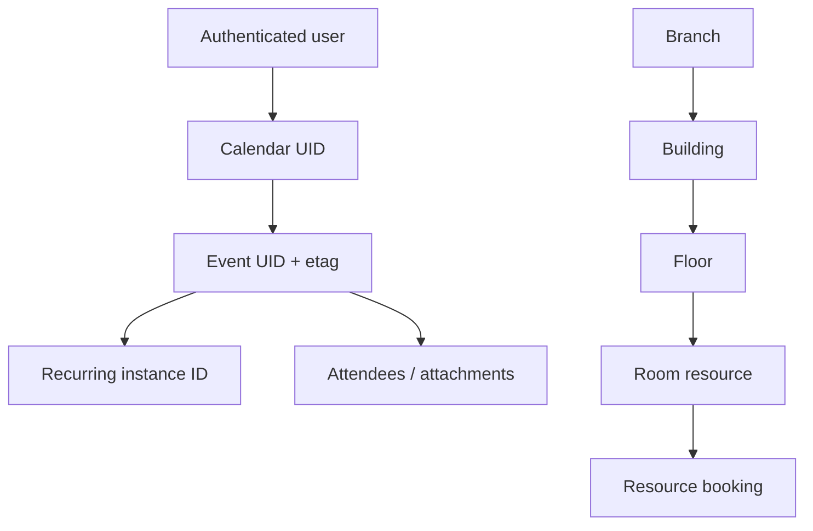

# Zoho Calendar — Events, Availability, Resource Booking, Sync, and AI Automation Knowledge Base

**Document ID:** GH-ZOHO-CALENDAR-KB
**Research cutoff:** 2026-07-20
**Audience:** ChatGPT, Codex, solution architects, Zoho administrators, Deluge/Catalyst developers, and GH Real Estate / Sylvara system owners
**Evidence policy:** Official Zoho documentation only. Tenant data center, plan, permissions, live identifiers, API behavior, integration state, and current limits must be revalidated before implementation.

## AI execution contract

1. **Zoho Calendar is a schedule and availability system, not the master record for tenants, leads, leases, work orders, payments, or appointments.** CRM, Creator, Contracts, Books, and Bookings retain those business truths.
2. **Resolve the authenticated user, data center, calendar, and permission before every operation.** A display name, email address, or calendar color is not a stable identifier.
3. **Treat create, update, move, share, invite, RSVP, room booking, notification, and delete as externally visible actions.** Require an explicit authorized intent and show the exact date, time zone, attendees, calendar, recurrence, and notification behavior before execution.
4. **Use the latest `etag` for event updates and deletes.** The current update endpoint replaces the full event resource; a partial-looking payload can erase omitted fields.
5. **Never guess recurrence scope.** Distinguish one occurrence, the selected and following occurrences, and the entire series. Preview the affected instances.
6. **Do not expose OAuth tokens, private calendar URLs, attendee data, event descriptions, attachments, meeting start links, room access details, or live identifiers in Git, prompts, URLs, or general logs.**
7. **Do not assume a generic Calendar event webhook exists.** No general event-created/updated/deleted webhook contract was found in the official Calendar API documentation at this cutoff. Use supported product integrations or bounded reconciliation polling unless Zoho documents a current event-delivery contract.
8. **An available time is not an approved appointment.** Free/busy results do not establish customer consent, staff assignment, service duration, travel time, or a Bookings reservation.
9. **The official Calendar MCP server can perform writes.** An AI host must apply the same confirmation, least-privilege, logging, and destructive-action controls as direct REST code.
10. **Prefer live official documentation and tenant metadata over this snapshot.** Plans, regional hosts, sync rules, limits, MCP tools, and integration behavior can change.

### Evidence labels

| Label | Meaning |
|---|---|
| `[OFFICIAL]` | Directly documented by Zoho in a source listed below. |
| `[INFERENCE]` | Recommended architecture or control derived from official behavior; not a Zoho guarantee. |
| `[LIVE-METADATA REQUIRED]` | Must be discovered from the target account or current documentation. |
| `[VOLATILE]` | Plan, limit, feature, regional, or UI detail likely to change. |
| `[GAP]` | A needed contract was not found in current official documentation and must not be invented. |

## 1. Product role and system boundaries

| Concern | System of record | Calendar role |
|---|---|---|
| Lead, applicant, tenant, owner, vendor, and property | Zoho CRM | Displays or links scheduled activity; never becomes the party master. |
| Customer-facing appointment and cancellation policy | Zoho Bookings | Busy-time source and resulting calendar event; Bookings owns service, staff, customer, and appointment status. |
| Maintenance request and access authorization | Creator / CRM Maintenance Requests | Schedules an approved visit; an event alone does not authorize entry. |
| Lease or document deadline | Contracts / Sign / CRM | Reminder or working calendar representation; source system owns the legal/business status. |
| Invoice or payment due state | Books / Billing | Optional reminder; calendar completion does not mark an invoice paid. |
| Online session | Zoho Meeting | Calendar holds conference metadata and schedule; Meeting owns session, join/start links, recording, and participant report. |
| Employee leave and holidays | Zoho People | People owns leave/holiday status; Calendar displays synchronized app-calendar data. |
| Office room inventory and booking | Calendar Resource Booking | Calendar owns configured branches/buildings/floors/rooms and room bookings. |
| Cross-system orchestration | Catalyst / approved Zoho Flow | Validates intent, maps opaque IDs, queues work, reconciles, redacts, and audits. |

`[INFERENCE]` GH Real Estate should use Calendar for internal availability and confirmed work, not as a substitute for the tenant portal or maintenance workflow. Sylvara should let Bookings own prospect/customer appointments and use Calendar to block staff time and expose confirmed schedules.

## 2. Authority ladder

When sources conflict, use this order:

1. Live tenant metadata, permissions, API responses, and current endpoint page.
2. Current official Zoho Calendar API, MCP, admin, and user documentation.
3. Current official documentation for the integrated product, such as Bookings, CRM, Meeting, or People.
4. This knowledge base.
5. Samples, inferred conventions, community posts, or remembered behavior.

API samples frequently contain historical dates and illustrative identifiers. Never treat them as live data, defaults, or evidence that an endpoint works in every calendar category.

## 3. Data centers and base addresses

The REST documentation uses:

```text
https://calendar.zoho.com/api/v1
```

Zoho's current sync documentation states that Calendar server addresses vary by account data center and explicitly lists these addresses:

| Data center | Calendar host | REST base form |
|---|---|---|
| United States | `calendar.zoho.com` | `https://calendar.zoho.com/api/v1` |
| Europe | `calendar.zoho.eu` | `https://calendar.zoho.eu/api/v1` |
| China | `calendar.zoho.com.cn` | `https://calendar.zoho.com.cn/api/v1` |
| India | `calendar.zoho.in` | `https://calendar.zoho.in/api/v1` |
| Australia | `calendar.zoho.com.au` | `https://calendar.zoho.com.au/api/v1` |

`[LIVE-METADATA REQUIRED]` The UI instructs users to retrieve the server address from **Settings > Synchronize > CalDAV**. Use that discovered host rather than inferring a suffix. Other Zoho data centers may exist without being listed on the cited Calendar server-address page. Bind each OAuth connection to an allowlisted regional base and reject redirects to an unexpected region.

OAuth account endpoints are also regional. Generate and refresh tokens against the Zoho Accounts domain for the tenant's data center. A valid token sent to the wrong Calendar region may fail or risk an incorrect integration design.

## 4. OAuth, scopes, and secrets

Zoho Calendar REST APIs use OAuth 2.0. The official guide describes access tokens as valid for one hour and refresh tokens as long-lived until revoked or invalidated. API calls use:

```http
Authorization: Zoho-oauthtoken <access_token>
```

The guide discusses server-based authorization code, browser/mobile PKCE, device, and Self Client patterns. For GH/Sylvara production automation, keep OAuth exchange and refresh server-side in Catalyst or an approved secret service. Do not place a refresh token or client secret in Creator pages, browser JavaScript, CRM fields, Calendar descriptions, GitHub, or AI project sources.

### Primary scope families

| Family | Least-privilege operations |
|---|---|
| `ZohoCalendar.calendar` | `READ`, `CREATE`, `UPDATE`, `DELETE`, or `ALL` as supported by the endpoint |
| `ZohoCalendar.event` | `READ`, `CREATE`, `UPDATE`, `DELETE`, or `ALL` |
| `ZohoCalendar.branches` | Resource-booking branch/building/floor discovery and administration |
| `ZohoCalendar.resources` | Room/resource discovery and administration |
| `ZohoCalendar.features` | Room-feature discovery and administration |
| `ZohoCalendar.bookings` | Room-booking reads and mutations |
| `ZohoCalendar.usersettings` | Resource-booking user preferences |
| `ZohoMeeting.meeting` | Required in addition when the Calendar event creates or updates a Zoho Meeting conference, per the event endpoint |

App calendars can require the integrated application's scopes. The event-list documentation specifically warns that CRM OAuth scope is also required for CRM Calendar events. Do not grant a broad CRM scope merely to avoid discovering the precise access need.

Separate connections for read-only schedule lookup, event writer, resource-booking administration, and AI/MCP use. Record owner, purpose, scopes, region, authorized calendars, revocation procedure, and last review date.

## 5. Object and identifier model



| Identifier | Meaning | Discovery / rule |
|---|---|---|
| user ID / `zuid` | Zoho user identity | User/profile or organization context; never infer from email. |
| calendar `uid` / `caluid` | Calendar API identity | `GET /calendars`; use the returned UID, not name or color. |
| calendar numeric `id` | A separate field returned in some payloads | Do not substitute for calendar UID unless the endpoint explicitly requests it. |
| event `uid` | Stable event resource identifier | Create/list/get response; opaque even when it resembles an email-style value. |
| `etag` | Event version/concurrency token | Always fetch and send the latest value for update/delete. |
| `recurrenceid` | Specific recurring occurrence | Get-by-instance/range response; use ICS-format timestamp/date exactly. |
| file ID | Uploaded Calendar attachment | Returned by `POST /attachment`; attach it to an event through the documented event payload. |
| group `zid` / group ID | Group-attendee identity | Group API or organization metadata. |
| branch/building/floor/resource IDs | Resource-booking hierarchy | Discover in branch/resource APIs; never infer from labels. |

`default` and `primary` are documented calendar-detail selectors, but persisted integrations should resolve the returned UID so a later call is explicit.

## 6. Calendar API catalog

The calendar collection is rooted at `/calendars`.

| Operation | Method and relative path | Scope |
|---|---|---|
| List calendars | `GET /calendars` | `ZohoCalendar.calendar.READ` |
| Get calendar | `GET /calendars/{calendar_uid}` | `ZohoCalendar.calendar.READ` |
| Get default/primary | `GET /calendars/default` or `/primary` | `ZohoCalendar.calendar.READ` |
| Create personal calendar | `POST /calendars` | `ZohoCalendar.calendar.CREATE` |
| Update calendar | `PUT /calendars/{calendar_uid}` | `ZohoCalendar.calendar.UPDATE` |
| Delete calendar | `DELETE /calendars/{calendar_uid}` | `ZohoCalendar.calendar.DELETE` |
| Read shares | `GET /calendars/{calendar_uid}/share` | `ZohoCalendar.calendar.READ` |
| Update sharing | `PUT /calendars/{calendar_uid}/share` | `ZohoCalendar.calendar.UPDATE` |

List categories include `own`, `group`, `app`, `others`, and `all`; if omitted, current docs say own calendars are returned. `showhiddencal` controls hidden-calendar inclusion.

Create/update fields can include name, colors, description, time zone, reminders, status/visibility, `include_infreebusy`, and public/private URL settings. Public `view` can expose full event details; public `freebusy` exposes availability. Private iCal/HTML URLs are bearer-like secrets—anyone who obtains an enabled URL may gain the configured view. Never store them in source control or broadly visible CRM fields.

Sharing privileges documented by the API and UI include free/busy, view details, edit, and delegate/manage depending on target type. Sharing with an organization, group, individual, public URL, and private URL are different controls. Preview the resulting access and require owner approval before escalation to edit/delegate.

## 7. Event API catalog and payload semantics

| Operation | Method and relative path | Important contract |
|---|---|---|
| List events | `GET /calendars/{caluid}/events` | Mandatory `range`; current maximum 31 days. |
| Get event | `GET /calendars/{caluid}/events/{eventuid}` | `recurrenceid` required for a break instance. |
| Get recurring instances | `GET /calendars/{caluid}/events/{eventuid}/byinstance` | Mandatory range; current maximum 90 days. |
| Create event | `POST /calendars/{caluid}/events` | `eventdata` JSON; date/time mandatory. |
| Update event | `PUT /calendars/{caluid}/events/{eventuid}` | Full replacement; latest `etag` and date/time mandatory. |
| Move event | documented move operation on `/calendars/{source}/events/{event}` | Supply destination calendar UID and current event data as required. |
| Delete event/series/instance | `DELETE /calendars/{caluid}/events/{eventuid}` | Latest `etag`; recurring scope in `eventdata`. |
| Upload attachment | `POST /attachment` | Multipart key `zcl_attachFile`; current maximum 10,240 kB. |
| Get attachment | `GET /calendars/{caluid}/events/{eventuid}/attachment/{fileid}` | View/download stream; sensitive. |
| Group attendee status | `GET /calendars/{caluid}/events/{eventuid}/groupattendeestatus` | Requires group ID. |
| Smart Add | `POST /smartadd` | Converts unstructured title text to an event; inspect result. |

The event create/update schema includes title, `dateandtime`, all-day/private flags, URL, location, plain or rich description, color, attendee and group-attendee arrays, reminders, notification behavior, attachments, free/busy transparency, Zoho Meeting conference, forwarding, and recurrence.

### Time and time-zone rules

- Timed values use the endpoint's documented ICS-like format, commonly `yyyyMMdd'T'HHmmss'Z'` for UTC or returned offset forms.
- All-day values use `yyyyMMdd`.
- Include an IANA time zone such as `America/Chicago` when the endpoint accepts it; do not use an unexplained local time.
- Store source-zone, normalized instant, all-day flag, and intended business zone in the integration record.
- Test daylight-saving gaps and repeated hours. A human phrase like “next Friday at 3” is incomplete until locale, date, and zone are confirmed.

### Attendees and notifications

Attendees can include email, Zoho ID, permission, required/optional participation, and RSVP state as documented. Current permission values include guest, view, invite, and edit. `notify_attendee` values control whether nobody, attendees, or attendees plus organizer receive notification.

Never add an attendee just to reserve internal time. Resolve the approved address from CRM/Bookings, prevent duplicate/cross-tenant recipients, and preview who will receive mail. `allowForwarding` changes downstream disclosure risk.

### Recurrence and concurrency

Creation supports `rrule` or a structured `repeat` array; do not send both. Recurrence supports daily/weekly/monthly/yearly patterns with interval, count, until, weekday, month-day, month, and set-position combinations described in the endpoint.

For updates, `recurrence_edittype` supports `only`, `following`, and `all`; the current update page says omission defaults to `all`. For recurring deletion, omission with a recurrence ID can default differently. Therefore never rely on a default—send the explicit supported scope and preview instances.

Update is a full replacement. Read the latest event, preserve every field intentionally, apply a typed diff, and send the newest `etag`. On a conflict, stop and re-read; do not overwrite a human's concurrent change.

## 8. Querying, synchronization, and reconciliation

The event-list range cannot currently exceed 31 days. Build an incremental reader using bounded time windows with overlap:

```text
for each approved calendar UID:
  load last committed window/cursor
  GET events for [cursor - overlap, cursor + bounded horizon]
  for each event or instance:
    key = (calendar UID, event UID, recurrence ID or parent)
    compare etag and normalized fields
    upsert minimal approved projection
  commit window only after the entire response is durable
periodically rescan an older correction window
```

The API documentation does not present a universal change token or general event webhook. `[INFERENCE]` Use `etag`, event identity, last-modified data when returned, overlap windows, and periodic full reconciliation over the business horizon. Treat a missing event carefully: it may be outside the range, moved, hidden, permission-revoked, or deleted.

Use `Accept: application/json+large` only when the documented endpoint requires descriptions. Metadata-first reads reduce exposure. Do not copy full event descriptions and attendee lists into general observability systems.

## 9. Free/busy and scheduling logic

The Free/Busy API retrieves availability for users over a time period. Calendar settings also determine whether calendars participate in free/busy and whether an event is transparent. Official user documentation notes that free/busy sharing is limited by organizational/configuration context.

Free/busy answers only “calendar blocked or not” within the returned contract. It does not account for:

- Bookings service duration, buffer, staff/resource rules, or cancellation policy;
- travel between GH properties;
- maintenance urgency, vendor skills, or tenant access consent;
- private off-calendar commitments;
- maximum daily workload or fair distribution.

`[INFERENCE]` Let Bookings calculate customer-facing availability. Use Calendar free/busy as one input, not as a replacement booking engine. For internal vendor scheduling, combine free/busy with CRM/Creator rules and require confirmation before creating/inviting.

## 10. Resource Booking API

Resource Booking is documented as a paid-plan feature and currently centers on rooms. Its hierarchy is branch → building → floor → room, with room features and bookings.

### Resource endpoint families

| Family | Representative paths | Scope family |
|---|---|---|
| Branches | `/branches` | `ZohoCalendar.branches.*` |
| Buildings | `/building` | `ZohoCalendar.branches.*` |
| Floors | `/floor` | `ZohoCalendar.branches.*` |
| Features | `/features` | `ZohoCalendar.features.*` |
| Resources/rooms | `/resources` | `ZohoCalendar.resources.*` |
| Favorite resources | `/resources/favorite` | `ZohoCalendar.resources.*` |
| Bookings | `/bookings`, `/bookings/list` | `ZohoCalendar.bookings.*` |
| User settings | `/userSettings` | `ZohoCalendar.usersettings.*` |

Current API pages state that adding/bookings support rooms; do not model vehicles, keys, tools, or rental units as supported Calendar resources merely because the word “resource” is broad. For GH property equipment or keys, use Creator/CRM Equipment and an approved checkout workflow.

Administrative deletions of branches/buildings/floors/rooms are destructive. Inventory child objects and active/future bookings, calculate a diff, obtain admin approval, and verify the API's dependency behavior. Use room capacity/features and booking approval only after confirming live tenant support.

## 11. CalDAV, iCal, EAS, and app-calendar integrations

Zoho documents CalDAV synchronization for common calendar clients. Current behavior varies by calendar class:

| Calendar class | Current documented CalDAV behavior |
|---|---|
| Personal | Two-way |
| Group | Two-way, subject to plan/account context |
| Shared | Two-way, subject to plan/account context |
| App | Read-only |
| Subscribed | Read-only |

The server address is region-specific. With MFA, app-specific passwords may be required by CalDAV clients. App passwords are secrets and should be revocable per device. iCal/HTML public or private URLs are separate from OAuth and must be handled as bearer-style links.

Zoho also documents Exchange ActiveSync and interoperability/sync with Google, Microsoft/Outlook, CRM, Meeting, People, and other Zoho app calendars. Sync creates multiple authorities and potential loops. Before enabling two-way sync, write down:

- which system owns event creation, cancellation, attendee notification, recurrence, and conference link;
- which calendars are read-only;
- how duplicates and deletion propagation are handled;
- what happens when a connection is disabled or an account leaves the organization;
- which fields are synchronized and which are not.

Zoho Meeting and Calendar have two-way synchronization for owner-created Meeting events. Meetings created through CRM or Bookings can follow different app-calendar paths. Test each origin rather than assuming identical propagation.

## 12. Official Zoho Calendar MCP server

Zoho documents a remote Calendar MCP server using JSON-RPC 2.0 and OAuth 2.0. Its tools can create, view, update, and delete events; manage calendars; retrieve free/busy; search; share; configure settings; find slots; and perform initial sync. Operations run in the authenticated user's context and shared-calendar actions depend on granted permissions.

MCP is an execution surface, not a safety policy. For ChatGPT/Codex use:

- configure only the tools needed for the project;
- prefer a read-only Calendar connection for planning/research;
- require an interactive confirmation for create/update/share/delete and attendee notifications;
- prevent autonomous recurrence edits or public-link creation;
- log tool name, approved intent, redacted target IDs, outcome, and human approver;
- do not paste MCP OAuth tokens or returned event content into GitHub;
- periodically review and revoke the user authorization.

`[INFERENCE]` A safe architecture is to let the AI propose a typed event intent, have Catalyst validate business rules and resolve IDs, then perform the Calendar mutation through a narrow connection. Direct natural-language write access should not bypass GH/Sylvara approval logic.

## 13. Webhooks and automation boundaries

`[GAP]` No general Calendar REST webhook/subscription endpoint for event changes was found in the current official Calendar API index or MCP guide. Do not invent callback URLs or signature rules.

Supported automation choices are:

1. Native product integrations and app-calendar sync where their documented ownership semantics fit.
2. Official Calendar MCP tools for user-authorized interactive operations.
3. Direct REST API for controlled CRUD and bounded polling.
4. CalDAV for approved client synchronization—not a server-to-server webhook substitute.
5. Catalyst/Flow orchestration driven by the authoritative source (for example, a confirmed Bookings appointment) followed by Calendar reconciliation.

Every mutation should carry an internal intent ID outside customer-visible content. Because the Calendar create API does not document a universal client idempotency key, ambiguous POST outcomes require reconciliation by calendar, narrow time window, organizer, title/purpose fingerprint, and returned UID—not blind retry.

## 14. Error, retry, and observability model

| Condition | Handling |
|---|---|
| 401 / expired token | Refresh once through controlled service; stop if still unauthorized. |
| Wrong region | Stop and re-run discovery; never follow an arbitrary redirect with credentials. |
| 403 / permission | Do not retry unchanged; resolve scope, calendar sharing, role, or app-calendar permission. |
| Validation / bad recurrence / bad time | Do not retry; return a redacted field-level error. |
| Stale `etag` / conflict | Re-read, show diff, and require a new decision. |
| 429 | Respect server guidance if present; exponential backoff with jitter and a queue. |
| 5xx on GET | Bounded retry, then alert and preserve cursor. |
| Timeout on POST/PUT/DELETE | Treat as ambiguous; reconcile before any repeat mutation. |

Log operation, regional host alias, OAuth connection alias, calendar/event hashed reference, intent ID, start/end timestamps, HTTP status, vendor error code, retry count, and result. Do not log titles, descriptions, invitees, locations, attachments, private URLs, or conference/start links by default.

Monitor token failures, permission drift, API latency/error rate, duplicate creates, reconciliation lag, stale etag conflicts, notification mistakes, and unexpected changes in calendar/category inventory. Calendar Admin Reports can provide resource and user activity views for administrators, but confirm plan and retention live.

## 15. Security and privacy controls

- Apply MFA/SSO and named user/service ownership; avoid a super-admin token for routine event reads.
- Separate read, write, sharing, and resource-admin scopes.
- Treat event title, location, description, attendee list, availability pattern, attachment, and meeting link as sensitive.
- Keep private events private, but do not assume the flag hides data from delegates or administrators under every policy.
- Never create public `view` calendars for tenant, applicant, maintenance, or employee schedules.
- Sanitize rich-text descriptions and do not let AI-generated markup execute active content.
- Virus-scan and policy-check attachments; current Calendar upload limit does not imply an attachment is safe.
- Use recipient resolution to prevent sending invitations to the wrong person with the same name.
- Review departures: revoke OAuth/CalDAV app passwords, transfer ownership where supported, remove sharing, and preserve required records.
- Do not infer occupancy, disability, religion, family status, or other sensitive traits from calendar patterns.

For property access visits, the event description must not contain door codes, alarm credentials, applicant reports, identity documents, or financial data. Link to an access-controlled Creator/CRM record instead.

## 16. GH Real Estate and Sylvara implementation patterns

### A. Confirmed maintenance visit

1. Maintenance Request remains canonical in Creator/CRM.
2. Staff chooses an approved vendor and proposed window.
3. Tenant access authorization and notice requirements are verified in the source workflow.
4. Catalyst checks internal/vendor availability and resolves the approved calendar UID.
5. Human confirms date, zone, attendees, reminder, and content.
6. Create one Calendar event with a non-sensitive reference; store returned UID/etag in the request.
7. On reschedule/cancel, mutate from the source workflow and reconcile Calendar.

Never mark the maintenance request completed merely because the event ended.

### B. Showing or prospect call

Use Zoho Bookings as the customer-facing appointment authority. Connect staff calendars for busy-time checks; let Bookings create the appointment and approved Meeting link. CRM records the lead/application relationship. Avoid a second custom Calendar create that causes duplicate invitations.

### C. Lease/renewal deadline

Contracts/CRM owns the deadline and status. Create an internal, private reminder event only if policy calls for it. Store a record link, not lease terms or tenant PII, in the description. A dismissed reminder does not change contract status.

### D. Sylvara discovery session

Bookings owns service and customer selection; CRM owns the account/deal; Meeting owns the session. Calendar blocks the staff member and exposes the confirmed schedule. After the session, a Meeting participant report can inform a human follow-up, but it must not automatically change deal stage based only on attendance duration.

### E. Portfolio/vendor calendar view

If a shared internal calendar is useful, expose the minimum metadata needed. Do not make a public calendar of occupied-unit work, rent due dates, or tenant names. Prefer role-based private sharing and periodic access review.

## 17. Testing and deployment checklist

### Discovery

- [ ] Confirm Calendar data center and exact server address from the tenant.
- [ ] Inventory personal, group, app, shared, and subscribed calendars with UID and permission.
- [ ] Identify authoritative origin for every event type.
- [ ] Record OAuth client, user, scopes, region, token owner, and revocation process.
- [ ] Confirm plan support for resource booking, sync class, admin reports, and MCP.
- [ ] Confirm whether Zoho Meeting/CRM scopes are additionally required.

### Functional tests

- [ ] Create/get/update/delete a synthetic event in an isolated test calendar.
- [ ] Verify update preserves all intended fields and rejects stale `etag`.
- [ ] Test all-day, UTC, America/Chicago, DST gap, DST repeated hour, and cross-zone attendee display.
- [ ] Test recurrence `only`, `following`, and `all` with preview and rollback.
- [ ] Test attendee notification 0/1/2, optional attendees, forwarding disabled, and private event.
- [ ] Exercise 31-day list windows, 90-day instance range, overlap, duplicate, moved, and deleted event.
- [ ] Test attachment boundary, blocked type, malware, and redacted logs.
- [ ] Test wrong DC, expired token, missing scope, revoked sharing, 429, 5xx, and ambiguous create.
- [ ] Verify Bookings/CRM/Meeting/People synchronization for each intended origin.
- [ ] If using MCP, verify tool allowlist and confirmation on every write/destructive action.

### Resource and governance tests

- [ ] Create a synthetic branch/building/floor/room only in an approved test context.
- [ ] Check capacity/features, overlapping booking behavior, and booking permission.
- [ ] Confirm destructive hierarchy changes cannot orphan active bookings.
- [ ] Verify private/public URL state and sharing privilege inventory.
- [ ] Confirm no live attendee data, tokens, descriptions, or IDs in fixtures/Git/logs.

### Rollout

- [ ] Start read-only and one calendar/origin at a time.
- [ ] Enable writes after reconciliation and recipient preview pass.
- [ ] Monitor duplicates, etag conflicts, sync loops, notification complaints, and lag.
- [ ] Rollback disables the job/MCP/connection without deleting calendar evidence.

## 18. Anti-patterns

- Using Calendar as the tenant, lead, booking, or maintenance database.
- Hard-coding `.com`, a calendar UID, or a resource ID without discovery.
- Updating an event with a partial payload or stale `etag`.
- Editing an entire recurring series when the user meant one occurrence.
- Blindly retrying an ambiguous create and sending duplicate invitations.
- Treating free/busy as Bookings availability or tenant access consent.
- Creating public calendars or leaking private iCal URLs.
- Storing door codes, screening data, payment details, or lease contents in descriptions.
- Assuming CRM, Meeting, Bookings, and Calendar events propagate identically.
- Treating CalDAV as an event webhook or enabling two-way sync without ownership rules.
- Giving an AI MCP connection unrestricted delete/share tools.
- Automatically changing CRM stages from calendar acceptance, decline, or elapsed time.

## 19. AI/Codex task recipe

Before producing runnable Calendar code or invoking an MCP tool, answer:

1. What system owns the business object and status?
2. Which tenant region, authenticated user, and calendar UID apply?
3. Is the calendar category writable with the user's current permission?
4. What exact endpoint/tool and least-privilege scope are required?
5. What date, time zone, all-day state, and recurrence scope did the user approve?
6. Who will be invited or notified, and were identities resolved from an authoritative source?
7. What current event UID and `etag` apply?
8. What content may be stored, logged, attached, or sent to a model?
9. What dedupe/reconciliation rule handles an ambiguous result?
10. What synthetic test, audit record, rollback, and live-doc verification are required?

If any are unknown, create a read-only discovery report or implementation questionnaire—not a guessed mutation.

## 20. Official source registry

All sources accessed 2026-07-20.

### REST API, authentication, and core objects

- [Introduction to Zoho Calendar API](https://www.zoho.com/calendar/help/api/introduction.html)
- [OAuth 2.0 User Guide](https://www.zoho.com/calendar/help/api/oauth2-user-guide.html)
- [Calendars API](https://www.zoho.com/calendar/help/api/calendars-api.html)
- [Get Calendar List](https://www.zoho.com/calendar/help/api/get-calendar-list.html)
- [Get Calendar Details](https://www.zoho.com/calendar/help/api/get-calendar-details.html)
- [Create a Calendar](https://www.zoho.com/calendar/help/api/post-create-calendar.html)
- [Share a Calendar](https://www.zoho.com/calendar/help/api/put-share-calendar.html)
- [Get Shared Calendar Details](https://www.zoho.com/calendar/help/api/get-shared-calendar-details.html)
- [Events API](https://www.zoho.com/calendar/help/api/events-api.html)
- [Get Events List](https://www.zoho.com/calendar/help/api/get-events-list.html)
- [Get Event Details](https://www.zoho.com/calendar/help/api/get-event-details.html)
- [Get Event by Instance](https://www.zoho.com/calendar/help/api/get-event-by-instance.html)
- [Create an Event](https://www.zoho.com/calendar/help/api/post-create-event.html)
- [Update an Event](https://www.zoho.com/calendar/help/api/put-update-event.html)
- [Move an Event](https://www.zoho.com/calendar/help/api/move-event.html)
- [Delete an Event](https://www.zoho.com/calendar/help/api/delete-event.html)
- [Attach a File](https://www.zoho.com/calendar/help/api/attach-file.html)
- [Get Attachment Details](https://www.zoho.com/calendar/help/api/get-attachment-details.html)
- [Free/Busy API](https://www.zoho.com/calendar/help/api/freebusy-api.html)
- [Groups API](https://www.zoho.com/calendar/help/api/groups-api.html)
- [Smart Add API](https://www.zoho.com/calendar/help/api/smart-add-api.html)
- [Create Event with Smart Add](https://www.zoho.com/calendar/help/api/post-create-event-smart-add.html)

### Resource Booking

- [Resource Booking API Introduction](https://www.zoho.com/calendar/help/api/resource-booking-api-introduction.html)
- [Get Branch List](https://www.zoho.com/calendar/help/api/get-branch-list.html)
- [Add a Branch](https://www.zoho.com/calendar/help/api/add-branch.html)
- [Add a Building](https://www.zoho.com/calendar/help/api/add-building.html)
- [Add a Floor](https://www.zoho.com/calendar/help/api/add-floor.html)
- [Get All Resources](https://www.zoho.com/calendar/help/api/get-all-resources.html)
- [Add a Resource](https://www.zoho.com/calendar/help/api/add-resource.html)
- [Book a Resource](https://www.zoho.com/calendar/help/api/book-resource.html)
- [Get Booking List](https://www.zoho.com/calendar/help/api/get-booking-list.html)
- [Resource Booking User Guide](https://www.zoho.com/calendar/help/resource-booking.html)
- [Resource Booking Admin Setup](https://www.zoho.com/calendar/help/adminconsole/resource-booking-setup.html)

### Sync, integrations, administration, and AI

- [Sync Other Calendars and Regional Server Addresses](https://www.zoho.com/calendar/help/sync-other-calendars.html)
- [Set Up CalDAV Sync](https://www.zoho.com/calendar/help/setup-caldav-sync.html)
- [Share Calendars](https://www.zoho.com/calendar/help/share-calendars.html)
- [Free/Busy Sharing](https://help.zoho.com/portal/en/kb/calendar/create-and-manage-events/articles/free-busy-sharing)
- [Zoho Meeting Two-Way Sync](https://www.zoho.com/calendar/help/zoho-meeting-sync.html)
- [Zoho CRM Sync](https://www.zoho.com/calendar/help/zoho-crm-sync.html)
- [Zoho People Integration](https://www.zoho.com/calendar/help/zoho-people-sync.html)
- [Calendar Interoperability](https://www.zoho.com/calendar/help/adminconsole/calendar-interoperability.html)
- [Calendar Admin Reports](https://www.zoho.com/calendar/help/adminconsole/calendar-admin-reports.html)
- [Zoho Calendar MCP Server](https://www.zoho.com/calendar/help/mcp/getting-started.html)

## 21. Explicit research gaps

At this cutoff, the official sources reviewed did not provide a single authoritative contract for:

- a general event-change webhook/subscription and its verification/retry semantics;
- a universal REST rate-limit table for all Calendar endpoint families;
- a universal create-event idempotency key;
- one complete current table covering every Calendar/API data center beyond the explicitly listed sync hosts;
- uniform conflict, pagination, and deletion-tombstone semantics across every calendar category;
- guaranteed field propagation among Calendar, CRM, Bookings, Meeting, People, CalDAV, and external calendars.

Do not fill these gaps by analogy to CRM, Mail, Google Calendar, or Microsoft Graph. Validate with current Zoho documentation, a synthetic tenant test, and Zoho support where the architecture depends on the missing contract.

---

**Maintenance rule:** Before every material Calendar automation or AI tool deployment, revalidate the regional host, authenticated user, calendar category and UID, exact scopes, event schema, `etag`, recurrence behavior, attendee notifications, integration ownership, limits, and plan. Record the validation date and approver.
