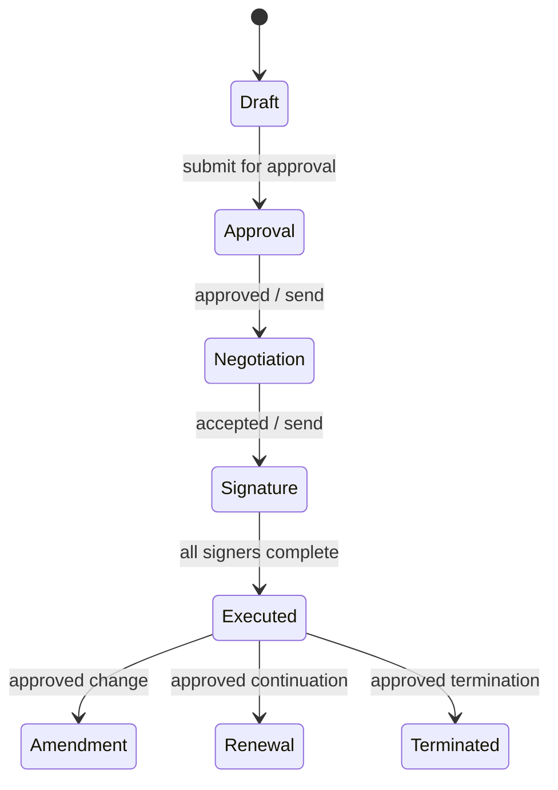

# Zoho Contracts Engineering and Automation Knowledge Base

**Document ID:** GH-ZOHO-CONTRACTS-KB  
**Program:** GH Real Estate / Sylvara systems knowledge base  
**Research cutoff:** 2026-07-20  
**Primary audience:** ChatGPT, Codex, solution architects, administrators, and maintainers  
**Source policy:** Official Zoho Contracts API, help, and pricing documentation plus the supplied GH system maps  
**Evidence labels:** `DOC-VERIFIED`, `LIVE-METADATA REQUIRED`, `TENANT-SPECIFIC`, `VOLATILE`, `GH-POLICY`, `DESIGN RECOMMENDATION`, `DOC-GAP`, `DOC-DRIFT`

> **AI ingestion directive.** Zoho Contracts is the contract-lifecycle and controlled-authoring system. It is not CRM's operational relationship database, Zoho Sign's independent envelope API, Books' ledger, or WorkDrive's general file repository. Never invent contract-type, field, clause, counterparty, contact, department, user, or contract API names. Discover the live contract-type schema through the documented `/allfields` metadata endpoint, preserve immutable IDs/API names, and validate the contract's present stage before every transition. Do not overwrite an executed agreement. Do not put agreements, counterparty data, credentials, signing links, or production payloads in GitHub, prompts, logs, or test fixtures.

## 1. Retrieval contract for AI agents

### 1.1 Evidence rules

| Label | Meaning | Required behavior |
|---|---|---|
| `DOC-VERIFIED` | Supported by an official page in the source registry | Recheck for high-risk production work because APIs can change |
| `LIVE-METADATA REQUIRED` | Value is generated or configured in the tenant | Query the tenant or use a recent sanitized export; never infer from a label |
| `TENANT-SPECIFIC` | Depends on organization, contract type, role, edition, data center, or integration | Resolve before designing payloads or lifecycle automation |
| `VOLATILE` | Limit, plan entitlement, credit use, or regional availability | Verify immediately before implementation or purchase |
| `GH-POLICY` | Required by supplied GH architecture/change-control material | Treat as binding until an approved decision supersedes it |
| `DESIGN RECOMMENDATION` | Engineering control inferred from documented behavior | Validate against business, legal, security, and tenant requirements |
| `DOC-GAP` | Not published clearly in the reviewed official material | Do not guess; obtain live evidence or Zoho support confirmation |
| `DOC-DRIFT` | Two parts of current official documentation conflict | Do not choose silently; verify in a controlled target-environment test or with Zoho support |

### 1.2 Non-negotiable rules

1. Resolve the legal entity, Contracts organization, data center, contract type, contract-type version, department, requester, counterparty, contact, and connection before a write.
2. Treat display labels as presentation, not API contracts. Use the API names and IDs returned by Contracts.
3. CRM owns approved pre-authoring operational facts. Contracts owns drafting, clause/template selection, review, approval, negotiation, signature handoff, amendment, renewal, extension, termination, obligations, and the resolved agreement snapshot.
4. A signed or executed contract is immutable evidence. Correct it through an approved amendment/renewal/termination process, not a record overwrite.
5. A successful API response means the request was accepted, not that the business outcome is legally or operationally complete. Retrieve current state and reconcile dependent systems.
6. Never log OAuth tokens, negotiation passwords, signer emails, contract text, party details, documents, or unredacted error payloads.
7. Do not confuse Contracts' built-in Zoho Sign lifecycle actions with the standalone Zoho Sign API. Define one owner for each envelope.

## 2. Product role and GH/Sylvara system boundary

`DOC-VERIFIED` Zoho Contracts is a contract lifecycle management platform with contract-type templates, a clause library, authoring, approvals, negotiation/redlining, electronic signature integration, amendments, renewals, extensions, termination, obligations, reports, counterparties, access controls, and activity/version history.

`GH-POLICY` The intended ownership map is:

| Fact or artifact | Owning system | Contracts relationship |
|---|---|---|
| Inquiry, applicant, tenant/contact, property, unit, deal/application status | CRM | Approved inputs arrive from CRM; Contracts returns lifecycle status and references |
| Accounting customer/vendor, invoice, payment, credit, deposit liability, ledger | Books/Billing | Contracts supplies approved commercial terms; finance owns postings |
| Draft, clauses, negotiation, approval, signed agreement state, obligations | Contracts | Authoritative lifecycle and resolved agreement snapshot |
| Recipient authentication, signature fields, signing evidence, completion certificate | Zoho Sign | Sign owns envelope/action evidence; Contracts may orchestrate its native Sign integration |
| Controlled document copy, property file, inspection evidence | WorkDrive | Store final/approved controlled copies and external IDs, not a second editable contract |
| Public website and approved portal entry | Sites/Creator | Never expose Contracts IDs, signing credentials, or agreement files directly |
| Source code, schemas, tests, sanitized metadata | GitHub | No executed documents, tenant PII, secrets, or live payloads |

### 2.1 Selection rule

- Use Contracts when the artifact needs governed authoring, clauses, review, negotiation, approval, signature routing, renewal/termination, or obligation tracking.
- Use Sign directly when the document is already final and only an independent signature envelope is needed. Do not create both a Contracts-managed and standalone envelope for the same agreement.
- Use WorkDrive for controlled storage and collaboration that is not contract lifecycle state.
- Use CRM/Creator for operational forms and workflow state; do not recreate a CLM in a custom module unless an approved gap analysis requires it.

## 3. Editions, entitlements, and regional variability

`VOLATILE` The public pricing page reviewed at the cutoff lists Free, Standard, Professional, and Premium capabilities. It advertises plan-dependent allowances for contracts, counterparties, templates, obligations, CRM integration, audit logs, in-person signing, intake, and related features. Zoho One is shown with Premium access, and included Zoho Sign capability is described as comparable to the corresponding Sign plan. Pricing, quotas, included credits, add-ons, and region availability can change and must not be encoded as permanent architecture.

The page snapshot included examples such as 25 contracts per user per month and 500 counterparties for Standard, with higher tiers described as unlimited, and Free with small user/contract/counterparty/template limits. These are procurement hints only. Verify the subscribed organization, remaining credits, enabled integration, and current tenant UI before deployment.

`VOLATILE` SMS authentication, third-party qualified signatures/eSignatures, e-stamping, and some regional providers can consume Sign credits. Region and plan determine availability. Treat credit exhaustion as an operational failure mode and monitor it.

### 3.1 Lite-user boundary

The pricing material describes Lite users as limited participants for actions such as approval/rejection, collaboration, e-signature, and obligations. Never authorize an integration based on the marketing role name. Verify the API principal's actual Contracts permissions and endpoint response.

## 4. OAuth, data centers, base URI, and scopes

### 4.1 OAuth 2.0

`DOC-VERIFIED` Contracts uses OAuth 2.0. Send the access token as:

```http
Authorization: Zoho-oauthtoken <access_token>
```

Access tokens are time-limited and revocable. Store refresh/client credentials only in a managed secret store or approved Zoho Connection. Separate read, metadata, write, lifecycle-transition, and administrative principals where practical.

### 4.2 Data-center-aware hosts

The documented Contracts application hosts are:

| Data center | Contracts host |
|---|---|
| United States | `contracts.zoho.com` |
| Europe | `contracts.zoho.eu` |
| India | `contracts.zoho.in` |
| Australia | `contracts.zoho.com.au` |
| Japan | `contracts.zoho.jp` |
| Canada | `contracts.zohocloud.ca` |
| Saudi Arabia | `contracts.zoho.sa` |

Append `/api/v1` to the exact verified host from the table. Do not build the hostname from a generic suffix token because Canada uses `zohocloud.ca`:

```text
https://{verified-contracts-host}/api/v1
```

Use the organization's actual data center and OAuth account domain. Do not copy `.com` examples into another region.

### 4.3 Scope families

The official scope list includes:

```text
contracts.clm.ALL
contracts.meta.READ
contracts.meta.CREATE
contracts.meta.UPDATE
contracts.meta.DELETE
contracts.contracts.CREATE
contracts.contracts.READ
contracts.contracts.UPDATE
contracts.contracts.DELETE
contracts.contracts.GET
contracts.contracts.ALL
```

Some lifecycle operations additionally require scopes belonging to the integrated editor or signer. For example, the documented negotiation action requires `ZohoWriter.documenteditor.all`; the documented signature action also lists Zoho Sign scopes. Follow the exact endpoint page and use the smallest workable set. Scope does not override the user's organization role or record permissions.

### 4.4 Connection registry

Maintain a sanitized registry containing connection name, environment, DC, organization, purpose, owner, OAuth scopes, authorized Zoho user/role, creation/rotation dates, dependent functions, and revocation procedure. The connection name is `LIVE-METADATA REQUIRED`; never assume one from an example.

## 5. Entity and lifecycle model

### 5.1 Core entities and identifiers

| Entity | Key identifiers/attributes | Safe use |
|---|---|---|
| Organization | organization ID/API name, name, currency, account owner, Zoho org identity | Establish tenant/legal-entity context |
| Contract type | `apiName`, ID, version state, intent, Party A/B roles, enabled state | Determines template and field schema |
| Contract | `apiName`, `resourceId`, `contractId`, type, stage, system status, source | Persist immutable identifiers; route by current stage |
| Contract field | `apiName`, `uniqueId`, ID, meta/data/display types, sequence | Build payload only from live metadata |
| Clause | API name/ID, version, alternatives, contract-type placement | Managed legal content; never silently replace |
| Counterparty | counterparty ID/API name and approved organization details | External party authority, distinct from free-form input |
| Counterparty contact | contact ID, email, role | Negotiator/signing routing; validate person and authority |
| Department/user | ID/API name/email, active state, role | Requester, owner, approval participants |
| Obligation | ID/API name, owner, due date, status, contract link | Post-execution commitments and evidence |
| Signer/signing info | signer ID/order/role, Sign service/status | Signing configuration and lifecycle projection |

`DESIGN RECOMMENDATION` Persist both the Contracts immutable identifier and the CRM/source-system identifier in a governed cross-reference table. Do not use title, counterparty name, email, or filename as a unique key.

### 5.2 Contract source value

The create/update documentation defines `source` values:

| Value | Meaning |
|---:|---|
| `1` | Created within Zoho Contracts |
| `2` | Imported into Zoho Contracts |
| `3` | Created by an integrated application, such as CRM |

Treat `source` as documented provenance, not authorization. Preserve a separate immutable business operation key and source record ID.

### 5.3 State machine

Contracts exposes both stage and system-status information. Documented transition examples include draft completion, approval pending, negotiation review pending, and sign pending. Other lifecycle states are tenant/product behavior and must be retrieved, not guessed.



This diagram is a business abstraction, not an exhaustive API state list. Before a transition, retrieve the contract and relevant signing/approval state; after it, retrieve again and reconcile.

## 6. Contract-type and field discovery

### 6.1 Mandatory discovery sequence

1. Resolve the Contracts organization and DC.
2. `GET /api/v1/admin/orginfo` and confirm expected organization/currency.
3. List contract types and select by approved immutable `apiName`, not label alone.
4. Retrieve the contract type and confirm it is enabled and the intended published version.
5. Call `GET /api/v1/admin/contracttypes/{contractTypeApiName}/allfields`.
6. Build a versioned sanitized manifest of every accepted input field, nested input API name, type, required/default rules, and business owner.
7. Resolve referenced departments, users, counterparties, and contacts.
8. Validate a synthetic payload in a nonproduction/test contract type or approved canary.

### 6.2 `/allfields` metadata

`DOC-VERIFIED` The response contains `meta` and `documentFields`. Important properties include `apiName`, `id`, `uniqueId`, `sequenceNumber`, `metaType`, `dataType`, `displayType`, and added/modified metadata.

Documented value mappings:

| Property | Value | Meaning |
|---|---:|---|
| `metaType` | `1` | System field |
| `metaType` | `3` | Custom field |
| `dataType` | `1` | Boolean |
|  | `2` | Number |
|  | `3` | String |
|  | `4` | Date |
|  | `5` | Index |
|  | `6` | Text |
|  | `7` | Currency |
|  | `8` | Term |
|  | `9` | Percentage |
|  | `10` | Phone |
|  | `11` | Email |
| `displayType` | `1` | Input |
|  | `2` | Dropdown |
|  | `6` | Date |

`LIVE-METADATA REQUIRED` These numeric mappings describe data representation; they do not define all validation, mandatory, choice, related-field, locale, currency, or template behavior. Capture and test the actual response.

### 6.3 Sanitized schema manifest

```yaml
verified_at: "2026-07-20T00:00:00Z"
environment: "sandbox-or-controlled-test"
organization_api_name: "<live value>"
contract_type:
  api_name: "<live value>"
  id: "<live metadata id>"
  version_state: "<live value>"
  intent: "<live value>"
fields:
  - meta_api_name: "<live value>"
    input_api_names: ["<live value>"]
    data_type: "<live value>"
    display_type: "<live value>"
    required_by_policy: true
```

The manifest contains no contract content, names, email addresses, property addresses, or production IDs if it will live in GitHub.

## 7. REST resource and endpoint map

All paths are relative to the DC-aware `/api/v1` base unless shown otherwise. This is a practical map, not a promise that every operation is enabled in every plan/role.

### 7.1 Organization and metadata

| Operation | Method and path | Scope/notes |
|---|---|---|
| Organization information | `GET /admin/orginfo` | `contracts.meta.READ` or `ALL` |
| Contract types list | `GET /contracttypes` | Metadata read/ALL per endpoint |
| Contract type detail | `GET /contracttypes/{apiName}` | Current page documents `contracts.contracts.READ` or `contracts.contracts.ALL` |
| Create contract type | `POST /admin/contracttypes` | `contracts.meta.CREATE`/ALL; privileged configuration change |
| Update contract type | documented update operation on `/admin/contracttypes/{apiName}` | Verify current method; protect published versions |
| Contract-type fields | `GET /admin/contracttypes/{contractTypeApiName}/allfields` | `contracts.meta.READ`; required discovery |
| Departments list | `GET /departments` | Read/ALL per endpoint |
| Create department | `POST /admin/departments` | `contracts.meta.CREATE`; duplicate can return 409/code 2236 |

### 7.2 Contracts

| Operation | Method and path | Important behavior |
|---|---|---|
| Create | `POST /contracts` | `source`, `inputfields`, optional clause overrides |
| Get one | `GET /contracts/{apiName}` | Retrieve before/after every stateful action |
| Update | official page documents `UPDATE /contracts/{apiName}` | The unusual HTTP verb is explicitly shown; verify client/proxy support and current docs before implementation |
| All-contracts list | `GET /allcontracts` | Admin privilege; `contracts.contracts.GET`/ALL |
| Obligation-contracts list | `GET /obligationcontracts` | Use documented sort/filter contract |
| Complete draft | `POST /contracts/{apiName}/actions/complete-draft` | Lifecycle transition, not idempotent without guard |
| Import signed contract file | `POST /contracts/uploadfile?module=uploadSignedDetail`, then `POST /importcontract` | Multipart first; `source=2`; sensitive file handling |
| Import draft contract | `POST /uploadcontract` | Multipart contract/document; verify field contract |
| Transfer ownership | documented update action at `/admin/actions/transferownership` | Payload maps contract API names to owner email; privileged bulk mutation |

### 7.3 Counterparties, approvals, negotiation, obligations

| Operation | Method and path | Important behavior |
|---|---|---|
| Create counterparty | `POST /counterparties` | Deduplicate against approved identity; CREATE/ALL |
| Submit for approval | `POST /contracts/{apiName}/actions/send-for-approval` | Response can project `approval-pending` |
| Send for negotiation | `POST /contracts/{apiName}/actions/send-for-negotiation` | Supplied users overwrite existing negotiators; first is primary |
| Create obligation | `POST /contracts/{contractApiName}/obligations` | Contract-linked post-execution commitment |
| List obligations | documented contract/obligations list endpoint | Retrieve exact filters/path from current page |
| Pending obligations | `GET /pendingobligations?direction=desc&sortBy=dueDate` | Read/ALL; pagination behavior must be verified |
| Delete obligation | documented delete-obligation endpoint | Destructive; validate stage/policy and retain audit evidence |

The negotiation request can include `users[]` with counterparty-contact `id`, `permissions` (`7` edit, `3` comment, `1` view), `deliveryMode` (`1` email, `2` offline), and an offline password. The first user is primary and can edit/submit review; the documented request overwrites existing negotiators. Never include a password in source or logs.

### 7.4 Signature through Contracts

| Operation | Method and path | Important behavior |
|---|---|---|
| Get signers | `GET /contracts/{apiName}/signers` | Returns interparty, receiver, and third-party signer groups |
| Edit signature details | Endpoint block: `PUT /contracts/{apiName}/signers`; sample curl: `UPDATE` | `DOC-DRIFT`: verify the accepted verb in a controlled non-production test or with Zoho support; reminder days, completion period, signer groups/order/auth are restricted in some active/expired states |
| Get signing settings | `GET /contracts/{apiName}/signinginfo` | Sign service, paper mode, cycle, status, reminders |
| Send for signature | `POST /contracts/{apiName}/actions/send-for-signature` | Signature fields must already exist for every signer |

The documented send action requires Contracts create/all plus Zoho Sign document/account access. Error cases include duplicate signer email and invalid/missing/negative/excess signing order. Use the signer ID/order and contract API name as identity; email is mutable personal data, not an idempotency key.

### 7.5 Signing status codes

The signing-settings page documents numeric status values including:

| Code | Meaning |
|---:|---|
| `10` | Expired |
| `12` | In progress |
| `14` | Completed |
| `33` | Recalled |
| `34` | Declined |
| `36` | Not initiated |
| `38` | Expired and cannot be extended |

`LIVE-METADATA REQUIRED` Persist raw code plus retrieved timestamp and mapped meaning. Unknown future values must route to review, not default to success/failure.

## 8. Create/update payload model

The documented create payload uses `source`, `inputfields[]`, and optional `clauseOverrides[]`:

```json
{
  "source": 3,
  "inputfields": [
    {
      "metaApiName": "<from-allfields>",
      "inputs": [
        {
          "inputApiName": "<from-live-schema>",
          "inputValue": "<approved-value>"
        }
      ]
    }
  ]
}
```

Common documented system input concepts include contract type, title, description, requester name/department, Party B name, counterparty primary contact, term, effective/end-date options, dates, renewal and notice details, amount, and tax. They are examples of available concepts, not permission to copy guessed names. Use the current Create Contract page and live `/allfields` response together.

`clauseOverrides[]` includes a clause `apiName`, `alternatives`, and `action` (`0`/`1` in current documentation). Clause alteration is a legal-content change. Require an approved clause playbook, legal owner, reason, version, and audit trail; never have an AI select or remove clauses solely from free-form text.

### 8.1 Contract-type configuration

The contract-type APIs describe attributes such as name, description, intent, Party A/Party B, categories, approval workflow, state, and `isCustom`. The detail response documents:

- version state: `1` Draft, `2` Published, `3` Published with subsequent modification;
- intent: `0` Others, `1` Buy, `2` Sell;
- Party A/B: `0` My Company, `1` Counterparty;
- enabled/disabled state.

`GH-POLICY` A lease type should explicitly identify the owning legal entity and counterparty role; shared type names must not cause GH and Sylvara agreements to cross organizations.

## 9. Lists, filtering, pagination, and reconciliation

`DOC-GAP` The reviewed public pages do not publish one universal pagination/search contract or one global rate-limit table for every Contracts endpoint. Do not project CRM, Books, or Sign paging conventions onto Contracts.

For every list endpoint:

1. Copy only query parameters documented on that endpoint.
2. Record returned paging metadata and ordering in a synthetic test.
3. Use stable ordering where available and persist a high-water mark plus IDs.
4. Deduplicate by immutable ID/API name.
5. Stop only when the documented terminal condition is reached.
6. Reconcile counts and retain a replayable cursor/checkpoint outside source code.

Never infer absence from the first page. Never use title/email/name as the only search key. For bulk jobs, use bounded batches and a dead-letter/review queue.

## 10. Errors, retries, idempotency, and concurrency

### 10.1 Documented errors

Common official examples include:

- `401 OAUTH_SCOPE_MISMATCH` — client lacks the required scope;
- `403 NO_PERMISSION` — authorized user lacks permission;
- `400 AUTHORIZATION_FAILED` — insufficient privilege for the operation;
- `400 INVALID_REQUEST_METHOD` — method does not match the endpoint;
- `404 INVALID_URL_PATTERN` — wrong path;
- `409` conflicts such as duplicate department, invalid signer email, or invalid order;
- `500 INTERNAL_ERROR` — unexpected server failure.

Parse both HTTP status and Zoho error code/message. Redact payloads before logging. Permission/scope/schema/state errors are non-retryable until corrected.

### 10.2 Retry policy

`DOC-GAP` No official public global request-per-minute budget was found in the reviewed Contracts API material. Observe any response headers/current admin documentation and obtain support confirmation for high-volume design.

- Retry transport failures, `429` if returned, and selected `5xx` responses with capped exponential backoff and jitter.
- Honor `Retry-After` where present.
- Do not blindly retry create/import/transition/send operations after an ambiguous timeout.
- Before retrying an ambiguous write, query by persisted operation key/cross-reference and current contract stage.
- Route schema, permission, illegal-transition, duplicate, and validation errors to review.

### 10.3 Idempotency design

The public documentation reviewed does not advertise a universal idempotency header. Create an integration operation record containing:

```text
operation_key | source_system | source_record_id | legal_entity
contract_type_api_name | payload_hash | contracts_api_name/id
requested_at | outcome | last_reconciled_at
```

Before create, lock the operation key, search the cross-reference, and create once. After a timeout, retrieve/reconcile. Before send-for-approval, negotiation, or signature, ensure the current stage is eligible and the target participants/configuration match. Concurrency conflicts must fail closed to human review.

## 11. Approval, negotiation, signature, and obligation controls

### 11.1 Approval

- Map approval workflows by immutable tenant identifier or approved contract-type configuration.
- Validate requester/department/owner and amount/currency thresholds before submission.
- Do not interpret API submission as approval.
- Retrieve the latest stage and preserve approver evidence through the product audit trail.

### 11.2 Negotiation

- Resolve contacts and authority before adding negotiators.
- Because the send request overwrites the list, compare intended and existing participants and require explicit confirmation for removals.
- Grant the minimum permission: view, comment, or edit.
- Use offline delivery/password only under approved secure out-of-band handling.
- Redlined text is untrusted contractual input; require legal review of deviations from approved clauses.

### 11.3 Signature

- Add a field for every intended signer before sending.
- Confirm unique signer email, deterministic signing order, authentication method, reminders, completion deadline, service, and paper/e-stamp mode.
- Text-tag syntax must render as one complete physical line; never split a tag across line wraps or template elements.
- One field belongs to one recipient. Use recipient numbering consistently.
- A governed date-tag example from the supplied project material is `{{SD:R1:(dateformat="MM/dd/yyyy hh:mm a z")}}`; smoke-test every production template because rendering is tenant/template sensitive.
- Zoho Sign supports up to 25 recipients per request in its current API limits; Contracts/Sign plan and regional limits are `VOLATILE`.
- On completion, retrieve/retain the completion evidence and archive the approved packet in WorkDrive. GitHub receives only sanitized schema/tests.

### 11.4 Obligations

Model an obligation with contract ID, owner, due date/time zone, recurrence if supported, status, evidence location, reminder/escalation policy, and source clause. Reconcile pending obligations daily. An obligation alert is not proof of performance; close only with approved evidence. Avoid duplicating the same obligation in CRM, Creator, and Contracts without one owner and explicit projections.

## 12. Security, privacy, audit, and retention

- Separate organizations/connections for distinct legal entities where required; never route solely by user-supplied company name.
- Enforce least privilege, MFA, active-user review, department/role review, and periodic OAuth token revocation.
- Limit contract-type/template/clause publishing to approved administrators and legal owners.
- Keep drafts, negotiations, signed PDFs, completion certificates, imports, exports, and counterparty lists out of GitHub and AI project files.
- Store controlled document copies in WorkDrive with access classification, retention, legal hold, recovery, and external-sharing policy.
- Minimize logged fields to operation key, sanitized IDs, stage, status, timestamps, HTTP/code category, and correlation ID.
- Treat counterparties, contacts, agreement terms, signatures, property addresses, rent/deposits, identification, bank information, and credentials as sensitive.
- Preserve activity/version/audit records; do not treat an integration log as the only legal evidence.
- Define deletion/retention with legal counsel. API delete capability does not establish authority to delete an agreement.

## 13. Testing, deployment, and rollback

`DOC-GAP` No separate public Contracts sandbox contract was found in the reviewed pages. Use a dedicated test organization or approved test contract types/data, synthetic parties, non-deliverable test inboxes, and clearly watermarked nonbinding templates. Confirm plan/credit implications.

### 13.1 Minimum test matrix

- OAuth token expiry, revoked token, wrong DC, insufficient scope, insufficient role;
- every selected contract type, published/draft/modified/disabled state;
- all required and optional `/allfields` types, nested inputs, dropdowns, dates/time zones, currency/percent/term;
- duplicate/missing counterparty/contact/department/user;
- create, retrieve, update, ambiguous timeout, duplicate operation, concurrent update;
- clause override allow/deny and alternative selection;
- approval accepted/rejected/recalled/re-entry paths;
- negotiation participant overwrite, permissions, offline password, redline handoff;
- every signer role/order/authentication, invalid duplicate emails, reminders, expiration, decline/recall/completion;
- import draft/signed document size/type/malware/quarantine controls;
- obligation create/list/overdue/close/delete and evidence;
- final WorkDrive archive, CRM status projection, Books term mapping, and reconciliation.

### 13.2 Deployment packet

Include requirement/owner, architecture decision, legal-entity and organization map, live metadata snapshot/hash, approved template/clause versions, scopes/connection owner, code/config diff, tests, synthetic evidence, risk assessment, rollout/canary, monitoring, and rollback. Repository merge is not tenant deployment evidence.

Rollback generally means disabling the initiating automation, stopping new transitions, restoring a prior published template/configuration where supported, and reconciling in-flight contracts. Never “roll back” an executed agreement by deleting or overwriting it.

## 14. GH Real Estate and Sylvara implementation patterns

### 14.1 Approved lease-generation pattern

1. CRM reaches an approved, explicit lease-ready state.
2. Server retrieves the CRM record by immutable ID and validates legal entity, property, unit, parties, approved economics, dates, and policy version.
3. Resolve tenant Contracts organization/DC, connection, contract type, and `/allfields` manifest.
4. Acquire `operation_key = lease:{source-record-id}:{approved-version}`.
5. Find-or-create approved counterparty/contact; never duplicate solely because spelling changed.
6. Create one contract and persist Contracts API name/ID in the cross-reference.
7. Retrieve it and compare critical terms with the approved source snapshot.
8. Complete draft and submit approval only when validation passes.
9. Human/legal review handles clause deviations and negotiation.
10. Configure and send signature exactly once after approval.
11. On completed signing state, archive signed packet/certificate to the controlled WorkDrive location.
12. Project lifecycle/reference back to CRM; hand approved billing terms to Books/Billing through a separate idempotent operation.

### 14.2 Renewal/amendment pattern

Never update the executed lease record to represent new terms. Create the product-supported amendment/renewal/extension lifecycle, link it to the original, preserve the effective date and approvals, and update CRM/Books only when the new instrument reaches the agreed authoritative milestone.

### 14.3 Obligation pattern

For renewal notice, inspection, insurance, compliance, or property deliverable:

- resolve the source clause and authoritative contract;
- create a single owned obligation with due date/time zone and responsible role;
- send operational projections to CRM/Creator only as references;
- store evidence in WorkDrive;
- escalate overdue items and reconcile closure.

### 14.4 Cross-entity separation

Maintain an allowlisted routing table:

```text
legal_entity -> Contracts org/DC -> OAuth connection -> contract types
             -> CRM org/module -> WorkDrive team/folder policy -> Books org
```

Reject an unrecognized entity. Never select an organization from free-form party name, email domain, property address, or browser parameter.

## 15. Anti-patterns

- Guessing field API names from template labels.
- Creating a contract before confirming organization, legal entity, contract type version, and current field metadata.
- Treating a title, email, counterparty name, or property address as a unique key.
- Retrying a timed-out create/send without reconciliation.
- Letting an AI silently choose or remove legal clauses.
- Using both Contracts' Sign integration and standalone Sign for the same agreement.
- Updating executed agreement terms in place.
- Granting every negotiator edit permission.
- Sending a signature request before fields, recipient order, authentication, and deadline are validated.
- Storing signed documents, template exports, or negotiation passwords in GitHub.
- Coding to plan limits or status codes without a current verification path.
- Assuming list results are complete without tested pagination.

## 16. Preflight and operational checklists

### 16.1 Before implementation

- [ ] Legal entity, Contracts organization, data center, edition, roles, and credits verified.
- [ ] Contract type/API name/version/state and `/allfields` captured.
- [ ] Template, clause library, categories, approvals, party roles, and deviations approved.
- [ ] Counterparty/contact/department/user identity and deduplication rules defined.
- [ ] OAuth scopes, connection owner, secret storage, rotation, and revocation tested.
- [ ] Immutable operation key and cross-reference/reconciliation tables exist.
- [ ] Signature ownership (Contracts-managed or standalone Sign) is explicit.
- [ ] WorkDrive archive and CRM/Books projections are defined.
- [ ] Test, deployment, monitoring, in-flight handling, and rollback approved.

### 16.2 Before each write/transition

- [ ] Retrieve current contract and relevant signing/approval state.
- [ ] Verify legal entity, contract type, source record/version, and payload hash.
- [ ] Confirm action is legal from the current stage.
- [ ] Confirm participants, permissions, order, authentication, and deadlines.
- [ ] Check an existing successful/in-progress operation with the same key.
- [ ] Redact observability; record correlation ID and expected postcondition.
- [ ] Retrieve after the action and reconcile the postcondition.

## 17. Unknowns and required live verification

The following were not fully documented as universal contracts in the reviewed public material and must not be invented:

- a global Contracts API request-rate/concurrency limit;
- one universal pagination/search schema across list endpoints;
- a universal idempotency request header;
- a standalone public webhook/event catalog for every Contracts lifecycle event;
- sandbox parity and promotion tooling;
- all stage/system-status values and allowed transitions;
- exact API names, validation rules, options, clause alternatives, and template layout for a tenant;
- plan/region availability, Sign credits, e-stamp/QES providers, and integrated service behavior;
- whether the unusual documented `UPDATE` HTTP verb is accepted through the chosen HTTP client/proxy at implementation time.

Obtain live tenant evidence, current official documentation, a controlled test, or written Zoho support confirmation.

## 18. Official source registry

All sources accessed and verified 2026-07-20. URLs are exact and intentionally retained for future revalidation.

### API foundations

- OAuth Authentication — https://www.zoho.com/contracts/api/understanding-the-basics/oauth-authentication.html
- List of Scopes — https://www.zoho.com/contracts/api/understanding-the-basics/list-of-scopes.html
- Data Centers vs Base URI Structure — https://www.zoho.com/contracts/api/understanding-the-basics/data-centers-vs-base-uri-structure.html
- Get Organization Info — https://www.zoho.com/contracts/api/organization/get-organization-info.html

### Contracts and lifecycle

- Create Contract — https://www.zoho.com/contracts/api/contract/create-contract.html
- Get Contract — https://www.zoho.com/contracts/api/contract/get-contract.html
- Update Contract — https://www.zoho.com/contracts/api/contract/update-contract.html
- Get All Contracts List — https://www.zoho.com/contracts/api/contract/get-all-contracts-list.html
- Get Obligation Contracts List — https://www.zoho.com/contracts/api/contract/get-obligation-contracts-list.html
- Complete Contract Draft — https://www.zoho.com/contracts/api/contract/complete-contract-draft.html
- Import Contract — https://www.zoho.com/contracts/api/contract/import-contract.html
- Import Draft Contract — https://www.zoho.com/contracts/api/contract/import-draft-contract.html
- Transfer Contract Ownership — https://www.zoho.com/contracts/api/contract/transfer-contract-ownership.html
- Submit for Approval — https://www.zoho.com/contracts/api/approval/submit-for-approval.html
- Send for Negotiation — https://www.zoho.com/contracts/api/negotiation/send-for-negotiation.html

### Contract types, fields, parties, and obligations

- Get Contract Types List — https://www.zoho.com/contracts/api/contract-type/get-contract-types-list.html
- Get Contract Type — https://www.zoho.com/contracts/api/contract-type/get-contract-type.html
- Create Contract Type — https://www.zoho.com/contracts/api/contract-type/create-contract-type.html
- Update Contract Type — https://www.zoho.com/contracts/api/contract-type/update-contract-type.html
- Get Contract Type Template All Fields — https://www.zoho.com/contracts/api/contract-type/get-contract-type-template-all-fields.html
- Create Counterparty — https://www.zoho.com/contracts/api/counterparty/create-counterparty.html
- Create Department — https://www.zoho.com/contracts/api/department/create-department.html
- Get Departments List — https://www.zoho.com/contracts/api/department/get-departments-list.html
- Create Obligation — https://www.zoho.com/contracts/api/obligations/create-obligation.html
- Get Obligations List — https://www.zoho.com/contracts/api/obligations/get-obligations-list.html
- Get Pending Obligations List — https://www.zoho.com/contracts/api/obligations/get-pending-obligations-list.html
- Delete Obligation — https://www.zoho.com/contracts/api/obligations/delete-obligation.html

### Signature integration

- Get Signers List — https://www.zoho.com/contracts/api/signature/get-signers-list.html
- Edit Signature Details — https://www.zoho.com/contracts/api/signature/edit-signature-details.html
- Get Sign Settings — https://www.zoho.com/contracts/api/signature/get-sign-settings.html
- Send for Signature — https://www.zoho.com/contracts/api/signature/send-for-signature.html
- Send for Signature (help) — https://help.zoho.com/portal/en/kb/contracts/user-guide/signature/articles/send-for-signature
- Sign Credits Add-on — https://help.zoho.com/portal/en/kb/contracts/admin-guide/subscription-details/articles/sign-credits-add-on

### Administration, authoring, and commercial reference

- Adding and Managing Clauses — https://help.zoho.com/portal/en/kb/contracts/admin-guide/clause-library/articles/adding-and-managing-clauses
- Managing Contract Types — https://help.zoho.com/portal/en/kb/contracts/admin-guide/contract-types/creation-and-management/articles/managing-contract-types
- Creating Contract Types and Building Templates — https://help.zoho.com/portal/en/kb/contracts/admin-guide/contract-types/creation-and-management/articles/creating-contract-types-and-building-templates
- Tailor the Settings — https://help.zoho.com/portal/en/kb/contracts/getting-started/articles/tailor-the-settings-as-per-your-needs
- Zoho Contracts Pricing — https://www.zoho.com/contracts/pricing.html
