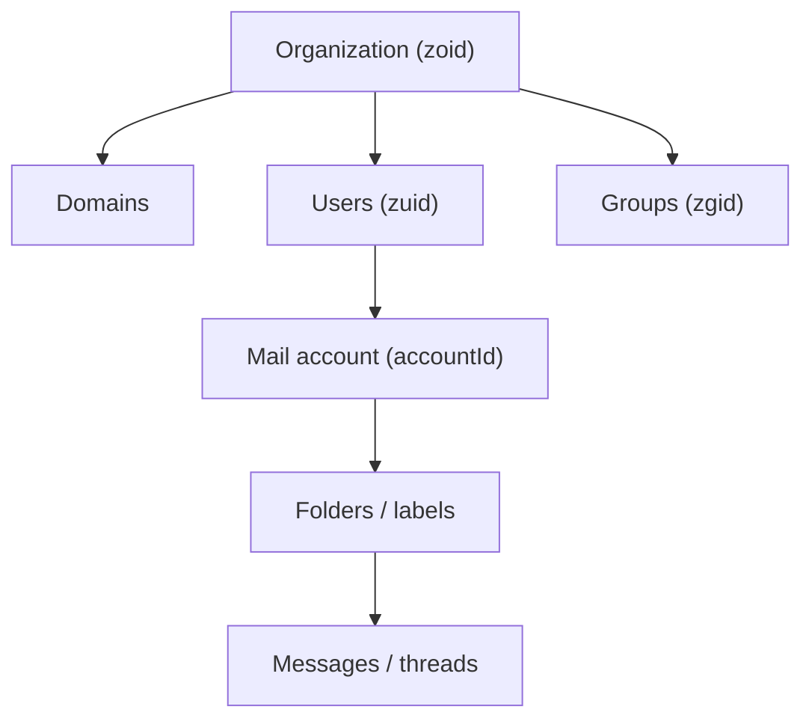
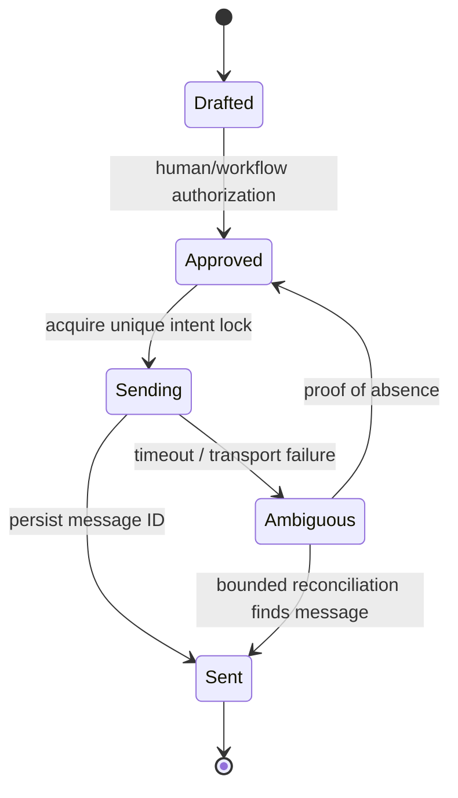

# Zoho Mail — Administration, Mailbox API, Automation, and Governance Knowledge Base

**Document ID:** GH-ZOHO-MAIL-KB  
**Research cutoff:** 2026-07-20  
**Audience:** ChatGPT, Codex, solution architects, Deluge/Catalyst developers, security administrators, and GH Real Estate / Sylvara system owners  
**Evidence policy:** Official Zoho documentation only. Tenant edition, regional host, live identifiers, permissions, policies, retention, and operational limits must be revalidated before implementation.

## AI execution contract

1. **Zoho Mail is a governed human mailbox and collaboration system, not a bulk-mail platform.** Do not turn the mailbox API into an ungoverned transactional or marketing sender. Zoho’s own limits page directs marketing use to Zoho Campaigns and transactional use to ZeptoMail.
2. **Resolve the organization’s data center first.** Never send a token or mailbox request to a guessed `.com` host.
3. **Discover organization, account, user, group, folder, label, message, and thread identifiers.** Treat them as opaque strings; never infer them from an email address.
4. **Request endpoint-specific least-privilege OAuth scopes.** An admin API and a mailbox message API have materially different impact.
5. **Never log or commit secrets, addresses, subject lines, message bodies, attachments, headers, search terms, legal-hold results, or live identifiers.** Mail data is sensitive even when the message body looks routine.
6. **Require user/admin authorization for sends, replies, deletes, account/domain/group changes, retention changes, holds, exports, or expunge operations.** Drafting is not authorization to send.
7. **Do not assume generic mailbox webhooks exist.** The official SIEM webhook described below transports selected audit events; it is not a documented “new message” webhook.
8. **Use a durable outbox and deterministic intent key for API sends.** A network timeout after a POST is an ambiguous outcome; reconcile before retry.
9. **Prefer current official documentation and tenant policy over this snapshot.** Sending reputation limits, feature availability, plan entitlements, retention, and DC inventory are volatile.

### Evidence labels

| Label | Meaning |
|---|---|
| `[OFFICIAL]` | Directly documented by Zoho in a cited source. |
| `[INFERENCE]` | Recommended architecture based on documented behavior, not a Zoho guarantee. |
| `[LIVE-METADATA REQUIRED]` | Must be discovered in the organization or current documentation before implementation. |
| `[VOLATILE]` | Limit, plan, feature, UI, or regional detail that can change. |
| `[BETA]` | Feature currently documented as beta or limited rollout. |

## 1. Product role in the GH / Sylvara architecture

Zoho Mail owns employee mailboxes, mail folders/labels/messages, organization email domains, users, groups, mail policies, and administrative mail controls. It may be an evidence source, but it should not replace CRM relationship records, Books transactions, Contracts/Sign audit trails, WorkDrive document storage, or a purpose-built outbound platform.

| Concern | System of record | Zoho Mail role |
|---|---|---|
| Customer, tenant, applicant, owner, vendor identity and consent | Zoho CRM / approved consent registry | Human communication channel; link messages to the canonical party only under approved matching rules. |
| Transactional app email | ZeptoMail or the approved product notification engine | Do not use a staff mailbox as a high-volume application sender. |
| Marketing campaigns and unsubscribe management | Zoho Campaigns or approved marketing platform | Mailbox API is not a campaign engine. |
| Employee correspondence | Zoho Mail | Primary mailbox artifact and human workflow. |
| Contract execution evidence | Zoho Contracts / Sign | Email can notify or transmit a link, but does not substitute for the signature audit trail. |
| Accounting evidence | Zoho Books | Email can carry an invoice link; it is not the ledger or payment status. |
| Durable files | WorkDrive / contract/accounting system | Attachments may be ingested under policy; avoid uncontrolled duplication. |
| Cross-system orchestration | Catalyst | Secret storage, validation, polling cursors, queues, dedupe, redaction, and audit correlation. |

`[INFERENCE]` For GH/Sylvara, automate metadata and workflow around mail more readily than message content. A CRM communication record can hold the Zoho Mail message ID, direction, participants in restricted form, sent/received time, owner, business purpose, and status. Store body/attachments only where records policy requires and access controls match the mailbox.

## 2. Regional hosts and base URLs

The official Getting Started page lists the following Mail hosts. Its prose and table count are inconsistent, so use the table and verify live behavior rather than relying on a count.

| Data center | Mail host | API base form |
|---|---|---|
| United States | `https://mail.zoho.com` | `https://mail.zoho.com/api/...` |
| Europe | `https://mail.zoho.eu` | `https://mail.zoho.eu/api/...` |
| India | `https://mail.zoho.in` | `https://mail.zoho.in/api/...` |
| Australia | `https://mail.zoho.com.au` | `https://mail.zoho.com.au/api/...` |
| Japan | `https://mail.zoho.jp` | `https://mail.zoho.jp/api/...` |
| Canada | `https://mail.zohocloud.ca` | `https://mail.zohocloud.ca/api/...` |
| China | `https://mail.zoho.com.cn` | `https://mail.zoho.com.cn/api/...` |
| UAE | `https://mail.zoho.ae` | `https://mail.zoho.ae/api/...` |
| Saudi Arabia | `https://mail.zoho.sa` | `https://mail.zoho.sa/api/...` |

`[LIVE-METADATA REQUIRED]` The mailbox web URL is one clue to the data center. Bind one OAuth client/configuration to one approved regional base and reject cross-region redirect or token use. Do not accept a caller-provided arbitrary host; choose from an allowlist.

## 3. OAuth 2.0 and permissions

- The Mail API uses OAuth 2.0.
- Send `Authorization: Zoho-oauthtoken <access-token>`.
- The cited OAuth guide states access tokens are valid for one hour; a refresh token is used to obtain replacements. Treat refresh tokens as high-impact secrets.
- Mail endpoint pages use scope patterns such as `ZohoMail.<resource>.<permission>`, with permissions including `ALL`, `READ`, `CREATE`, `UPDATE`, or `DELETE` as supported. Some overview prose may show shorthand; use the endpoint page’s current exact scope.
- Organization administrative APIs may require an organization admin/super admin in addition to OAuth scope.
- Keep separate OAuth clients/connections for read-only mailbox indexing, message send, and organization administration. Do not give a routine integration domain/user-provisioning scope.
- Revoke refresh tokens and keys under joiner/mover/leaver and incident response processes.

### Safe token handling

Store client ID, client secret, refresh token, and access tokens in Catalyst secrets or another approved secret manager. Never store them in Deluge source, CRM fields, Creator forms, GitHub Actions logs, URLs, or shared ChatGPT project files. Redact `Authorization`, cookies, and response headers from support traces.

## 4. Object model and identifier discovery



| Identifier | Object | Discovery method | Caution |
|---|---|---|---|
| `zoid` | Organization | Get Organization Details | Do not confuse with account or user ID. |
| `zuid` | Organization user | User/account detail APIs | A user may have more than one address/account context. |
| `accountId` | Mail account | Get all/specific user details | Required in most mailbox paths. Resolve by authenticated account and approved address. |
| `zgid` | Group | Group APIs | Email alias is not a stable substitute for group ID. |
| folder ID | Mail folder | Folders API | Folder names can be localized/renamed. Use ID. |
| label ID | Mail label | Labels API | Labels and folders are distinct concepts. |
| `messageId` | Message | Search/list response | Treat as opaque. Use with the owning `accountId`. |
| `threadId` | Thread | Message/thread response | One thread contains multiple messages; do not log a whole thread when one message is authorized. |
| task/bookmark/note ID | Collaboration object | Respective API | Keep separate from CRM task IDs or WorkDrive file IDs. |

`[INFERENCE]` Maintain a deployment manifest with organization ID, approved account IDs, purpose, regional base, OAuth connection, allowed operations, and retention classification. Do not commit addresses or live IDs to a public or broadly readable repository.

## 5. API resource map

The official API index groups these surfaces:

| Resource family | Typical capabilities | Risk level |
|---|---|---|
| Organization | Read organization, subscription/storage, spam lists, allowed IPs and settings | High administrative impact |
| Domain | Add/read/verify domains; primary/hosting; MX/SPF/DKIM; aliases; catch-all; notification; delete | Critical identity/delivery impact |
| Users / accounts | Add, fetch, update, suspend/enable or otherwise administer users and mail accounts as documented | Critical identity/access impact |
| Groups | Create/read/update/delete groups and membership/settings | High data-distribution impact |
| Mail policy | Read/configure mail policy and assignment | High governance impact |
| Accounts | Account details and settings | High, depending on mutation |
| Folders | List/create/update/delete folders and counts | Medium; deletion/move can affect evidence discovery |
| Labels | List/create/update/delete labels and assign/remove on messages | Medium |
| Email messages | Send, draft, reply, list/search/read, move, flag, archive, spam, delete, attachments/MIME | High privacy and customer impact |
| Signatures | Read/manage account signatures | Medium; can alter legal/brand presentation |
| Threads | Read/manage thread state | High privacy impact |
| Tasks, bookmarks, notes | Collaboration artifacts | Medium; do not conflate with CRM records |
| Logs / anti-spam | Administrative audit/delivery/security operations | High security and privacy impact |

## 6. Organization, domains, users, and groups

### Organization API

The documented organization paths are under `/api/organization` and `/api/organization/{zoid}`. Capabilities include retrieving organization details and administration-related data such as subscription/storage, spam lists, and allowed IPs. Use read-only discovery first and cache safe organization metadata.

### Domain API

The documented family is under `/api/organization/{zoid}/domains...` and includes:

- list and retrieve domains;
- add a domain;
- verify domain ownership;
- set primary domain and hosting state;
- retrieve or configure validation/security information such as MX, SPF, and DKIM as documented;
- manage aliases, catch-all behavior, and notification settings;
- delete a domain.

Domain changes affect mail routing and identity. Require two-person review for primary domain, MX, SPF, DKIM, catch-all, or deletion changes. DNS change success in an API response does not prove global DNS propagation or successful delivery. Verify live DNS, inbound and outbound test delivery, DKIM alignment, and rollback records.

### Users and accounts

Documented organization user/account routes include:

```text
POST /api/organization/{zoid}/accounts
GET  /api/organization/{zoid}/accounts
GET  /api/organization/{zoid}/accounts/{user-or-account-selector}
```

The Add User page documents fields such as primary email address and password among its request data. Do not embed permanent initial passwords in automation. `[INFERENCE]` Use a secure identity onboarding process, a one-time credential or invitation where supported, enforced MFA/SSO policy, manager/HR authorization, and automatic expiration of any bootstrap secret.

Provisioning controls:

- normalize and verify the approved primary address and aliases;
- check license/storage availability;
- apply the intended mail policy and group memberships;
- record role owner and employee/vendor lifecycle source;
- prevent account creation from an untrusted CRM form;
- test suspension/recovery and transfer/retention behavior before automating offboarding.

### Groups

Group APIs manage group identity, membership, and settings. A mail group can distribute sensitive messages to many recipients. Before a mutation, calculate a diff, exclude inactive/external identities unless explicitly approved, enforce owner review, and retain an audit correlation. Never infer a group’s purpose from its display name alone.

## 7. Mailbox endpoint catalog

Paths below use `{base} = https://mail.<regional-domain>/api` and `{accountId}` for the approved mailbox.

### Message creation and retrieval

| Operation | Method and relative path | Key behavior |
|---|---|---|
| Send email / save draft / use template | `POST /api/accounts/{accountId}/messages` | Operation depends on documented request fields. Message send requires approved from/to and content. |
| Upload attachment | `POST /api/accounts/{accountId}/messages/attachments` | Upload first as documented, then reference attachment metadata in the message. Enforce type/size/malware policy. |
| Reply | `POST /api/accounts/{accountId}/messages/{messageId}` | Reply semantics depend on documented action/request. Resolve correct message/account and require send authorization. |
| List messages in a folder/view | `GET /api/accounts/{accountId}/messages/view` | Use folder/view parameters and paging from current endpoint docs. Suitable for bounded reconciliation. |
| Search messages | `GET /api/accounts/{accountId}/messages/search` | Uses `searchKey`, time/paging and other documented filters. Search results contain sensitive metadata. |
| Get message content/details | Current message content/details endpoints under the same account path | Fetch only when the business purpose requires body access. Metadata-first processing is safer. |
| Get headers | Current headers endpoint | Headers can contain sensitive routing and authentication information; restrict access/logging. |
| Get attachment info | Current attachment-info endpoint | Inspect metadata before downloading content. |
| Download attachment | Current attachment-content endpoint | Stream to restricted scanning/storage; do not stage in public temp paths. |
| Get original MIME | Current original-message/MIME endpoint | High sensitivity; can include all headers, body parts, and attachments. |

### Message mutations

The Email Messages API documents mutations such as:

- mark read/unread;
- move between folders;
- add/remove flags;
- add/remove labels;
- archive;
- mark spam/not spam where supported;
- delete.

Many are performed through a documented update route such as:

```text
PUT /api/accounts/{accountId}/updatemessage
```

with an action and message IDs in the request. Use only actions listed on the current endpoint page. For multi-message mutations, enforce a maximum batch, confirm every message belongs to the approved account, and record per-item results. Delete and spam operations require explicit authorization and a retention/hold precheck.

### Folder, label, and thread APIs

Use folder and label IDs rather than names. Before folder deletion, enumerate message counts and policy dependencies. Thread updates can affect multiple messages; preview the target set. If CRM linkage is message-specific, do not overwrite it with a thread-level assumption.

## 8. Sending an email

The current Send Email endpoint documents a JSON request with fields including:

| Field | Requirement / meaning |
|---|---|
| `fromAddress` | Required; must be an authorized address/alias for the account. |
| `toAddress` | Required; recipient address list in the format accepted by the endpoint. |
| `ccAddress`, `bccAddress` | Optional; high risk for accidental disclosure. Resolve and preview recipients. |
| `subject` | Optional/required by business policy; sanitize for logs. |
| `content` | Message content. Treat as sensitive. |
| `mailFormat` | `html` or `plaintext`; current default documented as HTML. Sanitize generated HTML and links. |
| `askReceipt` | `yes` or `no` where supported; a receipt is not reliable proof of human reading. |
| `encoding` | Current default documented as UTF-8. |
| scheduling fields | `isSchedule`, `scheduleType` and for custom scheduling a timezone plus `scheduleTime` (`MM/DD/YYYY HH:MM:SS` in current docs) | Confirm timezone visibly. Scheduled delivery is not a legal deadline guarantee. |

### Send guardrail

Before any API send:

1. Resolve the mailbox and allowed `fromAddress` from configuration.
2. Resolve recipients through CRM/approved contacts and normalize addresses.
3. Display To/CC/BCC, subject, business purpose, body/template revision, attachment names, and scheduled timezone for confirmation.
4. Verify consent/transactional basis and suppression policy in the authoritative system.
5. Scan attachments and verify size/type.
6. Acquire an outbox idempotency key.
7. Send exactly once and persist the returned message ID/result.
8. If the response is ambiguous, search/reconcile by a private correlation marker and narrow time window before retry.

`[INFERENCE]` A safe intent key can be:

```text
mailbox | business-purpose | canonical CRM party | template revision | attachment set hash | scheduled window
```

Do not put the intent key in a customer-visible subject. A controlled custom header is preferable only if the API officially supports it; otherwise maintain server-side correlation.

## 9. Search, pagination, polling, and deduplication

The official Search Emails page documents:

- `GET /api/accounts/{accountId}/messages/search`;
- `searchKey` query expression;
- `receivedTime` in milliseconds, with a documented default behavior relative to the current time;
- `start`, currently documented with a default of 1;
- `limit`, currently documented as 1–200 with a default of 10;
- `includeto` option.

`[LIVE-METADATA REQUIRED]` Verify exact search grammar and timestamp inclusivity. Do not place raw customer search terms in routine logs.

### Polling pattern when no generic mailbox webhook is available

1. Poll only approved accounts/folders.
2. Use a stored watermark plus a deliberate overlap window.
3. Page deterministically under the documented `start`/`limit` behavior.
4. Deduplicate by `(accountId, messageId)`.
5. Fetch body/attachments only after metadata matches an approved business rule.
6. Advance the durable watermark only after all page items are committed.
7. On a partial failure, rerun the overlap window; idempotency prevents duplicates.
8. Respect the API rate limit and back off.

Do not infer exact delivery ordering from timestamps alone. Clock/timezone conversion, delayed delivery, moves, and mailbox rules can reorder visible results.

## 10. Attachments and MIME

Attachment endpoints separate metadata and content. Recommended processing:

- read attachment info first;
- enforce an allowlist/denylist, size ceiling, and business-purpose check;
- stream rather than load an entire large file into memory;
- malware scan before WorkDrive/CRM ingestion;
- derive a cryptographic hash for dedupe and evidence correlation;
- store the file once in the approved authoritative repository;
- retain the Mail account/message/attachment ID link;
- strip active content or reject risky formats according to policy;
- never send attachment bytes or original MIME to a model unless explicitly authorized and minimized.

`[VOLATILE]` The official rate/limits page currently states an incoming-message size maximum of 40 MB and up to 500 attachments. Sending and API endpoints can have different limits. Always validate the operation-specific limit and the organization’s policy.

## 11. Rate limits, sending restrictions, and platform fit

The current official Rates and Limits page documents:

- Mail API limit of 30 requests per minute;
- dynamic external outgoing limits of roughly 50–500 messages/hour based on reputation and behavior;
- internal outgoing of 1,000 messages/hour;
- incoming of 100 messages/minute;
- per-message recipient maxima (currently 150 external on paid plans, 100 on free plans, and 500 internal);
- bulk/burst sending is unsupported;
- temporary sending restrictions can last up to an hour;
- Zoho Campaigns is the recommended marketing channel and ZeptoMail the recommended transactional channel.

All values are `[VOLATILE]` and can vary by plan, account reputation, region, security action, and product changes. The limits are safety ceilings, not throughput targets.

### Retry policy

| Condition | Behavior |
|---|---|
| 401/token expired | Refresh once through the controlled token service; stop if still unauthorized. |
| 403 / permission / policy | Do not retry. Resolve scope, role, account state, sender authorization, or restriction. |
| Validation / bad address | Do not retry unchanged. Return a redacted field error. |
| 429 / rate limit | Queue and use exponential backoff with jitter; obey a server retry hint if present. |
| 5xx on GET | Retry a bounded number of times. |
| Timeout/5xx on send | Treat as ambiguous. Reconcile before retrying. |
| Sending restriction | Stop new sends, preserve outbox, alert the owner, and investigate reputation/content/security. Do not rotate mailboxes to evade controls. |

The Getting Started page describes a standard error wrapper containing a `status.code`, `status.description`, and optional `data.moreInfo`. Parse defensively and preserve an internal vendor error code; do not expose sensitive diagnostic content to end users.

## 12. Webhooks, SIEM, and event boundaries

The official SIEM integration is documented as a paid-plan beta capability that sends selected audit-event categories to systems such as Splunk, Loggly, QRadar, or a custom webhook. Supported payload styles described include JSON array and newline-delimited JSON, with custom headers and an OTP-confirmed setup process.

Critical boundary:

- This is an **audit-event webhook**, not a documented new-mail/message-change webhook.
- Do not build mailbox ingestion by assuming SIEM events contain complete messages.
- Treat SIEM payloads as at-least-once unless the live contract states otherwise; deduplicate by event identity/hash and time.
- Store the custom webhook credential as a secret, validate it at Catalyst, restrict source/schema, and rotate it.
- Keep the receiver fast; enqueue processing and return a bounded response.

For mailbox business automation, use the documented API with bounded polling or an approved current product integration. Periodic reconciliation remains necessary.

## 13. Retention, eDiscovery, backup, audit, and legal holds

Zoho distinguishes retention/eDiscovery from backup. Retention archives content under policy for discovery/compliance; backup is oriented toward recovery of deleted mail. Do not claim one substitutes for the other.

The current eDiscovery documentation describes availability for Workplace Professional and Mail Premium, with eligible subscriptions capable of covering services such as Mail, Cliq, and WorkDrive. `[VOLATILE]` Confirm actual plan and licensed users.

### Governance responsibilities

| Capability | Purpose | Required control |
|---|---|---|
| Retention policy | Preserve messages according to organizational policy | Legal/records owner approval, documented duration/scope, test queries, periodic review. |
| Investigation | Search and collect potentially relevant records | Matter authorization, least-privilege investigator role, query audit, protected exports. |
| Hold | Prevent deletion/expiry for defined custodians/content | Legal authorization, precise scope, start/end record, release approval. |
| Export | Produce investigation material | Encryption, chain-of-custody hash, access log, secure transfer, retention/disposal rule. |
| Recovery | Restore eligible deleted content | Ticket, user/owner approval, validation that hold/retention is not disturbed. |
| Expunge | Permanently remove eligible content | Extremely destructive; verify legal hold/retention and require dual authorization. |
| Backup | Operational recovery | Tested restore procedure, separate access, documented retention and coverage. |

Administrative log reports include admin activity, calendar activity, mail delivery/rejection/rule logs, and related reporting. The cited page currently states one-year default retention for specified admin/calendar audit logs; `[LIVE-METADATA REQUIRED]` never generalize that to all Mail logs or all plans. Export only under policy and verify coverage.

## 14. Security and privacy controls

### Administrative separation

- Separate mailbox reader, sender, organization administrator, and eDiscovery roles.
- Use named service accounts/connections with narrow purpose; avoid a super-admin user’s refresh token.
- Require MFA/SSO and monitor admin changes.
- Review allowed IPs and session policies without locking out emergency access.
- Use organization groups for legitimate distribution, with periodic membership attestation.

### Content protection

- Subjects, snippets, senders/recipients, headers, message IDs, filenames, and search terms are sensitive metadata.
- Mask or tokenize email addresses in general logs.
- Do not index full mailboxes into CRM or an AI vector store by default.
- Do not train or prompt on privileged, applicant-screening, banking, identity-document, medical/accommodation, or legal-hold content without explicit approved handling.
- Strip quoted thread history from model input unless needed.
- Treat HTML as untrusted; sanitize before rendering.
- Do not follow links or execute attachment content automatically.

### Domain and deliverability controls

Manage MX, SPF, DKIM, aliases, catch-all, and sender policies through change control. Test authentication/alignment with approved tools and sample mail. Catch-all mailboxes increase spam and misdelivery risk. A successful API send does not prove inbox delivery, identity, consent, or message reading.

## 15. Integration patterns for GH / Sylvara

### A. CRM-linked correspondence

1. A user explicitly selects a CRM party and message in an authorized mailbox.
2. Catalyst verifies the mailbox owner and CRM access.
3. Match exact normalized address against approved CRM contact points; surface collisions.
4. Create/update a CRM communication-link record keyed by `(accountId, messageId)`.
5. Store metadata and a secure deep reference. Store body/attachment only under policy.
6. Do not overwrite CRM consent or status from an email footer/string match.

### B. Inbound application intake

Prefer a purpose-built form/Creator portal. If an approved mailbox is used:

- poll a dedicated folder/account at a bounded rate;
- filter by metadata and a non-secret correlation value;
- validate attachments and sender relationship;
- create a review queue, not an automatic tenant/accounting mutation;
- send acknowledgments through ZeptoMail/product notification or an explicitly approved mailbox flow;
- prevent mail loops and duplicate acknowledgments.

### C. Invoice/statement communication

Books creates the invoice/statement and owns delivery/payment status. Mail may send a human explanation or approved link. Never copy bank details from an inbound message into Books automatically. Any payment-instruction change requires out-of-band verification under fraud controls.

### D. Contract/signature communication

Contracts/Sign sends and audits the signature process. Mail may correlate notifications, but an email reply does not replace the Sign completion certificate unless legal/business policy explicitly says so. Store executed artifacts in the approved repository, not an employee’s Inbox alone.

### E. Bookings notifications

Choose Bookings, ZeptoMail, or a Mail mailbox as the owner of each event template. Do not send a second “booked/rescheduled/canceled” email from Catalyst merely because an appointment webhook/poll is received.

## 16. Safe implementation patterns

### API request skeleton

```text
base = allowlisted regional Mail API base
token = secret-service access token for narrow OAuth connection
accountId = deployment manifest value authorized for this purpose

request headers:
  Authorization: Zoho-oauthtoken <redacted>
  Content-Type: application/json

never log:
  Authorization
  full request/response body
  message content or recipient lists
```

### Send outbox state machine



### Poller pseudocode

```text
load mailbox cursor and overlap window
GET messages/search or messages/view using documented paging
for each result:
  if (accountId, messageId) already committed: skip
  classify metadata under approved rule
  fetch body/attachment only if necessary
  write restricted normalized record and processing outcome atomically
advance cursor after full page/window commit
back off on 429 and stop on authorization errors
```

## 17. Testing and deployment checklist

### Discovery

- [ ] Confirm organization data center and regional Mail base.
- [ ] Discover `zoid`, approved `zuid`/`accountId`, folder IDs, label IDs, groups, domains, and aliases.
- [ ] Document each OAuth connection, exact scope, user/admin role, owner, and revocation procedure.
- [ ] Confirm plan entitlements, API rate, sending restrictions, retention/eDiscovery, SIEM status, and audit coverage.
- [ ] Choose Zoho Mail vs ZeptoMail vs Campaigns for every outbound use case.

### Functional tests

- [ ] Read/search/list with paging, time overlap, duplicate message, moved message, and empty page.
- [ ] Token expiry, wrong region, missing scope, suspended account, 429, and 5xx.
- [ ] Draft vs send vs scheduled send with explicit timezone.
- [ ] To/CC/BCC collision and unauthorized sender alias.
- [ ] Unicode, HTML sanitization, long subject/content, and plain-text fallback.
- [ ] Attachment metadata, download, malware rejection, size boundary, duplicate hash, and restricted format.
- [ ] Ambiguous send response reconciles without duplicate email.
- [ ] SIEM event receiver validates secret/schema and deduplicates.
- [ ] Folder/label/message mutations affect only the approved account/items.

### Governance tests

- [ ] Retention policy, legal hold, export, release, recovery, and expunge procedures reviewed by authorized owners.
- [ ] API workflow respects holds and does not destroy evidence.
- [ ] Audit/report access and export retention are verified.
- [ ] CRM link does not disclose mailbox content to unauthorized CRM users.
- [ ] No live PII, mail body, attachments, tokens, or IDs in source control/test fixtures.

### Rollout

- [ ] Start with a synthetic test account and approved nonproduction domain/address if available.
- [ ] Enable read-only metadata flow before content retrieval or sending.
- [ ] Turn on one mailbox/folder and one business rule at a time.
- [ ] Monitor API usage, send restrictions, error codes, duplicates, and privacy incidents.
- [ ] Rollback disables job/webhook/connection without deleting message or audit evidence.

## 18. Anti-patterns

- Sending marketing blasts through `POST /messages`.
- Using a staff mailbox as the application’s universal transactional identity.
- Granting an organization-admin token to a read-only message indexer.
- Hard-coding `.com`, `zoid`, `accountId`, folder IDs, or aliases.
- Logging subjects, recipient lists, bodies, attachments, or MIME in standard application logs.
- Blindly retrying a timed-out send.
- Assuming a delivery response means inbox placement or human reading.
- Using SIEM webhooks as if they were complete new-message webhooks.
- Automatically creating CRM contacts from every inbound sender.
- Letting an LLM follow mail links, open attachments, or send replies without authorization.
- Treating backup as retention/eDiscovery, or retention as a complete backup strategy.
- Changing MX/SPF/DKIM/catch-all without a tested rollback.
- Deleting mail while a hold, retention rule, investigation, or records requirement may apply.

## 19. AI/Codex task recipe

Before generating runnable Zoho Mail code, answer:

1. Is this human mailbox communication, transactional email, or marketing? If transactional/marketing, why is Mail—rather than ZeptoMail/Campaigns—the approved system?
2. What is the organization’s data center and allowlisted API base?
3. Which organization/user/account owns the data and action?
4. What exact endpoint and least-privilege scope are required?
5. Are recipients and sender aliases resolved and previewed?
6. What authoritative CRM record and consent/business-purpose record applies?
7. What PII/content can be read, logged, stored, or sent to a model?
8. What is the cursor/dedupe strategy for reads or the outbox idempotency strategy for sends?
9. Could a retention policy or legal hold prohibit the mutation?
10. What synthetic test, approval, audit evidence, rollback, and live-document validation are required?

If these are unknown, produce a read-only discovery tool or implementation questionnaire—not a guessed admin change or send.

## 20. Official source registry

All sources accessed 2026-07-20.

### API platform, OAuth, and resource indexes

- [Zoho Mail API — API Index](https://www.zoho.com/mail/help/api/)
- [Zoho Mail API Overview](https://www.zoho.com/mail/help/api/overview.html)
- [Getting Started with Zoho Mail API](https://www.zoho.com/mail/help/api/getting-started-with-api.html)
- [Using OAuth 2.0 for Zoho Mail API](https://www.zoho.com/mail/help/api/using-oauth-2.html)
- [Organization API](https://www.zoho.com/mail/help/api/organization-api.html)
- [Domain API](https://www.zoho.com/mail/help/api/domain-api.html)
- [Users API](https://www.zoho.com/mail/help/api/users-api.html)
- [Add a User to an Organization](https://www.zoho.com/mail/help/api/post-add-user-to-org.html)
- [Group API](https://www.zoho.com/mail/help/api/group-api.html)
- [Email Messages API](https://www.zoho.com/mail/help/api/email-api.html)
- [Send an Email](https://www.zoho.com/mail/help/api/post-send-an-email.html)
- [Search Emails](https://www.zoho.com/mail/help/api/get-search-emails.html)
- [Get Attachment Information](https://www.zoho.com/mail/help/api/get-attach-info.html)
- [Get Attachment Content](https://www.zoho.com/mail/help/api/get-attachment-content.html)

### Administration, limits, and governance

- [Zoho Mail Rates and Limits](https://www.zoho.com/mail/help/adminconsole/rates-and-limits.html)
- [Retention and eDiscovery](https://www.zoho.com/mail/help/adminconsole/retention-and-ediscovery.html)
- [Set Up eDiscovery](https://www.zoho.com/mail/help/adminconsole/ediscovery-setup.html)
- [Manage eDiscovery](https://www.zoho.com/mail/help/adminconsole/manage-ediscovery.html)
- [Investigation and Hold](https://www.zoho.com/mail/help/adminconsole/investigation-and-hold.html)
- [Email Backup and Recovery](https://www.zoho.com/mail/help/adminconsole/backup-and-recovery.html)
- [Logs and Reports](https://www.zoho.com/mail/help/adminconsole/log-reports.html)
- [SIEM Integration](https://www.zoho.com/mail/help/adminconsole/siem.html)
- [Email Filters](https://www.zoho.com/mail/help/filters.html)

---

**Maintenance rule:** Before every material Mail automation or administrative change, revalidate the regional host, endpoint scope, account/folder identifiers, sending limits, retention/hold impact, and correct product channel (Mail vs ZeptoMail vs Campaigns). Record the validation date and approver.
