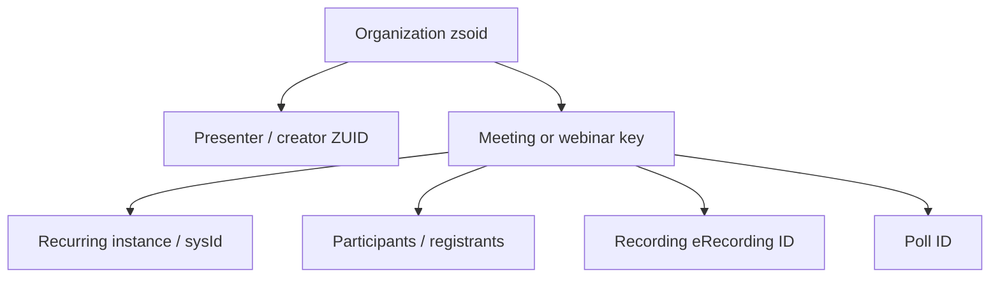

# Zoho Meeting — Meetings, Webinars, Recordings, Reports, SDK, and Automation Knowledge Base

**Document ID:** GH-ZOHO-MEETING-KB
**Research cutoff:** 2026-07-20
**Audience:** ChatGPT, Codex, solution architects, Zoho administrators, Catalyst/Deluge developers, and GH Real Estate / Sylvara system owners
**Evidence policy:** Official Zoho Meeting, Zoho Webinar, and Zoho help/API documentation only. Tenant edition, data center, identifiers, integration state, participant limits, storage, recording/transcription behavior, and current API contracts must be revalidated before implementation.

## AI execution contract

1. **Zoho Meeting owns online-session transport and session artifacts; it does not own the customer, appointment, deal, maintenance request, contract, or legal outcome.** CRM, Bookings, Creator, Contracts/Sign, and Books retain those truths.
2. **Resolve the data center and organization (`zsoid`) before every API call.** Never hard-code `.com`, copy a sample organization ID, or infer an ID from an email address.
3. **Treat meeting/webinar creation, edits, registrant mail, participant invitations, recording, transcription, sharing, and deletion as externally visible or privacy-sensitive actions.** Require explicit authorization and a preview.
4. **Never disclose presenter start links, embedded host tokens, passwords, access codes, registration keys, OAuth material, recording URLs, transcripts, participant email addresses, IP/location data, or live IDs in Git, prompts, PDFs, client logs, or CRM text fields.**
5. **Do not confuse `joinLink`, `registrationLink`, `startLink`, `meetingEmbedUrl`, or recording `shareUrl`.** A host/start link is privileged; a registration URL is not proof of registration; a join URL is not an attendance record.
6. **Do not infer business outcomes from participant reports.** Join/leave times and duration do not prove identity, attention, consent, service delivery, lease notice, or agreement.
7. **Do not assume a generic Meeting webhook exists.** No official general session/recording/participant webhook contract was found in the public API documentation reviewed at this cutoff. Use documented APIs, native integrations, or bounded reconciliation unless a current official event contract is verified.
8. **Recording and transcription require a separate approved purpose, notice/consent analysis, access policy, retention period, and deletion process.** Scheduling a session does not authorize recording it.
9. **Do not silently switch between Zoho Meeting's webinar surface and the separately branded Zoho Webinar API.** Their domains and scopes differ in current documentation.
10. **Prefer current endpoint pages and tenant metadata over this snapshot.** API paths, editions, regional availability, capacities, recording/transcription features, and SDK pricing are volatile.

### Evidence labels

| Label | Meaning |
|---|---|
| `[OFFICIAL]` | Directly documented by Zoho in a cited official source. |
| `[INFERENCE]` | Architecture/control recommendation based on documented behavior. |
| `[LIVE-METADATA REQUIRED]` | Discover from the target organization or current endpoint documentation. |
| `[VOLATILE]` | Plan, capacity, price, feature, or regional behavior can change. |
| `[GAP]` | Official documentation reviewed did not establish the needed contract. |

## 1. Product role and boundaries

| Concern | Authority | Zoho Meeting role |
|---|---|---|
| Lead, applicant, tenant, customer, vendor, and staff identity | Zoho CRM | Hosts communication after identity and purpose are resolved. |
| Customer appointment | Zoho Bookings | Provides the online conference for a confirmed appointment. |
| Calendar availability and event | Zoho Calendar | Reflects schedule and conference metadata; Calendar/Meeting sync behavior depends on event origin. |
| Maintenance request | Creator / CRM | Provides a video call if approved; does not close or classify the ticket. |
| Contract or signature | Contracts / Sign | Can host discussion; session attendance/recording is not execution evidence. |
| Payment/invoice | Books / Billing | Can host a support call; cannot alter ledger status. |
| Online meeting/webinar transport | Zoho Meeting | Session, organizer/presenter, link, participant report, recording, transcript, polls/engagement where supported. |
| Cross-system policy and reconciliation | Catalyst | Resolves IDs, protects secrets, queues, enforces recording/retention policy, and audits. |

For GH Real Estate, Meeting is appropriate for remote maintenance triage, applicant/tenant conferences, or vendor coordination only when a call is operationally useful. It should not replace the tenant portal, written notices, inspections, or signed forms. For Sylvara, Meeting is appropriate for discovery calls, demos, onboarding, and webinars coordinated by Bookings and CRM.

## 2. Authority ladder and product-name boundary

Use this authority order:

1. Live tenant edition, organization metadata, permissions, integration configuration, and API response.
2. Current official endpoint page for the exact Meeting/Recording/Poll/Webinar/SDK operation.
3. Current official Meeting security, integration, and user documentation.
4. This knowledge base.
5. Samples, remembered behavior, or inference.

Zoho's current documentation contains both:

- **Zoho Meeting webinar endpoints**, normally hosted on `meeting.zoho.*` and scoped `ZohoMeeting.webinar.*`; and
- **standalone Zoho Webinar endpoints**, commonly hosted on `webinar.zoho.*` and scoped `ZohoWebinar.webinar.*`.

Some official pages show mixed example hosts. `[LIVE-METADATA REQUIRED]` Choose the product actually licensed and the endpoint family shown by its current API documentation. Never rewrite one scope or host into the other by analogy.

## 3. Regional API roots

The documented root for the US data center is:

```text
https://meeting.zoho.com/api/v2
```

Zoho's Multi DC page lists:

| Data center | Meeting host | Root form |
|---|---|---|
| US | `meeting.zoho.com` | `https://meeting.zoho.com/api/v2` |
| Australia | `meeting.zoho.com.au` | `https://meeting.zoho.com.au/api/v2` |
| Europe | `meeting.zoho.eu` | `https://meeting.zoho.eu/api/v2` |
| India | `meeting.zoho.in` | `https://meeting.zoho.in/api/v2` |
| China | `meeting.zoho.com.cn` | `https://meeting.zoho.com.cn/api/v2` |
| Japan | `meeting.zoho.jp` | `https://meeting.zoho.jp/api/v2` |
| Canada | `meeting.zohocloud.ca` | `https://meeting.zohocloud.ca/api/v2` |
| Saudi Arabia | `meeting.zoho.sa` | `https://meeting.zoho.sa/api/v2` |

The page directs integrations to replace the sample `.com` host with the account's regional host. It does not license arbitrary suffix construction. The User Details response includes `redirectionServer`; validate it against an allowlist and store the resulting base per organization.

Some newer resource pages use `/meeting/api/v2/...` beneath the host while core CRUD pages use `/api/v2/...`. Preserve the exact path from the current endpoint page. Do not “clean up” the extra `/meeting` segment.

## 4. OAuth and organization discovery

All Meeting APIs use OAuth 2.0. Requests send:

```http
Authorization: Zoho-oauthtoken <access_token>
Content-Type: application/json;charset=UTF-8
```

Register the client in the Zoho API Console for the correct Accounts data center. Store client secret, refresh token, and access token only in an approved secret manager. Use separate clients/connections for scheduling, reports/recordings, and SDK operations.

### First call: current user and organization

```text
GET /api/v2/user.json
Scope: ZohoMeeting.manageOrg.READ
```

The response documents `zsoid`, `zuid`, `redirectionServer`, email/display data, admin/privileged flags, trial/paid/edition indicators, participant count, and Meeting/Webinar/recording entitlement fields. Use it to discover the organization and validate the region. Do not persist the whole response in general logs.

### Scope families

| Resource | Scope pattern |
|---|---|
| Organization/user discovery | `ZohoMeeting.manageOrg.READ` |
| Meetings | `ZohoMeeting.meeting.READ|CREATE|UPDATE|DELETE|ALL` |
| Meeting-hosted webinars | `ZohoMeeting.webinar.READ|CREATE|UPDATE|DELETE|ALL` |
| Recordings | `ZohoMeeting.recording.READ|DELETE` and any exact download scopes shown by the endpoint |
| AV SDK | `ZohoMeeting.sdk.READ` and other exact SDK scopes documented per operation |
| Standalone Zoho Webinar | `ZohoWebinar.webinar.*` rather than `ZohoMeeting.webinar.*` |

The recording download page currently names `ZohoMeeting.meetinguds.READ` and `ZohoFiles.files.READ`. Treat such unusual endpoint-specific scopes literally and revalidate them; do not replace them with a more plausible-looking scope.

## 5. Object and identifier model



| Field | Meaning and safe use |
|---|---|
| `zsoid` | Meeting organization ID; required by most paths. Discover through `/user.json`. |
| `zuid` / presenter / creator ZUID | Zoho user identity; resolve from tenant, not email alone. |
| `meetingKey` | Meeting or webinar server-generated identifier. Treat as opaque even when numeric. |
| `sysId` / `instanceId` | Event/recurrence instance identifier returned by relevant APIs; do not substitute meeting key. |
| `registerKey` / `registerId` | Webinar registration identity; sensitive and scoped to webinar/instance. |
| `erecordingId` | Recording identity used for recording-specific operations. |
| poll ID | Poll resource identity; scope by webinar key/instance where required. |
| `memberId` | Participant-report identity where returned; not automatically a CRM contact ID. |

Join, registration, host/start, embed, download, play, transcript, and summary URLs can carry privileged or long opaque tokens. Store restricted references only and never expose start/embed tokens to attendees.

## 6. Meeting CRUD API

Core meeting routes are scoped by `zsoid`:

| Operation | Method and relative path | Scope |
|---|---|---|
| List meetings | `GET /{zsoid}/sessions.json` | `ZohoMeeting.meeting.READ` |
| Get meeting | `GET /{zsoid}/sessions/{meetingKey}.json` | `ZohoMeeting.meeting.READ` |
| Create meeting | `POST /{zsoid}/sessions.json` | `ZohoMeeting.meeting.CREATE` |
| Edit meeting | `PUT /{zsoid}/sessions/{meetingKey}.json` | `ZohoMeeting.meeting.UPDATE` |
| Delete meeting | `DELETE /{zsoid}/sessions/{meetingKey}.json` | `ZohoMeeting.meeting.DELETE` |
| Participant report | `GET /{zsoid}/participant/{meetingKey}.json` | `ZohoMeeting.meeting.READ` |

The list API requires `listtype` (`all`, `past`, `today`, or `upcoming`), `index`, and `count` under the current contract. Use the returned count and bounded pages; do not assume an undocumented default or maximum.

Create/update use a `session` payload. Documented fields include:

| Field | Meaning |
|---|---|
| `topic` | Meeting title; required on create. Avoid sensitive case details. |
| `agenda` | Optional description; sensitive and potentially participant-visible. |
| `presenter` | Presenter Zoho user ID; required on create in current docs. |
| `startTime` | Scheduled start; confirm exact accepted format and zone live. |
| `duration` | Duration, shown in API examples as milliseconds. Revalidate units on endpoint. |
| `timezone` | Scheduled time zone. Use explicit IANA zone from tenant-supported list. |
| `participants` | Participant objects with email where accepted. Resolve recipients first. |

Response fields can include `meetingKey`, presenter/creator IDs, `startTime`, `endTime`, duration, time zone, `joinLink`, `startLink`, access code/password information, dial-in URL, and `meetingEmbedUrl`.

### Creation guardrail

1. Resolve CRM/Bookings record, organizer, and purpose.
2. Discover `zsoid`, region, presenter ZUID, entitlement, and exact endpoint.
3. Normalize start/duration/time zone and preview in America/Chicago plus participant-local zone where useful.
4. Resolve participants; show recipient list and notification consequence.
5. Acquire an internal intent lock.
6. Create once; persist returned meeting key and restricted link references.
7. If the POST outcome is ambiguous, reconcile the organizer's narrow upcoming-session window before retry.

The public create endpoint does not document a universal caller-supplied idempotency key. Blind retry can create duplicate sessions and invitations.

## 7. Webinar API within Zoho Meeting

Meeting's webinar CRUD uses:

| Operation | Method and relative path | Scope |
|---|---|---|
| List webinars | `GET /{zsoid}/webinar.json` | `ZohoMeeting.webinar.READ` |
| Get webinar | `GET /{zsoid}/webinar/{webinarKey}.json` | `ZohoMeeting.webinar.READ` |
| Create webinar | `POST /{zsoid}/webinar.json` | `ZohoMeeting.webinar.CREATE` |
| Edit webinar | `PUT /{zsoid}/webinar/{webinarKey}.json` | `ZohoMeeting.webinar.UPDATE` |
| Delete webinar | `DELETE /{zsoid}/webinar/{webinarKey}.json` | `ZohoMeeting.webinar.DELETE` |

List uses `listtype`, `index`, and `count`. Webinar responses add registration link, registrant/attendee counts, instance ID, and session-start/past indicators. Creation/editing uses topic, agenda, presenter, start time, duration, time zone, participants, and other current session fields.

Editing a webinar can notify registrants. Treat edit as a communication action: show changed fields, target instance/series, audience size, and send behavior. Delete removes the ability to host and requires explicit destructive approval.

### Registration and engagement surfaces

Official API pages document:

- bulk registration through `POST /api/v2/{zsoid}/register/{meetingKey}.json`, with `instanceId` and `sendMail` options;
- registration listing filtered by status and instance/system ID;
- attendee/registrant reports with names, emails, approval/registration status, join/leave time, duration, questions, and poll information;
- polls create, read/list, update, and delete under paths such as `/meeting/api/v2/{zsoid}/poll` and `/poll/{pollId}`, scoped with webinar permissions.

Bulk registration is high impact. Validate consent/source, deduplicate by authoritative CRM contact, cap batch size, preview whether Zoho sends mail, and persist per-registrant results. A successful registration is not attendance.

Do not import webinar Q&A, polls, or free-text responses into broad CRM notes without purpose, access controls, and retention policy. These fields can contain personal or confidential information.

## 8. Participant and attendee reports

Meeting participant report:

```text
GET https://{meeting-host}/api/v2/{zsoid}/participant/{meetingKey}.json
Query: index, count
Scope: ZohoMeeting.meeting.READ
```

Current responses can include participant count, role, join/leave timestamps, duration, source, email, avatar URL, and member ID. Webinar report variants include registration/approval status, registered time, country, questions, polls, and other engagement data.

Normalize provider timestamps to UTC while retaining source zone. Deduplicate repeated joins per participant/anonymous identity and preserve raw segments only in a restricted report store. Do not assume:

- email was verified as the person who attended;
- a participant was continuously present or attentive;
- duration means a service was delivered;
- lack of attendance authorizes cancellation fees or status changes;
- a country/region field is precise or appropriate for decision-making.

`[INFERENCE]` CRM may receive a minimal communication outcome such as “session held” after human review, with a restricted Meeting reference. Do not push full attendance telemetry into the standard contact timeline by default.

## 9. Recording, transcript, and summary APIs

Official Recording API pages document:

| Operation | Method and path | Scope |
|---|---|---|
| List recordings | `GET /meeting/api/v2/{zsoid}/recordings.json` | `ZohoMeeting.recording.READ` |
| Get by meeting key | `GET /meeting/api/v2/{zsoid}/recordings/{meetingKey}.json` | `ZohoMeeting.recording.READ` |
| Delete by eRecording ID | `DELETE /api/v2/{zsoid}/recordings/{erecordingId}.json` | `ZohoMeeting.recording.DELETE` |
| Download from returned URL | provider download URL | Endpoint page currently lists `ZohoMeeting.meetinguds.READ,ZohoFiles.files.READ` |

Responses can contain recording ID, resource name, duration, size, processing/status, creator, timestamps, play/download/share URLs, transcript/summary flags and download URLs, and access options. A `processingState` such as uploaded is not a business-retention decision.

### Recording governance

Before enabling or starting recording:

- identify federal/state/country call-recording and privacy requirements with counsel;
- provide required notice and capture consent in the approved workflow;
- define participants allowed in the session;
- classify the recording/transcript/summary;
- set access, sharing, storage, retention, legal-hold, and deletion ownership;
- decide whether AI transcription/summary is allowed for the content;
- prohibit applicant-screening, banking, access-code, medical/accommodation, or privileged content unless explicitly approved.

Returned download/share URLs are not durable public assets. Do not copy them into public WorkDrive links, CRM descriptions, or emails. If an approved recording must be retained, ingest it into a restricted repository with hash, source ID, capture time, access log, and policy—subject to Zoho terms and current endpoint behavior.

Delete is irreversible from the API perspective. Verify legal hold/records policy, exact `erecordingId`, and authorized approver; record deletion outcome without logging the URL or transcript.

## 10. Security modes and privacy

Zoho documents encryption in transit and at rest, MFA, privacy settings, action logs, and optional end-to-end encryption (E2EE). Current E2EE documentation states:

- professional Meeting edition;
- up to 25 attendees;
- a host/co-host-generated key not stored by Zoho;
- Chromium-based browser constraint and no mobile start/join;
- features unavailable in E2EE sessions include chat, polls, recording, phone audio, file sharing, whiteboard, video layouts, live transcription, Meeting Rooms, and specified screen-sharing methods.

All of these details are `[VOLATILE]`. Do not promise recording plus E2EE; current documentation explicitly makes them incompatible. If the key is lost, do not expect Zoho to recover it.

Encryption-at-rest documentation lists protected data including meeting passwords, user region/country, IP address, names, agenda, and integration tokens. This does not eliminate the need for access minimization, tenant policy, or restricted exports.

Use MFA, least-privilege org roles, waiting-room/lock/password controls where supported, presenter restrictions, and screen-sharing policy. Review the Action Log Viewer and admin audit coverage live. Avoid reusable meeting links for sensitive tenant or client matters.

## 11. Calendar, Bookings, CRM, and other integrations

### Calendar

Meeting and Calendar have documented two-way sync for owner-created Meeting events. Events created from Calendar with Zoho Meeting appear in both. A meeting created in Meeting creates a Calendar event. Recording access may also surface through Calendar.

Meetings originating in CRM or Bookings can appear in their respective app calendars rather than the same personal-calendar path. Test create/edit/cancel/recording behavior for each origin and pick one authority to avoid duplicate invitations.

### Bookings

Bookings can automatically provide Zoho Meeting links for virtual appointments. Let Bookings own service, staff, customer, appointment state, and notification template. Do not create a second Meeting session from Catalyst on the same appointment event unless the first integration is disabled by design.

### CRM and Projects/other Zoho apps

Zoho documents Meeting integrations across CRM, Projects, Connect, Mail, Calendar, Bookings, and other applications. Availability and plan requirements differ. An app's embedded view does not mean its API owns the Meeting record. Store the canonical Meeting key and source application record ID to prevent duplication.

## 12. AV SDK and embedding

Zoho Meeting's AV SDK embeds audio/video meeting capabilities into a web application. Current setup documentation describes domain registration/verification, OAuth client registration, a separate SDK plan/pricing, and initial free minutes. Treat all pricing/minute figures as `[VOLATILE]`.

Documented available SDK features include audio, video, screen sharing, reactions, meeting lock, recording, picture-in-picture, fullscreen, invitations, layouts, and settings. Current unavailable items include chat, whiteboard, shared material, notes, polls, co-host assignment, and breakout rooms.

SDK list endpoint example:

```text
GET /meeting/api/v2/{orgId}/sdk/sessions
Scope: ZohoMeeting.sdk.READ
```

An embedded meeting still processes sensitive audio/video. Enforce allowed origins, Content Security Policy, HTTPS, session-scoped tokens, authenticated portal access, tenant separation, and server-side token acquisition. Do not expose OAuth refresh tokens or privileged host URLs in browser source. A registered domain is not user authorization.

For GH's tenant portal, embedding video is probably unnecessary until a clear recurring use case exists. A standard link minimizes custom security and accessibility burden. Sylvara may consider AV SDK only if embedded meetings are a product feature rather than a cosmetic preference.

## 13. Webhooks, callbacks, and event delivery

`[GAP]` The public Meeting API documentation reviewed did not establish a general webhook subscription for meeting started/ended, participant joined/left, recording ready, webinar registration, or transcript ready, nor a signature/retry/idempotency contract.

Do not borrow webhook verification semantics from CRM, Bookings, Twilio, or another Zoho product. Safe alternatives:

1. Use the authoritative application's documented webhook when it creates the appointment, then reconcile Meeting by stored key.
2. Poll bounded upcoming/past sessions or recordings with least-privilege read scope.
3. Fetch participant/attendee reports after a configured grace period, then reconcile again if processing is incomplete.
4. Use native Calendar/Bookings/CRM integration behavior where documented and tested.

If Zoho adds an official webhook, implement its exact authentication, delivery, retry, ordering, and dedupe contract after current review.

## 14. Error handling, retries, and idempotency

Official endpoint pages show errors such as invalid OAuth token/DC, invalid meeting key or recording ID, and unauthorized organization user. Parse HTTP status plus structured code/key; do not expose provider messages or live identifiers to end users.

| Condition | Handling |
|---|---|
| 400 invalid token/DC | Revalidate region and token; refresh only through controlled service. |
| 401 unauthorized organization | Stop; confirm `zsoid`, user membership, role, and scope. |
| Invalid meeting/recording key | Do not retry unchanged; re-run discovery. |
| 429 | Queue and back off with jitter; honor provider guidance if present. |
| 5xx on GET | Bounded retry, preserving page/cursor. |
| Timeout on create/edit/delete/register | Ambiguous; reconcile before repeating. |
| Recording still processing | Poll at bounded intervals; do not treat as failure or ready. |

Use an internal intent key such as canonical appointment ID + operation + schedule revision + presenter. Because no universal API idempotency key is documented, acquire a unique outbox lock before create/register, persist result atomically, and search a narrow provider window after ambiguous transport failures.

## 15. Observability and retention

Log only:

- operation/resource family;
- regional host alias and connection alias;
- hashed `zsoid`/meeting/resource reference;
- internal intent/correlation ID;
- start/end time, latency, HTTP status, provider error code;
- page/retry/reconciliation result;
- approved actor/automation identity.

Do not log agenda, participant/registrant email, join/start/access data, passwords, poll/Q&A content, recording/transcript URLs, or transcript text.

Monitor API failures by endpoint, token/region mismatch, duplicate sessions, participant-report lag, recording processing backlog, failed/deleted recordings, unusual bulk registration, sharing changes, storage/edition limits, and Action Log anomalies. Define separate retention for session metadata, attendance, recordings, transcripts, summaries, and application logs.

## 16. GH Real Estate and Sylvara patterns

### A. Booked showing or consultation

1. Bookings creates the appointment after availability and customer confirmation.
2. The native Meeting integration creates one conference and delivers the approved link.
3. CRM stores appointment/business relationship and Meeting key, not a privileged start link.
4. Calendar blocks time.
5. Catalyst reconciles missing/duplicate links; it does not create a second session by default.
6. Human follow-up uses participant report as context, not as an automatic lead-stage decision.

### B. Remote maintenance triage

Creator/CRM owns ticket and tenant authorization. Create a Meeting only after the tenant chooses video support. Do not record by default. Never request the tenant to show identity documents, payment data, access codes, or private areas unrelated to the issue. Store repair findings in the maintenance record after human review.

### C. Lease/application conversation

Use Meeting for explanation, never as a substitute for written disclosures, screening authorization, lease, or Sign audit trail. If recording is considered, legal/privacy approval and explicit notice/consent are required. Avoid recording applicant discussions by default due to fair-housing and privacy risk.

### D. Sylvara discovery/demo

Bookings → CRM → Meeting → Calendar is the preferred chain. After the call, the account owner records a concise outcome in CRM. An approved transcript summarizer may draft notes, but a human checks them before they influence a proposal, qualification, or contractual representation.

### E. Webinar campaign

CRM/Campaigns owns consent and outreach; Meeting/Webinar owns registration and session engagement. Bulk registration must not substitute for opt-in. Reconcile registrations and attendance by stable IDs; keep poll/Q&A data restricted and aggregate analytics where possible.

## 17. Testing and deployment checklist

### Discovery

- [ ] Call User Details and verify `zsoid`, ZUID, redirection server, roles, edition, and entitlements.
- [ ] Confirm Meeting versus standalone Webinar product and scopes.
- [ ] Record exact regional base and each endpoint's path form.
- [ ] Inventory presenters, integrations, recurring meetings, recordings, and retention settings.
- [ ] Confirm participant, recording/storage, transcription, dial-in, E2EE, AV SDK, and API limits live.

### Functional tests

- [ ] Create/get/list/edit/delete a synthetic meeting with no real participants.
- [ ] Test time zones, DST, duration units, Unicode, long topic/agenda, and invalid presenter.
- [ ] Test participant invitation only with approved synthetic addresses.
- [ ] Exercise pagination for all/past/today/upcoming and duplicate/ambiguous create reconciliation.
- [ ] Test wrong DC, expired token, missing scope, wrong `zsoid`, invalid key, 429, and 5xx.
- [ ] Create/edit/delete a synthetic webinar; verify whether registrants are mailed.
- [ ] Test registration status, bulk registration dedupe, polls, attendee report, and recurring instance ID.
- [ ] Record only a consented synthetic session; test list/get/download/delete and processing delay.
- [ ] Verify E2EE disables the currently documented incompatible features.
- [ ] If using AV SDK, test origin restriction, session-token expiry, unsupported features, and browser/device compatibility.

### Integration/governance tests

- [ ] Verify Bookings, Calendar, CRM, and Meeting create exactly one session and one intended invitation.
- [ ] Verify cancellation/reschedule propagates from the chosen authority.
- [ ] Ensure start/embed links never appear in attendee messages, Git, or standard logs.
- [ ] Confirm participant reports cannot automatically change deal, tenant, contract, or billing state.
- [ ] Test recording notice/consent, restricted access, retention, legal hold, and approved deletion.
- [ ] Confirm no real participant data, recordings, tokens, or IDs in fixtures.

### Rollout

- [ ] Start with read-only discovery and one organizer/integration.
- [ ] Enable creation after idempotency/reconciliation and recipient preview pass.
- [ ] Enable recording/transcription separately, only if approved.
- [ ] Monitor duplicate sessions, delivery complaints, permission drift, and processing backlog.
- [ ] Rollback disables integration/token/job without deleting session evidence.

## 18. Anti-patterns

- Hard-coding `.com`, `zsoid`, presenter ZUID, meeting key, or recording ID.
- Sending a presenter start link to attendees.
- Creating both a Bookings-native Meeting and a second custom Meeting.
- Blindly retrying create or bulk registration after a timeout.
- Treating attendance duration as verified identity, consent, completion, or qualification.
- Recording every tenant/applicant/customer session by default.
- Putting recording/transcript URLs or text in broadly visible CRM fields.
- Promising E2EE together with recording, phone audio, or transcription under the current contract.
- Treating a custom domain or embedded SDK as authorization.
- Mixing `ZohoMeeting.webinar.*` and `ZohoWebinar.webinar.*`.
- Guessing API paths by removing or adding `/meeting`.
- Inventing a webhook or using another product's signature rules.
- Deleting a recording without retention/legal-hold review.

## 19. AI/Codex task recipe

Before generating Meeting code or executing a change, answer:

1. What authoritative CRM/Bookings/Creator record and approved purpose apply?
2. What data center, host, `zsoid`, presenter ZUID, product, and edition apply?
3. What exact endpoint path and least-privilege scope does the current page require?
4. Is this meeting, Meeting-hosted webinar, standalone Webinar, recording, poll, report, or SDK?
5. What date/time zone/duration/instance and recipient list did the user approve?
6. Which returned URL types may each recipient receive?
7. What outbox/dedupe/reconciliation rule prevents duplicate creation or mail?
8. Is recording/transcription authorized, consented, classified, and retained correctly?
9. What content can be logged, stored in CRM, or processed by AI?
10. What synthetic test, audit, rollback, and live-doc validation are required?

If unknown, generate a discovery report or implementation questionnaire—not a guessed API mutation.

## 20. Official source registry

All sources accessed 2026-07-20.

### API foundation and meeting CRUD

- [Zoho Meeting API Documentation](https://www.zoho.com/meeting/api-integration.html)
- [OAuth Authentication](https://www.zoho.com/meeting/api-integration/authentication.html)
- [Multi DC API Hosts](https://www.zoho.com/meeting/api-integration/multi-dc.html)
- [Get User Details / Organization ID](https://www.zoho.com/meeting/api-integration/organization-id.html)
- [Meeting API](https://www.zoho.com/meeting/api-integration/meeting-api.html)
- [List Meetings](https://www.zoho.com/meeting/api-integration/meeting-api/list-of-meeting-api.html)
- [Get Meeting](https://www.zoho.com/meeting/api-integration/meeting-api/get-meeting-api.html)
- [Create Meeting](https://www.zoho.com/meeting/api-integration/meeting-api/create-a-meeting.html)
- [Edit Meeting](https://www.zoho.com/meeting/api-integration/meeting-api/edit-meeting-api.html)
- [Delete Meeting](https://www.zoho.com/meeting/api-integration/meeting-api/delete-meeting-api.html)
- [Meeting Participant Report](https://www.zoho.com/meeting/api-integration/meeting-api/participant-report.html)

### Webinar, registration, reports, and polls

- [Zoho Meeting Webinar API](https://www.zoho.com/meeting/api-integration/webinar-api.html)
- [List Webinars](https://www.zoho.com/meeting/api-integration/webinar-api/list-of-webinar-api.html)
- [Get Webinar](https://www.zoho.com/meeting/api-integration/webinar-api/get-webinar-api.html)
- [Create Webinar](https://www.zoho.com/meeting/api-integration/webinar-api/create-a-webinar.html)
- [Edit Webinar](https://www.zoho.com/meeting/api-integration/webinar-api/edit-webinar.html)
- [Delete Webinar](https://www.zoho.com/meeting/api-integration/webinar-api/delete-webinar-api.html)
- [Bulk Registration](https://www.zoho.com/meeting/api-integration/webinar-api/bulk-registration-api.html)
- [Webinar Attendee Report](https://www.zoho.com/meeting/api-integration/webinar-api/attendee-report.html)
- [Reports API — Attendees](https://www.zoho.com/meeting/api-integration/attendee-report.html)
- [Polls API](https://www.zoho.com/meeting/api-integration/polls-api.html)
- [Create Poll](https://www.zoho.com/meeting/api-integration/polls/create-poll.html)
- [Delete Poll](https://www.zoho.com/meeting/api-integration/polls/delete-poll.html)
- [Standalone Zoho Webinar API](https://www.zoho.com/webinar/api/webinar-api.html)

### Recording, SDK, integrations, and security

- [Recording API](https://www.zoho.com/meeting/api-integration/recording-api.html)
- [Get All Recordings](https://www.zoho.com/meeting/api-integration/recording-api/get-all-recordings.html)
- [Get Recording by Meeting Key](https://www.zoho.com/meeting/api-integration/recording-api/get-specific-recording.html)
- [Download Recording](https://www.zoho.com/meeting/api-integration/recording-api/download-recording.html)
- [Delete Recording](https://www.zoho.com/meeting/api-integration/recording-api/delete-specific-recording.html)
- [AV SDK Setup](https://help.zoho.com/portal/en/kb/meeting/avsdk/articles/how-to-setup-avsdk)
- [Get SDK Sessions](https://www.zoho.com/meeting/api-integration/sdk/get-list-of-sessions.html)
- [Zoho Meeting and Calendar Two-Way Sync](https://www.zoho.com/calendar/help/zoho-meeting-sync.html)
- [Zoho Bookings Integrations](https://www.zoho.com/bookings/integrations/)
- [End-to-End Encryption](https://help.zoho.com/portal/en/kb/meeting/user-guide/settings/security/articles/end-to-end-encryption)
- [Encryption in Zoho Meeting](https://help.zoho.com/portal/en/kb/meeting/user-guide/settings/security/articles/encryption-in-zoho-meeting)
- [Meeting Security Knowledge Base](https://help.zoho.com/portal/en/kb/meeting/user-guide/settings/security)
- [Zoho Meeting Dial-In Numbers](https://help.zoho.com/portal/en/kb/meeting/user-guide/audio/dial-in-numbers/articles/zoho-meeting-dial-in-numbers)
- [Webinar Analytics and Reports](https://help.zoho.com/portal/en/kb/meeting/user-guide/webinars/webinar-analytics/articles/generate-webinar-reports)

## 21. Explicit research gaps

The official sources reviewed did not establish one complete current contract for:

- generic Meeting/Webinar/participant/recording/transcript webhooks, signatures, retries, or event ordering;
- universal API rate limits, page maxima, and retry headers across all endpoint families;
- caller-supplied idempotency keys for create/edit/register operations;
- guaranteed processing time for participant reports, recordings, transcripts, or summaries;
- one consistent path convention across core `/api/v2` and newer `/meeting/api/v2` resources;
- a single uniform API for Meeting-hosted webinars and standalone Zoho Webinar;
- complete field-propagation rules for every Calendar, Bookings, CRM, Projects, and other integration origin;
- retention/recovery guarantees for deleted recordings and transcripts.

Do not fill these gaps by analogy to Calendar, Bookings, CRM, Zoom, Teams, or Twilio. Validate current documentation, perform synthetic tests, and obtain Zoho support confirmation where a business-critical design depends on the missing contract.

---

**Maintenance rule:** Before every material Meeting automation, revalidate product (Meeting versus Webinar), data center, `zsoid`, presenter, endpoint path, exact scope, edition, schedule/time zone, participant/registration behavior, recording/transcription policy, integration ownership, and live limits. Record the validation date and approver.
