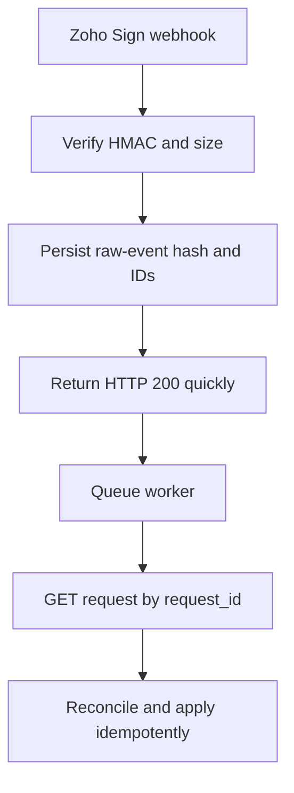

# Zoho Sign Engineering and Automation Knowledge Base

**Document ID:** GH-ZOHO-SIGN-KB  
**Program:** GH Real Estate / Sylvara systems knowledge base  
**Research cutoff:** 2026-07-20  
**Primary audience:** ChatGPT, Codex, solution architects, security reviewers, and maintainers  
**Source policy:** Official Zoho Sign API/help documentation and the supplied GH system maps  
**Evidence labels:** `DOC-VERIFIED`, `LIVE-METADATA REQUIRED`, `TENANT-SPECIFIC`, `VOLATILE`, `GH-POLICY`, `DESIGN RECOMMENDATION`, `DOC-GAP`

> **AI ingestion directive.** Zoho Sign owns signature-envelope routing, recipient actions, signing fields, authentication, signing status, and completion evidence. It does not own lease/business terms, CRM relationships, accounting, or general document storage. Never send from a guessed recipient, role, template, field-type ID, action ID, document ID, request ID, folder ID, data center, or connection. Create a draft, retrieve the returned IDs, place/validate every required field against the correct recipient, submit once, verify signed state through authenticated webhook/API retrieval, and archive the completed PDF plus completion certificate in controlled storage. A browser redirect, email, `200` from a submit call, or visible signature image alone is not proof of a completed envelope.

## 1. Retrieval contract for AI agents

### 1.1 Evidence rules

| Label | Meaning | Required behavior |
|---|---|---|
| `DOC-VERIFIED` | Supported by an official source in the registry | Recheck volatile/high-risk behavior before production |
| `LIVE-METADATA REQUIRED` | Account-generated identifier or configuration | Retrieve from the authorized account and preserve exact value |
| `TENANT-SPECIFIC` | Depends on account, plan, region, sender, template, recipients, or policy | Resolve explicitly before code generation |
| `VOLATILE` | Limit, API credit, plan entitlement, authentication provider, or region feature | Verify immediately before design/deployment |
| `GH-POLICY` | Constraint from the supplied GH architecture/change-control documents | Follow until an approved decision changes it |
| `DESIGN RECOMMENDATION` | Defensive implementation guidance inferred from documented behavior | Validate against legal/security/business requirements |
| `DOC-GAP` | Not published or not universal in reviewed official docs | Never guess; obtain evidence through current docs, live metadata, test, or support |

### 1.2 Non-negotiable rules

1. Resolve legal entity, Sign account, DC, OAuth connection, sender, request/template, document, action, recipient role/order, authentication, and field assignments before send.
2. Treat `request_id`, `document_id`, `action_id`, template ID, and field ID as immutable identities. Names and emails are mutable attributes.
3. Do not create a standalone Sign envelope if Zoho Contracts owns that agreement's native signature lifecycle.
4. Every non-`VIEW` action must have its required assigned fields before submit; one field belongs to one recipient/action.
5. Never reuse a signing URL, embed token, verification code, OAuth token, or webhook secret as a business identifier.
6. Do not place documents, completion certificates, signer PII, field values, signing URLs, tokens, secrets, or production webhook bodies in GitHub or AI project sources.
7. A webhook is an event notice. Verify its HMAC, deduplicate it, return quickly, and retrieve authoritative request state before downstream irreversible action.

## 2. System boundary and product selection

| Need | Owning system | Sign's role |
|---|---|---|
| Approved contract terms, clauses, negotiation, amendments, obligations | Zoho Contracts | Signs the finalized agreement when Contracts owns the lifecycle |
| Ad hoc or template-based signature envelope | Zoho Sign | Owns request, actions, fields, signing status, evidence |
| Leads, contacts, applicants, properties, units, operational status | CRM | Supplies approved identities/context; stores Sign reference/status projection |
| Invoice/payment/deposit/ledger | Books/Billing/Payments | May act only after verified authorized milestone; Sign is not financial truth |
| Completed document and evidence archive | WorkDrive | Receives approved immutable packet/certificate with controlled permissions |
| Tenant/public UX | Creator/Sites | May initiate or embed approved experience; never owns credentials/evidence |
| Source/config/tests | GitHub | Sanitized schema and automation only; no signed artifacts or live PII |

`GH-POLICY` Signed documents never belong in GitHub. CRM should store immutable external references and a useful status projection, not duplicate the signed PDF as the source of truth.

### 2.1 When to use which sending mode

- **Direct document request:** document is generated for one transaction, recipients/fields are supplied through the request APIs.
- **Template:** repeated form with stable roles/field topology; retrieve live template details and fill role/field data.
- **Text tags:** document generator can render one-line tags reliably; template must be smoke-tested after every layout change.
- **Embedded signing:** authenticated first-party application controls the signer experience; create `is_embedded=true`, obtain short-lived token, bind to the intended user/session.
- **Embedded sending:** a trusted staff application embeds the prepare/send UI; constrain `frameorigin` and redirect URLs.
- **Bulk send:** same document/template to many independent recipients; capacity, credits, privacy, and reconciliation require a separate design.

## 3. Plan, credits, and test mode

`VOLATILE` Official quick-start material describes Enterprise/API access and sufficient API credits as prerequisites and currently quotes five Sign credits per submitted envelope. Pricing/credit allocation can change by plan, bundle, add-on, data center, and signing method. SMS authentication, e-stamping, and third-party digital/qualified signatures can add credits or provider charges.

`DOC-VERIFIED` The current quick-start page documents `testing=true` for API testing, up to 50 test envelopes per month. Test envelopes are watermarked and carry no legal authority. Use this mode with synthetic documents and test identities; never mistake a successful test for legal production evidence.

Record account plan, remaining credits/renewal, enabled authentication/signature providers, owner, data center, and production/test routing. Credit exhaustion is a monitored failure condition, not a manual surprise.

## 4. OAuth, data centers, roots, and scopes

### 4.1 OAuth lifecycle

The official getting-started guide uses OAuth 2.0 and documents:

- authorization grant code validity of approximately 60 seconds;
- access-token validity generally about one hour;
- a maximum of 20 refresh tokens per user, with oldest tokens removed after the limit;
- HTTP methods `GET`, `POST`, `PUT`, and `DELETE` across the API.

Send:

```http
Authorization: Zoho-oauthtoken <access_token>
```

Never create self-client/development tokens for production. Use a managed OAuth client/Zoho Connection, least privilege, controlled owner, rotation/revocation, and dependency testing.

### 4.2 Data-center API roots

| Data center | Sign API root |
|---|---|
| United States | `https://sign.zoho.com/api/v1/` |
| Europe | `https://sign.zoho.eu/api/v1/` |
| India | `https://sign.zoho.in/api/v1/` |
| Japan | `https://sign.zoho.jp/api/v1/` |
| Australia | `https://sign.zoho.com.au/api/v1/` |
| Canada | `https://sign.zohocloud.ca/api/v1/` |
| Saudi Arabia | `https://sign.zoho.sa/api/v1/` |

Use the matching Accounts/API-console domain and the account's actual DC. Never hardcode the `.com` example.

### 4.3 Scope families

Document management pages identify least-privilege scope families such as:

```text
ZohoSign.documents.CREATE
ZohoSign.documents.READ
ZohoSign.documents.UPDATE
ZohoSign.documents.DELETE
ZohoSign.documents.ALL
ZohoSign.templates.CREATE
ZohoSign.templates.READ
ZohoSign.templates.UPDATE
ZohoSign.templates.ALL
```

Use the exact endpoint's current scope table. Account/folder/user operations and Contracts-integrated signature can require additional scopes. A broad scope still does not bypass Sign user/account permissions.

## 5. Envelope data model

Zoho Sign calls an envelope a request in the API.

| Object | Important fields | Identity and handling |
|---|---|---|
| Request/envelope | `request_id`, name, status, owner, expiration, sequential/reminder settings | Primary workflow identity; persist returned ID |
| Document | `document_id`, name, order, pages, size | One request can contain multiple documents |
| Action/recipient | `action_id`, type, recipient, role, order, verification, status | One recipient action and its fields; persist ID |
| Field | `field_id`, type ID/name, document/action ID, coordinates/page, mandatory/default/value | Assigned to exactly one action |
| Template | template ID, roles/actions, documents, prefills, field topology | Retrieve current details before each automation version |
| Folder/category/type | generated IDs | Resolve through account APIs; never infer from display name |
| Completion certificate | PDF evidence associated with completed request | Archive with completed document under retention/access policy |

### 5.1 Action types

The create API documents:

- `SIGN` — recipient signs/completes assigned fields;
- `VIEW` — recipient views; does not require signing fields;
- `INPERSONSIGN` — hosted/in-person signing arrangement;
- `APPROVER` — approval action.

Template pages document a similar but version-sensitive set. Verify exact availability in the target account. The action can include recipient name/email, signing order, `verify_recipient`, verification type (`EMAIL`, `SMS`, or `OFFLINE` where documented), verification code for offline mode, and private notes.

`TENANT-SPECIFIC` Recipient authority is a business/legal input. Email delivery proves neither identity nor authority. Select stronger authentication when risk requires it, subject to consent, region, credits, and accessibility.

### 5.2 Status model

The document-detail/use-case pages use request statuses such as `inprogress`, `completed`, and `declined`. Recipient `action_status` examples include `UNOPENED`, `VIEWED`, `SIGNED`, and `NOACTION` for sequential recipients not yet reached.

Persist raw status and mapped meaning with timestamp. Treat an unknown future status as pending review. Only the exact completion policy—normally `request_status=completed` plus required action evidence—can trigger archival/financial/operational completion.

## 6. REST endpoint and operation map

All paths are relative to the DC-aware `/api/v1` root.

### 6.1 Document requests

| Operation | Method/path | Notes |
|---|---|---|
| Create draft/request | `POST /requests` | Multipart files plus `data`; returns request/document/action IDs |
| Update draft/request | `PUT /requests/{request_id}` | Add/update actions and fields before submit; retrieve first |
| Submit for signature | `POST /requests/{request_id}/submit` | Stateful send; guard against duplicates |
| Correct | `POST /requests/{request_id}/markforcorrection` | Moves eligible request into correction flow |
| Get detail | `GET /requests/{request_id}` | Authoritative current status and actions |
| List requests | `GET /requests` | Page context, search, sort; default page size documented as 100 |
| Get filled field data | `GET /requests/{request_id}/fielddata` | Sensitive; minimize retention/logging |
| Download all PDF(s) | `GET /requests/{request_id}/pdf` | `with_coc`, `merge`, optional document password; PDF or ZIP |
| Download completion certificate | documented completion-certificate endpoint | Retrieve exact current path from official catalog |
| Download particular PDF | documented per-document endpoint | Use returned `document_id`; verify path |
| Remind | `POST /requests/{request_id}/remind` | Do not spam; reconcile status first |
| Recall | `POST /requests/{request_id}/recall` | Cancels signing access; approved exception workflow |
| Extend | documented extend endpoint | Validate current eligibility/deadline and audit reason |
| Delete/move to trash | `PUT /requests/{request_id}/delete` | Can require `recall_inprogress` and reason; destructive governance |

### 6.2 Account metadata

The document-management catalog includes operations for folders, field types, and document/request types. Retrieve these before constructing fields or category assignments. The sending use case permits caching field-type IDs for one fixed account, but GH/Sylvara automation should maintain a versioned account/DC manifest and invalidate it after account/configuration changes.

### 6.3 Templates

| Operation | Method/path | Notes |
|---|---|---|
| Create template | `POST /templates` | Multipart file + template data/roles |
| Update template | `PUT /templates/{template_id}` | Configuration/legal change; version and test |
| Get template | `GET /templates/{template_id}` | Returns roles/prefill requirements/topology |
| List templates | documented templates list endpoint | Page through all; route by ID, not name |
| Create/send from template | `POST /templates/{template_id}/createdocument` | `is_quicksend=true` can send; false creates draft |
| Delete template | documented delete endpoint | Impact inventory required before deletion |

When sending from template, the documented payload nests `templates`, `field_data`, and `actions`; each action identifies the template `action_id`/role and recipient attributes. `is_quicksend=false` is safer when an additional document or validation step is required. Do not assume a template remains unchanged: hash/snapshot its sanitized topology and retrieve it before production use.

### 6.4 Other documented surfaces

Official API sections also cover signer groups, embedded signing, embedded sending, bulk send, e-stamping, attachments, recipient reassignment/forwarding behavior, and regional digital-signature integrations. These are capability families, not blanket authorization. Verify plan, account setting, legal validity, consent, data residency, credits, and exact endpoint contract.

## 7. Creating and sending an envelope

### 7.1 Create request

`POST /requests` is multipart form data with one or more `file` parts and a JSON `data` part. A simplified structure:

```json
{
  "requests": {
    "request_name": "<approved non-sensitive title>",
    "notes": "<approved message>",
    "expiration_days": 15,
    "is_sequential": true,
    "email_reminders": true,
    "reminder_period": 5,
    "actions": [
      {
        "action_type": "SIGN",
        "recipient_name": "<resolved recipient>",
        "recipient_email": "<resolved address>",
        "signing_order": 0,
        "verify_recipient": true,
        "verification_type": "EMAIL"
      }
    ]
  }
}
```

Documented request options include `request_type_id`, `description/notes`, `expiration_days`, `is_sequential`, `email_reminders`, `reminder_period`, `folder_id`, and `actions`. Requiredness and availability can vary. Recipient data is PII; the example above is a schema, never a fixture with real values.

### 7.2 Add fields/update

Use returned request/action/document IDs in `PUT /requests/{request_id}`. Field groups include signature/image fields, text, date, checkbox, radio, dropdown, attachment, payment, and other account-supported types. Each field requires the correct `document_id`, `action_id`, type, page/position/dimensions or text-tag placement, mandatory behavior, and optional prefills/validation.

Official use-case guidance says every action except `VIEW` needs at least one field or submit will fail. Validate:

- each mandatory business field exists exactly once where intended;
- fields are assigned to the intended action/recipient;
- coordinates remain on-page at the rendered document size;
- values do not overlap/clip or expose unrelated recipient data;
- dates/time zones and number formats are explicit;
- optional attachments/payment fields are approved and within limits.

### 7.3 Submit

`POST /requests/{request_id}/submit` sends the request. Before submit:

1. lock the immutable business operation key;
2. retrieve the request and compare document hash/name/page count, recipients, order, authentication, fields, expiration, reminders, sender/account, and legal entity;
3. ensure it is still a draft/eligible state and has not already been submitted;
4. submit once;
5. persist response/correlation and retrieve again.

An ambiguous timeout must be reconciled by `request_id`; do not create/send another envelope blindly.

## 8. Fields and text tags

### 8.1 Field identity and assignment

Never hard-code a field-type ID from another Sign account. Retrieve field types for the current account and keep a sanitized account manifest. Field names are not unique identities; use IDs and action/document associations.

### 8.2 Text-tag safety

Official help supports automatic field addition using text tags embedded in documents. The supplied GH governance adds field-tested constraints:

- the complete tag must render on one physical line;
- prevent word-processing line wrapping or element splitting;
- assign exactly one recipient number/role to each field;
- use a stable font/color strategy that does not disrupt tag parsing;
- smoke-test the generated PDF, not only the source DOCX/HTML;
- re-test after margin, font, merge-field, conditional section, or renderer changes.

A governed canonical date example is:

```text
{{SD:R1:(dateformat="MM/dd/yyyy hh:mm a z")}}
```

This is project evidence, not a promise that every tenant/template parser behaves identically. Test in `testing=true` mode and inspect every mapped field.

### 8.3 Prefill and field data

Template requests can include `field_data` groups such as text, boolean, and date. Filled data returned by `/fielddata` can contain sensitive agreement/person information. Use only fields approved for downstream automation; validate type and provenance; do not treat signer-entered free text as trusted commands, accounting authorization, or identity proof.

## 9. Pagination, search, and list completeness

The getting-started and list pages document a default page size of 100 and `page_context` with fields such as:

```json
{
  "row_count": 100,
  "start_index": 1,
  "has_more_rows": true,
  "search_columns": {"request_name": "<value>"},
  "sort_column": "created_time",
  "sort_order": "DESC"
}
```

Use only supported search columns from the current endpoint. The request list documents examples including request, folder, owner, recipient, form, and template names/emails. Search is not an idempotency guarantee. Page until `has_more_rows` is false, deduplicate by `request_id`, and protect against result mutation by storing IDs/high-water marks and reconciling totals.

## 10. API limits and capacity planning

`VOLATILE` The official API limitations page reviewed at the cutoff publishes:

| Limit | Documented value |
|---|---:|
| Most API calls | 50 per minute |
| Template export | 2 per minute |
| Template import | 1 per minute |
| Recipients per request | 25 |
| Documents per request | 40 |
| Envelope size | 40 MB |
| Individual document size | 25 MB |
| Bulk-send recipients | 1,000 |
| Attachment total/request | 25 MB |
| Total fields/envelope | 2,000 |
| Checkbox fields/recipient | 2,000 |
| Text fields/recipient | 750 |
| Date fields/recipient | 500 |
| Image fields/recipient | 300 |
| Radio/dropdown fields/recipient | 500 |
| Attachment fields/recipient | 20 |
| Payment fields/request | 1 |
| Options per radio/dropdown | 100 |

These are current documentation snapshots, not contractual constants. Design queues below the limit, account for all workers sharing the credential/account, and monitor `429`/provider responses. Do not “solve” recipient limits by splitting a single legal agreement into unrelated envelopes without legal approval.

## 11. Errors, retries, idempotency, and concurrency

### 11.1 Response model

Official getting-started material describes JSON responses with fields such as `code`, `message`, and a resource key. General HTTP categories include `200`, `400`, `401`, `404`, `405`, and `500`. Parse HTTP plus body status/code/message; some business errors can arrive in a technically successful HTTP response structure.

### 11.2 Retry policy

- Refresh once on an expired access token; do not loop on invalid client/revoked refresh token.
- Retry `429`, transport failure, and selected `5xx` with capped exponential backoff/jitter; honor `Retry-After` if supplied.
- Do not retry schema, invalid field/action/document ID, state, authentication, permission, size, or legal-policy failures until fixed.
- For create/submit/recall/delete/remind/extend after ambiguous timeout, retrieve and reconcile first.
- Rate-limit reminders and user-visible messages; automated retry must not harass recipients.

### 11.3 Idempotency ledger

The reviewed API does not document one universal idempotency header. Maintain:

```text
operation_key | legal_entity | source_system | source_record/version
document_hash | template_id/version | request_id | intended_actions_hash
state | created/submitted/completed timestamps | last_reconciled_at
```

Acquire a lock before create/submit. Reject a changed payload under the same operation key unless an approved supersession creates a new key/version. Serialize recall/correction/extend/delete and verify state transitions.

## 12. Embedded signing and embedded sending

### 12.1 Embedded signing

The documented flow is:

1. Create request with `is_embedded=true` and the intended action.
2. Add/validate fields and request configuration.
3. Request an embed token at `POST /requests/{request_id}/actions/{action_id}/embedtoken`.
4. Render the returned URL only in the authenticated, authorized user's session.
5. Observe the result, but confirm through verified webhook and authenticated API retrieval.

Bind request/action/user/legal entity server-side. Never accept `request_id` or `action_id` directly from the browser without authorization. Do not log or cache the embed URL. Protect against clickjacking, session fixation, shared-device exposure, and replay.

### 12.2 Embedded sending

The documented endpoint is `POST /requests/{request_id}/embedsendtoken`, with a corresponding template surface. Official material describes the link as valid for about two minutes before access and the accessed session for about one hour. Configure trusted `frameorigin`/redirect URLs. `VOLATILE`: reverify durations and exact arguments.

Embedded sending is privileged staff functionality. Require strong app authentication, sender authorization, CSRF protection, exact origin allowlist, short session, audit, and post-send reconciliation.

## 13. Webhooks and event verification

### 13.1 Supported events

Official help lists events such as Sent, Viewed, Signed by a recipient, Completed by all, Declined, Reassigned, Expires, Recalled, and Approved. Payload operation types include examples such as `RequestSubmitted`, `Viewed`, `SigningSuccess`, `Completed`, `Rejected`, `Recalled`, `Forwarded`, and `Expired`.

The payload contains `notifications` and `requests` structures with values such as operation type, request/action IDs, request status/name, and document IDs. Use documented fields only; Zoho warns that nonstandard extra fields can be removed.

### 13.2 HMAC verification

Official webhook security uses HMAC-SHA256 and a Base64 signature in:

```http
X-ZS-WEBHOOK-SIGNATURE: <base64-hmac>
```

Compute the HMAC over the exact raw request body using the configured secret, Base64-encode it, and compare in constant time. Do not parse/re-serialize or reorder JSON before verification. Store the secret in a secret manager; the management page indicates it is not retrievable after saving.

### 13.3 Receiver architecture



Official best practices require HTTP `200` within five seconds and advise against heavy inline work. Documentation warns after roughly 10–15 consecutive failures and disables the webhook after 20. Monitor delivery health and build replay/reconciliation because webhooks can be duplicated, delayed, out of order, or disabled.

`VOLATILE` The help page currently limits an account to two webhooks and lists Enterprise/API/Zoho One/People Plus availability. Verify plan and current UI.

### 13.4 Event deduplication

Prefer an official event/notification ID if present. Otherwise hash the verified raw body plus stable operation/request/action/timestamp fields. Store receipt time, signature result, request/action IDs, operation type, raw-body checksum, processing state, attempt count, and retrieval reconciliation. Never log the unredacted body.

## 14. Completion, evidence, and archival

On a verified completion event:

1. authenticate webhook and enqueue;
2. `GET /requests/{request_id}` and confirm request status plus all required action statuses;
3. match legal entity, source record/version, document hash/topology, and expected recipients;
4. download completed PDF using `/requests/{request_id}/pdf?with_coc=true`; `merge=true` where approved;
5. validate content type, nonzero size, malware scan where applicable, checksum, and expected document/certificate count;
6. store in the controlled WorkDrive location with classification/retention/access;
7. persist checksum, WorkDrive resource ID, request/document/action IDs, completion time, and archive result;
8. update Contracts/CRM/Creator projection idempotently;
9. trigger approved Books/Billing workflow only if the business/legal milestone calls for it.

Never overwrite the completed file. A subsequent correction or superseding agreement becomes a new version/request linked to the original.

## 15. Security, privacy, legal, and audit controls

- Separate GH and Sylvara routing by allowlisted legal entity -> Sign account/DC/connection/sender/template registry.
- MFA and least privilege for senders/admins; quarterly users, API clients, webhooks, folders/templates, and provider review.
- Use recipient authentication proportionate to risk and approved by legal/security; accommodate accessibility and lawful consent.
- Keep OAuth credentials, HMAC secrets, verification codes, signing/embed URLs, document passwords, private notes, and real recipient data out of code/logs.
- Validate uploaded file type, signature, page count, size, checksum, malware status, and generated content before send.
- Sanitize request names/notes; emails and SMS can leak descriptive text.
- Restrict webhook ingress by HMAC and optionally provider-published network controls where current official guidance exists; never trust IP alone.
- Preserve request/activity/completion evidence and approved WorkDrive archive. Define retention/legal hold with counsel.
- Do not assert legal validity solely because Zoho Sign supports a signing method; jurisdiction, document type, consent, identity, notarization, witness, e-stamp/QES, and record retention require policy/legal review.

## 16. GH/Sylvara workflow patterns

### 16.1 Contracts-managed lease signature

1. Contracts completes approved drafting/negotiation.
2. Contracts signer configuration identifies every party/action/order/authentication.
3. Generated document text tags/fields pass a watermarked test.
4. Contracts sends through its Zoho Sign integration exactly once.
5. Verified Sign completion flows back into Contracts.
6. Final document/certificate is archived to WorkDrive.
7. CRM stores reference/status; Books receives only separately approved terms/events.

Do not also call standalone `/requests` for this agreement.

### 16.2 Standalone disclosure/acknowledgment

1. Approved source system freezes a document version and operation key.
2. Resolve Sign account/template and intended parties.
3. Create draft or template document with `testing=true` during validation.
4. Retrieve IDs, validate fields/recipients, submit once in production.
5. HMAC webhook -> queue -> API retrieval -> archive -> operational projection.

### 16.3 Embedded portal signing

Creator authenticates the tenant/applicant and authorizes one mapped `action_id`; backend obtains a short-lived embed token. Sites must never expose raw Sign IDs/tokens in static code. Completion is confirmed asynchronously by webhook/API, not browser callback.

### 16.4 Decline, recall, correction, expiration

Map each exception to an explicit state and owner. Stop downstream financial/access actions, notify the responsible internal queue, preserve the original evidence, and decide whether correction/resend requires a new request. Never automatically keep resending an expired/declined legal document without human review.

## 17. Testing and deployment

### 17.1 Minimum test matrix

- wrong DC, token expiration, revoked refresh token, missing scope/permission;
- `testing=true`, watermark, monthly test-envelope boundary;
- one/multiple files, 25/40 MB boundaries, invalid/malicious document;
- sequential/parallel, all action types, 25-recipient boundary;
- every field type, account field-type discovery, coordinates, text tags, mandatory rules, clipping;
- template roles/prefills, stale template/version, quicksend false/true;
- email/SMS/offline authentication, invalid addresses/numbers/codes;
- reminders, expiration, extend, decline, recall, correction, delete;
- embedded token wrong user/action/origin, expiration/replay, browser abandonment;
- webhook HMAC valid/invalid/changed body, duplicate/out-of-order/delayed events, five-second response, disabled hook;
- ambiguous create/submit timeout and reconciliation;
- completed PDF/ZIP/certificate download, checksum, WorkDrive archive and downstream projections;
- API 50/min and special import/export throttles under shared workers.

### 17.2 Deployment evidence

Store sanitized architecture, account/DC/template/field-type manifest, scopes, test results, generated-document hash, approval, rollout, webhook health check, and rollback/reconciliation plan. Repository commit is not proof the Sign account/template/webhook was deployed.

## 18. Anti-patterns

- Sending immediately after upload without retrieving/validating action and field topology.
- Treating recipient email as immutable identity or authority.
- Hard-coding field-type/action/template IDs copied from docs or another account.
- Splitting a legal agreement merely to bypass recipient/document/field limits.
- Blindly retrying `POST /submit` after timeout.
- Trusting browser redirect or webhook body before HMAC and API retrieval.
- Parsing and reserializing JSON before webhook signature verification.
- Doing archive/CRM/Books work synchronously before returning webhook `200`.
- Putting a signing/embed URL or completion certificate in GitHub/logs.
- Using both Contracts-managed Sign and standalone Sign for the same agreement.
- Assuming a watermark test envelope has legal effect.
- Modifying or replacing an executed document in place.

## 19. Preflight checklist

- [ ] Legal entity, Sign account, region/DC, plan/credits, owner/sender verified.
- [ ] Contracts-managed vs standalone ownership is explicit.
- [ ] OAuth client/connection/scopes/rotation and role permission tested.
- [ ] Request/template/document/action/field-type IDs retrieved from correct account.
- [ ] Final document version/hash, page count, fields, roles, recipients, order, authentication, reminders, expiration approved.
- [ ] Immutable operation key and cross-reference/idempotency record exist.
- [ ] Webhook HMAC secret, fast receiver, queue, dedupe, reconciliation, and monitoring tested.
- [ ] WorkDrive archive path/classification/retention and downstream projections approved.
- [ ] Test-mode evidence passed; production canary, credits, rollback and exception owners ready.

## 20. Unknowns and required live verification

Do not invent:

- account-generated IDs, template roles, field-type IDs, folder/document categories, request/action/field/document IDs;
- plan/credit availability, signing provider, SMS/QES/e-stamp behavior, regional legal validity;
- all request/action status values and every permissible transition;
- a universal idempotency header or guaranteed webhook delivery order/exactly-once semantics;
- current retention/trash/recovery behavior;
- current signing-link/embed-token TTL beyond the verified endpoint documentation;
- whether account-level webhook count, test-envelope allowance, or any size/rate limit has changed.

Retrieve live metadata, current official pages, tenant UI, a controlled test, or Zoho support confirmation.

## 21. Official source registry

All sources accessed and verified 2026-07-20.

### API foundations

- Zoho Sign API — https://www.zoho.com/sign/api/
- Introduction — https://www.zoho.com/sign/api/introduction.html
- Getting Started — https://www.zoho.com/sign/api/getting-started.html
- OAuth — https://www.zoho.com/sign/api/oauth.html
- API Endpoint / Data Centers — https://www.zoho.com/sign/api/api-endpoint.html
- API Limitations — https://www.zoho.com/sign/api/api-limitations.html
- Quick Start with Zoho Sign API — https://www.zoho.com/sign/api/quick-start-with-zoho-sign-api.html
- Get Started with APIs / Test Mode — https://www.zoho.com/sign/api/getting-started-with-zoho-sign-api.html

### Document management

- Document Management — https://www.zoho.com/sign/api/document-managment.html
- Create Document — https://www.zoho.com/sign/api/document-managment/create-document.html
- Update Document — https://www.zoho.com/sign/api/document-managment/update-document.html
- Send Document for Signature — https://www.zoho.com/sign/api/document-managment/send-document-for-signature.html
- Correct Document — https://www.zoho.com/sign/api/document-managment/correct-document.html
- Get Document Details — https://www.zoho.com/sign/api/document-managment/get-details-of-a-particular-document.html
- Get Document List — https://www.zoho.com/sign/api/document-managment/get-document-list.html
- Get Document Form Data — https://www.zoho.com/sign/api/document-managment/get-document-form-data.html
- Download PDF — https://www.zoho.com/sign/api/document-managment/download-pdf.html
- Remind Recipient — https://www.zoho.com/sign/api/document-managment/remind-recipient.html
- Recall Document — https://www.zoho.com/sign/api/document-managment/recall-document.html
- Delete Document — https://www.zoho.com/sign/api/document-managment/delete-document.html
- Sending a Document for Signature (use case) — https://www.zoho.com/sign/api/use-cases/sending-a-document-for-signature.html
- Checking Document Status (use case) — https://www.zoho.com/sign/api/use-cases/checking-the-document-status.html
- Downloading the Completed Document (use case) — https://www.zoho.com/sign/api/use-cases/downloading-the-completed-document.html

### Templates and specialized APIs

- Template Management — https://www.zoho.com/sign/api/template-managment.html
- Create Template — https://www.zoho.com/sign/api/template-managment/create-template.html
- Update Template — https://www.zoho.com/sign/api/template-managment/update-template.html
- Get Template Details — https://www.zoho.com/sign/api/template-managment/get-template-details.html
- Get Template List — https://www.zoho.com/sign/api/template-managment/get-template-list.html
- Send Documents Using Template — https://www.zoho.com/sign/api/template-managment/send-documents-using-template.html
- Delete Template — https://www.zoho.com/sign/api/template-managment/delete-template.html
- Embedded Signing — https://www.zoho.com/sign/api/embedded-signing.html
- Embedded Sending — https://www.zoho.com/sign/api/embedded-sending.html
- Signer Groups — https://www.zoho.com/sign/api/signergroups.html
- eStamping API — https://www.zoho.com/sign/api/estamping.html

### Fields, sending, and webhooks

- Automatic Field Addition / Text Tags — https://help.zoho.com/portal/en/kb/zoho-sign/user-guide/sending-a-document/articles/automatic-field-addition-in-zoho-sign
- Document Fields — https://help.zoho.com/portal/en/kb/zoho-sign/user-guide/sending-a-document/articles/document-fields-in-zoho-sign
- Send for Signatures — https://help.zoho.com/portal/en/kb/zoho-sign/user-guide/sending-a-document/articles/send-for-signatures
- Webhooks Management — https://help.zoho.com/portal/en/kb/zoho-sign/admin-guide/webhooks/articles/webhooks-management
- Webhooks Best Practices — https://help.zoho.com/portal/en/kb/zoho-sign/admin-guide/webhooks/articles/webhooks-best-practices
- Securing Webhooks with HMAC — https://help.zoho.com/portal/en/kb/zoho-sign/admin-guide/webhooks/articles/securing-zoho-sign-webhooks-with-hmac-authentication
