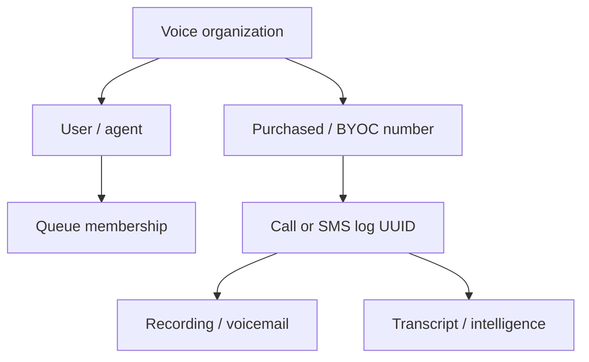

# Zoho Voice — Telephony, SMS, Call Logs, Queues, SDK, Deluge, and Compliance Knowledge Base

**Document ID:** GH-ZOHO-VOICE-KB
**Research cutoff:** 2026-07-20
**Audience:** ChatGPT, Codex, solution architects, Zoho administrators, Catalyst/Deluge developers, compliance owners, and GH Real Estate / Sylvara system owners
**Evidence policy:** Official Zoho Voice and related official Zoho documentation only. Account data center, plan, numbers, carrier capabilities, registration, scopes, rates, limits, recording/transcription settings, and live identifiers must be revalidated before implementation.

## AI execution contract

1. **Zoho Voice is a communications/PBX platform, not the master record for people, consent, appointments, property access, maintenance, contracts, or payments.** CRM/Creator and the applicable business system remain authoritative.
2. **Never place a call, send an SMS/MMS, create a power-dialer campaign, record, transcribe, monitor, or delete because the API permits it.** Require an approved purpose, verified recipient, lawful permission/consent, sending identity, time window, content/script, and authorized actor.
3. **Resolve data center, Voice organization/account, user/agent, assigned number, queue, and current role from live metadata.** Phone numbers, extensions, email addresses, and display names are not interchangeable with opaque IDs.
4. **Never expose OAuth tokens, SDK refresh tokens, SIP/BYOC credentials, callback secrets, phone numbers, recordings, voicemail, transcripts, message content, contact data, or live IDs in Git, prompts, PDFs, browser logs, or standard application logs.**
5. **Do not assume a general signed webhook exists.** Current official docs describe SMS `statusCallback` with URL-level authentication and Deluge rules triggered by call/SMS events; they do not establish a universal cryptographically signed external call/SMS webhook contract.
6. **Treat provider delivery and call logs as transport evidence, not human identity or authorization.** A connected call or delivered SMS does not prove the intended person received, read, understood, consented, paid, signed, or approved anything.
7. **Recording/transcription/call intelligence require separate approval, notice/consent, access, retention, and bias controls.** Never automatically use sentiment, emotion, intent, scores, or summaries for housing, applicant, employee, or credit decisions.
8. **Respect carrier and US messaging registration rules.** Zoho's 10DLC guidance requires website consent disclosures and opt-in/opt-out/help handling even for one-to-one business messaging contexts described by Zoho.
9. **Do not invent a REST call-origination endpoint.** The reviewed common REST API index covers logs, SMS, contacts, users, queues, metrics, transcription, recordings, and power dialer; interactive calling is documented through native apps/integrations and SDKs.
10. **Prefer live official docs and console configuration over this snapshot.** Product regions, plans, prices, number inventory, country rules, throughput, API limits, 10DLC requirements, SDK behavior, and carrier support are volatile.

### Evidence labels

| Label | Meaning |
|---|---|
| `[OFFICIAL]` | Directly documented by Zoho in an official source below. |
| `[INFERENCE]` | Recommended architecture/control derived from official behavior. |
| `[LIVE-METADATA REQUIRED]` | Must be discovered from the actual Voice organization/console/API. |
| `[VOLATILE]` | Plan, price, availability, carrier, limit, or policy can change. |
| `[GAP]` | No complete current official contract was found; do not guess. |

## 1. Product role and system boundaries

| Concern | System of record | Zoho Voice role |
|---|---|---|
| Lead, applicant, tenant, owner, vendor, and customer | Zoho CRM | Resolves a governed phone number/contact for communication. |
| Consent, opt-out, quiet hours, communication purpose | CRM or governed Creator consent registry | Enforces provider/carrier opt-outs too; Voice is not the only consent ledger. |
| Maintenance request and access permission | Creator / CRM | Carries a call/SMS; does not authorize entry or close a ticket. |
| Appointment | Bookings | Sends/receives approved communication; does not mutate appointment from free text alone. |
| Lease/signature | Contracts / Sign | Can notify; call/SMS is not the signature audit trail. |
| Invoice/payment | Books/Billing | Can send an approved link/reminder; no reply or call changes the ledger. |
| Telephony transport | Zoho Voice | Numbers, call routing, agents, queues, call/SMS logs, voicemail, recording, PBX features. |
| Cross-system automation | Catalyst / Voice Deluge | Validates, redacts, deduplicates, queues, invokes approved downstream actions, and audits. |

Do not operate Zoho Voice and Twilio as overlapping uncontrolled senders on the same use case. `[INFERENCE]` Choose a provider/number owner per channel and business purpose, define failover explicitly, and maintain one shared CRM consent/suppression registry.

## 2. Product editions, Telephony, and availability

Zoho distinguishes **Zoho Voice** (the cloud PBX/contact-center product) from **Zoho Telephony/PhoneBridge** (the integration layer that embeds a PBX into Zoho One, CRM, Desk, Recruit, Bigin, and related apps).

Official integration documentation describes Business Phone and Enterprise Telephony editions/plans with materially different user licensing, web-console access, agent roles, and PhoneBridge availability. Zoho Voice is a separate subscription and is not included merely because an organization licenses Zoho One.

Current official global English product material says Voice is available in the US and EU data centers while AU remains unavailable and India access/calling is restricted. However, Zoho's current India-localized pricing page describes an IN offering, Mumbai numbers, and domestic Indian calling; older official help can also retain superseded US-only wording. `[VOLATILE]` The official regional statements are not fully consistent. `[LIVE-METADATA REQUIRED]` Confirm current eligibility, number inventory, and calling/SMS capability in the target tenant before design.

The public REST pages reviewed use the US example host:

```text
https://voice.zoho.com/rest/json/...
```

`[GAP]` A current official multi-data-center REST-base table equivalent to the Meeting API's table was not found. Do not automatically change the host to `voice.zoho.eu`. Discover the API domain from the live Voice account/current OAuth documentation or obtain Zoho support confirmation. BYOC documentation separately publishes US/EU SIP endpoints and IPs; those SIP values are not REST bases.

## 3. Authentication, scopes, and secrets

Voice REST pages use OAuth and the header:

```http
Authorization: Zoho-oauthtoken <access_token>
Accept: application/json
```

Create the OAuth client in the correct Zoho Accounts data center. Use separate connections for:

- read-only call/SMS log reconciliation;
- SMS sends;
- user/queue/contact administration;
- recording/transcription;
- power-dialer administration;
- SDK calling, if approved.

Official scope spelling is inconsistent in capitalization across pages, including `ZohoVoice.*` and `zohovoice.*`. OAuth scopes can be case-sensitive. Use the exact current endpoint page/consent screen value; do not normalize capitalization by preference.

### Scope map

| Surface | Documented scope family |
|---|---|
| Calls, call logs, recordings, voicemail, transcripts | `ZohoVoice.call.READ|CREATE|DELETE` as documented |
| SMS/MMS | `ZohoVoice.sms.READ|CREATE` and exact endpoint operation |
| Voice contacts | `zohovoice.contacts.READ|CREATE|UPDATE|DELETE|ALL` on current pages |
| Users/agents | `zohovoice.agents.*` / `ZohoVoice.agents.READ` depending endpoint |
| Queues | `zohovoice.queues.*` |
| Power Dialer | `ZohoVoice.powerdialer.*` |
| SDK multi-agent status | `ZohoVoice.sdk.READ` on the current online-status page |

Store refresh tokens and client secrets in Catalyst secrets or another approved vault. The Java SDK guide describes downloading a Voice refresh token; treat it as a high-impact secret and do not follow sample “store in DB” language without encryption, access control, rotation, and revocation.

## 4. Roles and object identifiers



The Users API documents roles such as Super Admin, Admin, Technician, Supervisor, Supervisor Plus, and Telephony Agent. A query's visibility can depend on the caller's role; multi-agent status APIs explicitly describe role-scoped results.

| Identifier | Meaning | Rule |
|---|---|---|
| user ID | Voice user identity | Different from CRM Contact ID and can differ from agent ID. |
| agent ID | Telephony agent identity | Discover via Users API; use for queue/status filters. |
| number map/number ID | Purchased/BYOC number assignment | Use live response/configuration, not the E.164 string as a substitute. |
| queue/group ID | Call queue identity | Discover through Queues API; “group” path names do not mean Zoho Mail/CRM groups. |
| contact ID | Voice-local contact | Voice Contacts is not the CRM contact master. |
| `logId` (call APIs) / `logid` (SMS payloads) | UUID-like provider log identity | Preserve the endpoint's exact field casing; use the returned value as the primary reconciliation key for the applicable call/SMS log and for call recording/transcription operations. |
| `unique_id` | Deluge call/SMS event argument | Preserve this documented trigger field name; map it to a REST log reference only after verification rather than renaming it to `logId`. |
| recording filename | File selector returned by log metadata | Sensitive; never construct from examples. |
| transcription type | `1` voicemail, `2` call recording in current API | Send explicitly; do not rely on default for deletion. |
| power-dialer campaign ID | Campaign identity where returned | Scope to approved purpose and owner. |

Keep a deployment manifest with hashed/non-sensitive aliases for organization, regional base, number, queue, OAuth connection, purpose, and authoritative CRM registry. Do not commit live IDs or phone numbers to a public repository.

## 5. REST API surface map

| Resource | Representative method/path | Scope |
|---|---|---|
| Call logs | `GET /rest/json/zv/logs` | `ZohoVoice.call.READ` |
| Single call log | `GET /rest/json/zv/logs/{logId}` | `ZohoVoice.call.READ` |
| Queue ringing order | `GET /rest/json/zv/logs/queue/ringingOrder` | `ZohoVoice.call.READ` |
| Recording/voicemail download | `GET /rest/json/zv/logs/voicerecording` | `ZohoVoice.call.READ` |
| Batch recording request | `POST /rest/json/zv/logs/recording/batch/download` | current page lists `ZohoVoice.call.CREATE` |
| Transcription | `POST|GET|DELETE /rest/json/zv/transcribe` | call create/read/delete respectively |
| Transcription file | `GET /rest/json/zv/transcribe/download` | `ZohoVoice.call.READ` |
| Send SMS | `POST /rest/json/v1/sms/send` | `ZohoVoice.sms.CREATE` |
| Send MMS | `POST /rest/json/v2/sms/send` | `ZohoVoice.sms.CREATE` |
| SMS logs | `GET /rest/json/v1/sms/logs` | `ZohoVoice.sms.READ` |
| MMS stream | `GET /rest/json/v2/sms/stream/mms` | `ZohoVoice.sms.READ` |
| SMS conversation list | `GET /rest/json/v1/sms/chatlist` | `ZohoVoice.sms.READ` |
| Contacts | CRUD `/rest/json/zv/contacts` | `zohovoice.contacts.*` |
| Users | CRUD `/rest/json/zv/api/users` | `zohovoice.agents.*` |
| Queue create/update/delete | `POST`, `PUT`, or `DELETE` on `/rest/json/zv/api/groups` | `zohovoice.queues.CREATE`, `.UPDATE`, or `.DELETE` |
| Queue reads | `GET /rest/json/zv/api/queues` | `zohovoice.queues.READ` |
| Current-agent online status | `GET` or `PUT` on `/rest/json/zv/api/agents/onlineStatus` | `ZohoVoice.agents.READ` or `ZohoVoice.agents.UPDATE` |
| Multi-agent online status | `GET /rest/json/zv/api/v2/agents/onlineStatus` | `ZohoVoice.sdk.READ` |
| Agent status metrics | `/rest/json/zv/metrics/statusaudit/...` | `ZohoVoice.agents.READ` |
| Power Dialer | CRUD `/rest/json/zv/api/powerdialer` | `ZohoVoice.powerdialer.*` |

`[GAP]` The common API index did not present a general server-side REST endpoint that simply originates an arbitrary phone call. Use the documented UI/ZDialer, native/PhoneBridge integration, or supported WebSDK/Java SDK after current validation; never fabricate `/calls`.

## 6. Call logs, queue data, and reconciliation

`GET /rest/json/zv/logs` supports filters including offset/size, date range, agents, call types (`incoming`, `outgoing`, `missed`, `bridged`, `forward`), number IDs, number/country search, voicemail/recording flags, department, and queue IDs. The single-log endpoint retrieves one log. Queue ringing-order APIs expose which agents rang and related data.

The current call-log page states a threshold of **30 calls per minute with a 10-minute lock period** for the noted URL. Treat this as `[VOLATILE]` and design below it. A lock is more damaging than a delayed dashboard.

Safe poller:

```text
load last committed time window
GET logs with bounded date/page and approved filters
for each log:
  key = logId
  normalize direction/status/timestamps/agent/queue with minimal PII
  link to canonical CRM party only after exact governed number matching
  store restricted provider reference and processing outcome atomically
advance cursor after full page commit
periodically overlap and reconcile late changes/recording readiness
```

Do not auto-create CRM contacts for every caller. Phone numbers can be shared, reassigned, spoofed, malformed, or duplicated across records. Surface collisions for human review. A missed call may trigger a follow-up task, but not a lease/payment/maintenance status change.

## 7. Recording, voicemail, transcription, and call intelligence

The recording endpoint downloads recordings or voicemail selected by filename. Current official limits include up to 10 files and 1 GB for the direct download request; the page also documents batch download behavior and a 30/minute threshold/lock. Revalidate every number before implementation.

Transcription uses the call `logId`:

| Action | Method | Scope |
|---|---|---|
| Initiate | `POST /rest/json/zv/transcribe` | `ZohoVoice.call.CREATE` |
| Read JSON | `GET /rest/json/zv/transcribe` | `ZohoVoice.call.READ` |
| Download | `GET /rest/json/zv/transcribe/download` | `ZohoVoice.call.READ` |
| Delete | `DELETE /rest/json/zv/transcribe` | `ZohoVoice.call.DELETE` |

The newer call-transcription page supports multiple languages and distinguishes voicemail (`1`) from call recording (`2`). Initiation can include provider, notification, supervisor email, attachment, and terms-acceptance-related fields. Do not programmatically assert acceptance of terms until the authorized organization owner has accepted them.

Returned intelligence can include transcript segments, speakers, summary, sentiment, emotion, intent, highlights, and call scores. These are machine-generated and can be wrong. For GH Real Estate, never use them to approve/deny applicants, evaluate protected-class traits, assess accommodation requests, set fees, or decide tenancy. For Sylvara, they may draft internal follow-up notes after human review, not score people automatically.

### Recording governance

- Obtain legal/compliance guidance for each jurisdiction and call direction.
- Configure audible/visual notice and consent as required.
- Record only approved queues/numbers/use cases; default off for tenant/applicant matters unless justified.
- Restrict playback/download by role; audit access.
- Store only the minimum required period; document legal hold separately.
- Delete recording, transcript, derived summary, and downstream copies consistently after authorized retention expiry.
- Never email raw recordings/transcripts merely because an API option supports notification.

## 8. SMS and MMS APIs

### Send SMS

```text
POST https://voice.zoho.com/rest/json/v1/sms/send
Scope: ZohoVoice.sms.CREATE
```

Current fields include:

| Field | Contract / control |
|---|---|
| `senderId` | Approved short number, alphanumeric sender, or MSISDN form; must be owned/capable for destination/use case. |
| `customerNumber` | Required destination; docs allow comma-separated numbers. Do not use multi-recipient sends without governed batch authorization. |
| `message` | Required; page says up to 10,000 characters. Carrier segmentation/cost and channel rules still apply. |
| `statusCallback` | Optional URL; docs state URL-level authentication only. See callback warning below. |
| `dataCoding` | Character/binary selection under documented values. Test Unicode and segment behavior. |
| `validityPeriod` | Current range 0–14,400 minutes. Confirm operational meaning live. |
| `scheduledTime`, `timeZone` | Scheduled delivery; show the exact zone and quiet-hours result. |
| `flash` | Flash-display behavior; do not use without a specific supported business purpose. |

MMS uses `POST /rest/json/v2/sms/send` with multipart media and JSON `sms_data`. Treat inbound/outbound media as untrusted. Scan it, enforce content/size policy, store restricted hashes/references, and never use public durable URLs for tenant documents.

### Logs and scheduled messages

SMS log/list APIs support date, direction, destination/country, paging, conversation view/search, scheduled-message views, and MMS streaming according to the current page. Provider log statuses such as `IN_QUEUE` or `DELIVERED` are transport states, not proof of human reading.

### SMS send guardrail

1. Resolve the canonical CRM party and approved E.164 number.
2. Verify channel consent/purpose/source, opt-out, quiet hours, and frequency rules.
3. Resolve the approved Voice sender/number and 10DLC campaign where applicable.
4. Render and preview message, links, schedule zone, and media.
5. Acquire a durable outbox intent lock.
6. Send once and persist returned `logid`/provider result.
7. Reconcile SMS logs/callback before any retry after an ambiguous response.

The API does not document a universal client idempotency key. Comma-separated destinations multiply risk and should be expanded into individually governed intents when possible.

## 9. SMS status callback and event security

The SMS page says `statusCallback` supports **URL-level authentication** and shows a credential-like query parameter. It does not document a signature, retry policy, ordering guarantee, complete schema, or dedupe token.

This is a weaker contract than a signed webhook. If used:

- require HTTPS;
- use a dedicated high-entropy, rotatable route secret rather than user credentials;
- ensure proxy/access/application logs redact the path/query;
- reject unexpected method, content type, size, sender/recipient ownership, and unknown log IDs;
- accept only callbacks for an existing outbound intent;
- after synthetic validation, correlate only fields actually delivered to an existing outbound `logid` and deduplicate with an internal event hash; do not assume an undocumented callback field;
- treat ordering as non-guaranteed and reconcile through SMS Logs API;
- rotate immediately if a URL leaks.

`[INFERENCE]` If URL-secret exposure risk is unacceptable, omit the callback and poll SMS logs within documented thresholds. Do not claim the callback cryptographically proves Zoho origin.

No general external webhook for inbound calls, missed calls, recording ready, or agent status was found in the public Voice API docs reviewed. Voice Deluge workflows provide an official event-driven automation surface instead.

## 10. Contacts and CRM integration

Voice Contacts CRUD uses `/rest/json/zv/contacts` with fields for name, email, multiple mobile/phone values, company/address, favorite/spam flags, and contact status. The list API currently documents size 1–50.

Voice contact is a dialer convenience record, not the CRM party master. Recommended one-way ownership:

```text
CRM approved contact point -> normalized sync projection -> Voice contact
Voice call/SMS log -> restricted communication record/reference -> CRM
```

Do not overwrite CRM legal name, phone consent, tenant status, or contact ownership from Voice. Resolve duplicates before create; store the Voice contact ID in a restricted integration map. Deleting a Voice contact should not delete the CRM record.

Native/Zoho Telephony integration can provide click-to-call, caller pop-ups, notes/disposition, automatic call logging, and agent import for CRM/Desk/Bigin/other supported apps. Feature availability differs by native versus PhoneBridge mode and plan. Use the supported integration before building duplicate synchronization.

## 11. Users, roles, online status, and metrics

Users API supports list/create/update and other documented administration under `/rest/json/zv/api/users`. The current list endpoint documents maximum 50 records per API response and filters by user/agent ID, search, role, account status, online status, sort, and paging.

Creating/updating a user can assign role, department, associated numbers, moderator/supervisor relationships, and other high-impact settings. Apply joiner/mover/leaver authorization, license checks, least privilege, and a before/after diff. Never let a CRM contact or untrusted form provision a Voice user.

Online status endpoints provide the current caller's status and role-scoped multiple-agent status. Documented states include Available, On Break, Offline, On Call, and Busy forms. Status metrics APIs expose detailed intervals and aggregates across agents/queues and can correlate incoming queue call logs.

Agent analytics is employee-monitoring data. Limit access, disclose monitoring under policy, define retention, avoid punitive automated scoring, and validate time-zone/excluded-day logic. A browser/network outage can make status misleading.

## 12. Queues, routing, and Power Dialer

Queue creation, update, and deletion use `/rest/json/zv/api/groups`; queue reads use `/rest/json/zv/api/queues`. The current API covers queue name, members/order, extension, notification configuration/email, wait music/audio profile, maximum wait, no-agent wait, and strategies including top-down, ring progressively, round robin, and ring all. Queue audio profiles have separate operations.

Queue changes can reroute every incoming call. Before update:

1. inventory number → IVR/queue/agent routing;
2. validate agent licenses, availability, hours, and fallback;
3. calculate member/order/strategy/wait-time diff;
4. test with a nonproduction or controlled number;
5. approve and schedule change;
6. perform inbound test, voicemail/fallback test, and rollback.

Power Dialer API supports creating/updating campaigns with campaign name, break/snooze duration, assigned user IDs, contact details, and country mapping. This is a high-risk outbound campaign surface. Apply federal/state calling rules, Do Not Call controls, time zones/quiet hours, consent/legal basis, caller identification, agent availability, abandonment rules, and counsel review. Do not feed an unreviewed CRM segment or AI-generated list directly to Power Dialer.

## 13. Deluge workflow automation

Zoho Voice documents a Deluge automation model with **Rules, Functions, and Connections**:

- rules select Call or SMS module, trigger/event criteria, comparators, and conditions;
- functions are custom Deluge or gallery functions and expose module-specific arguments;
- connections authorize Zoho or non-Zoho services;
- call/SMS events trigger matching functions.

Current docs state a rule can have at most five functions and function module type must match the rule module. Call arguments include caller/destination number, contact, rating, duration, call mode, and other documented log fields; SMS has its own argument set.

Safe pattern:

```text
Voice call/SMS event
  -> narrow rule
  -> minimal Deluge function
  -> authenticated connection to Catalyst
  -> schema/consent/identity/dedupe validation
  -> CRM/Creator task or review queue
```

Do not place complex cross-system state logic or secrets directly in every Voice function. Connections handle authentication; function logs must redact phone/message/call data. Use the documented Deluge `unique_id` plus the rule/event/action as an internal dedupe key, reconcile it to REST log identifiers where possible, and handle repeated execution. This is an integration control, not a documented Zoho delivery or idempotency guarantee.

Examples:

- missed GH maintenance queue call creates a review task linked by hashed caller match, not a new tenant;
- voicemail-ready event creates a restricted human review item, not an automatic maintenance diagnosis;
- Sylvara sales call end prompts the owner to record outcome, rather than letting call intelligence move the deal.

## 14. WebSDK, Java SDK, and embedded calling

Zoho Voice documents a Java SDK for server integrations and a browser WebSDK for WebRTC calling. WebSDK methods/events include registration state, call state, make/answer/end call, DTMF, mute, hold, and register/unregister behavior. It can render with or without a dialpad UI.

The SDK page contains legacy-looking examples for credentials, HTTP domains, CSRF, agent keys, usernames/passwords, and OAuth callbacks. `[LIVE-METADATA REQUIRED]` Obtain current SDK package and security guidance from Zoho before production. Never embed a Voice username/password, refresh token, permanent agent key, or OAuth secret in browser JavaScript.

Controls:

- HTTPS and strict allowed origins/CSP;
- server-side authorization and short-lived/session-scoped browser material where supported;
- authenticated user-to-agent mapping;
- microphone permission, visible call state, and explicit dial action;
- E.164 validation and policy/consent check before `makeCall`;
- disable SDK debug/SIP debug in production because browser console can leak call metadata;
- protect against clickjacking and untrusted number injection;
- test reconnect, duplicate clicks, transfer/hold/end, device permission, and browser close.

Use native ZDialer/PhoneBridge unless a custom embedded dialer creates real business value. Custom WebRTC UI adds security, accessibility, and support burden.

## 15. BYOC and carrier boundary

Bring Your Own Carrier connects SIP-compliant carriers to Zoho Voice using SIP trunks. Official prerequisites include public FQDN/IP, IPv4, and TCP/UDP/TLS support. Trunks and numbers require Zoho verification; number ownership documentation and call OTP are used.

Current BYOC docs publish US/EU SIP endpoints and origination IPs, priorities, IP ACL configuration, and state transitions such as pending/approved and active/inactive. These values are `[VOLATILE]`; retrieve current values immediately before network changes.

BYOC FAQ says SMS is not supported through BYOC. Do not assume a voice-capable BYOC number can send Zoho Voice SMS. Trunk edits can re-trigger verification; number removal stops calls through Voice.

SIP credentials, carrier IPs, invoices, and number proof are secrets/restricted records. Require network/security review, TLS where carrier supports it, least-privilege ACL, carrier failover test, emergency-calling review, fraud spend controls, and documented rollback.

## 16. Compliance, privacy, and security

### Messaging and 10DLC

Zoho's US 10DLC guidance describes brand/campaign registration, website privacy/terms requirements, explicit SMS opt-in language near phone collection, message frequency/rates disclosures, and STOP/HELP handling. It states the website consent expectation applies to marketing and one-to-one customer SMS contexts.

Maintain evidence: source page/form version, consent text revision, timestamp, number, purpose, IP/user where lawful, campaign, and opt-out. Sync opt-outs immediately across Voice and the CRM registry. Never obscure consent in a lease/application or make optional marketing consent a condition of housing/service.

### Calls and recording

This document is not legal advice. Counsel should approve TCPA/DNC, state calling-time, call-recording, fair-housing, debt-collection, employment monitoring, emergency calling, and international rules. A Zoho feature or registered campaign does not itself make a communication lawful.

### Security controls

- MFA/SSO and least-privilege Voice roles.
- Separate admin, supervisor, agent, recording reviewer, and integration identities.
- Spend/credit alerts, country allowlists, destination restrictions, and anomaly monitoring.
- Periodic number, queue, forwarding, IVR, BYOC, user, and OAuth inventory.
- Restricted recording/transcript storage and access audit.
- Mask phone numbers and message text in logs/analytics.
- Immediate offboarding: revoke sessions/tokens, remove routes/numbers/queues, and preserve records per policy.

## 17. Error handling, limits, and observability

| Condition | Handling |
|---|---|
| 401/invalid token | Refresh once through controlled OAuth service; stop if still invalid. |
| Wrong DC/API host | Stop and rediscover; never send token to a guessed host. |
| 403/unauthorized/plan/license | Do not retry unchanged; resolve role, scope, edition, credits, number, or campaign state. |
| Validation/unsupported destination | Do not retry; surface a redacted actionable error. |
| 429/threshold lock | Stop workload, back off beyond provider lock guidance, alert; do not evade with extra tokens. |
| 5xx on GET | Bounded retry with jitter. |
| Timeout on send/campaign mutation | Ambiguous; reconcile SMS by returned/queried `logid`, or campaign changes by campaign ID/current state, before retry. |
| Recording/transcript not ready | Poll slowly within threshold; preserve pending state. |

Observe operation, endpoint family, regional host alias, connection alias, hashed log/agent/queue/number reference, intent ID, latency/status/vendor code, retry count, and reconciliation outcome. Do not log phone numbers, caller names, message bodies, recordings, transcripts, or callback secrets.

Monitor call/SMS failure rates, callback mismatch, duplicate sends, opted-out attempts, queue abandonment/missed calls, agent-status anomalies, recording/transcription backlog, API lockouts, credit/spend anomalies, unauthorized routing changes, and token failures.

## 18. GH Real Estate and Sylvara patterns

### A. GH main number and routing

Use one public GH business number with business-hours routing, a small queue/fallback, voicemail, and emergency guidance appropriate to the operation. CRM resolves caller context. Missed calls create one review task keyed by `logId`; they do not create a new lead/contact when a match is ambiguous.

### B. Maintenance communication

Creator/CRM owns ticket and urgency. Voice may route maintenance calls and send transactional updates. Free-text SMS cannot approve unit entry, close a request, or authorize charges. For entry/access, use a structured portal confirmation and preserve required notice.

### C. Rent/payment communication

Books owns balance/payment status. Voice can send approved reminders/links only under policy. Never take bank/card credentials in SMS or transcript; never mark paid from a text response. Debt-collection and late-fee communications require legal review.

### D. Applicant/tenant calls

Apply consistent scripts and fair-housing controls. Do not use accent, emotion, sentiment, call score, responsiveness, or transcript-derived traits in screening. Avoid recording by default. Material terms and notices must be delivered through approved written systems.

### E. Sylvara AI receptionist

If Zoho Voice is evaluated as the phone layer, CRM owns business/contact context; the receptionist application owns dialog policy; Voice owns number/transport/log. Catalyst validates events and invokes AI with minimal redacted content. Human escalation, emergency boundaries, opt-out, recording notice, failure fallback, and transcript retention must be explicit.

### F. Provider choice

Compare Zoho Voice native CRM/PhoneBridge convenience against Twilio's programmable event/control surface for each Sylvara use case. Do not run both ad hoc. Select one number/provider and document number ownership, porting, failover, consent, logging, API availability, and total cost.

## 19. Testing and deployment checklist

### Discovery

- [ ] Confirm Voice is available in the tenant's data center and discover exact REST base.
- [ ] Confirm edition/plan, roles, credits, number capability, countries, SMS/10DLC status, and API/SDK entitlement.
- [ ] Inventory users, agent IDs, number IDs, queues, IVRs, forwarding, recordings, BYOC, and integrations.
- [ ] Record every OAuth connection, exact scope capitalization, owner, region, and revocation process.
- [ ] Define CRM consent registry, provider ownership, quiet hours, and recording/transcript policy.

### Functional tests

- [ ] Read paginated call logs with overlap, duplicate `logId`, missed/forwarded/queue calls, and late recording readiness.
- [ ] Test single recording/voicemail download limits with synthetic consented content.
- [ ] Initiate/read/download/delete synthetic transcription for explicit type 1 and 2.
- [ ] Send one synthetic SMS; test Unicode, segment cost, invalid/unsupported destination, scheduled zone, validity, opt-out, and ambiguous timeout.
- [ ] Validate callback route secret/redaction/dedupe and reconcile against SMS logs.
- [ ] Test MMS scanning, type/size, preview/download, and deletion/retention.
- [ ] Test Voice contact create/update/list/delete without altering CRM authority.
- [ ] Test user/queue changes with before/after diff and inbound/outbound rollback.
- [ ] Test role-scoped online status and metrics privacy.
- [ ] Test wrong region, expired token, missing scope, license/credit failure, 429 lock, and 5xx.
- [ ] If using SDK, test OAuth/session material, origin/CSP, devices, reconnect, duplicate call clicks, hold/transfer/end, and disabled debug.

### Compliance/governance tests

- [ ] 10DLC registration and website consent/privacy/terms reviewed live.
- [ ] STOP/HELP and suppression propagate across Voice and CRM before another send.
- [ ] Do-not-call, quiet hours, time zone, frequency, and power-dialer approval enforced.
- [ ] Recording notice/consent and jurisdiction rules tested and approved.
- [ ] Call intelligence cannot automate housing, applicant, credit, or employee decisions.
- [ ] No real numbers, message bodies, recordings, transcripts, tokens, or IDs in source/fixtures/logs.

### Rollout

- [ ] Start with read-only logs and one controlled number/queue.
- [ ] Enable one outbound SMS template/use case after consent and reconciliation pass.
- [ ] Enable Deluge rules one at a time with idempotent functions.
- [ ] Enable recording/transcription or Power Dialer only as separately approved phases.
- [ ] Monitor failures, opt-outs, duplicates, routing, recording access, and spend.
- [ ] Rollback disables rule/token/integration/routing safely without deleting evidence.

## 20. Anti-patterns

- Treating Voice Contacts as the CRM master.
- Guessing the EU REST hostname or reusing a token across regions.
- Hard-coding user, agent, number, queue, contact, or log IDs.
- Inventing `/calls` REST endpoints or undocumented call webhooks.
- Placing a call or sending a message without consent/purpose/quiet-hours checks.
- Sending comma-separated bulk destinations from an unreviewed CRM list.
- Trusting URL-level SMS callback as a cryptographically signed webhook.
- Blindly retrying an ambiguous send and duplicating a customer message.
- Automatically creating a tenant/lead from caller ID.
- Recording/transcribing all applicant, tenant, or employee calls.
- Using sentiment/emotion/intent/call scores for housing or employment decisions.
- Logging phone numbers, messages, recordings, transcripts, or SDK debug data.
- Editing live queue/BYOC routing without controlled tests and rollback.
- Launching a Power Dialer campaign without DNC/consent/time-zone/legal review.

## 21. AI/Codex task recipe

Before writing Voice code or executing an operation, answer:

1. What CRM/Creator record, communication purpose, and consent evidence apply?
2. What Voice data center, exact REST base, organization, plan, role, and OAuth connection apply?
3. What exact current endpoint/scope spelling is documented?
4. Which agent, number/sender, queue, log, or campaign ID has been discovered?
5. Is this a call, SMS/MMS, log read, recording, transcription, queue change, Deluge event, SDK action, or Power Dialer operation?
6. What recipient/time zone/quiet-hours/content/recording notice did the authorized user approve?
7. What outbox/dedupe/reconciliation strategy handles repeats and ambiguous outcomes?
8. What PII/content may be stored, logged, or processed by AI?
9. What legal, carrier, 10DLC, fair-housing, recording, and retention approval applies?
10. What synthetic test, audit record, rollback, and live-doc validation are required?

If unknown, produce read-only discovery or an implementation questionnaire—not a guessed call, send, recording, campaign, or routing change.

## 22. Official source registry

All sources accessed 2026-07-20.

### Product, availability, and integration

- [Zoho Voice Knowledge Base](https://help.zoho.com/portal/en/kb/zoho-voice)
- [Zoho Voice Features and Availability](https://www.zoho.com/voice/features.html)
- [Zoho Voice | Cloud-based telephony | Plans and Pricing](https://www.zoho.com/en-in/voice/pricing.html) (India locale)
- [Zoho Voice vs Zoho Telephony](https://help.zoho.com/portal/en/kb/zoho-voice/integrations/native-and-telephony-integration/articles/zoho-voice-vs-zoho-telephony)
- [Zoho Telephony Integration](https://help.zoho.com/portal/en/kb/zoho-voice/integrations/native-and-telephony-integration/articles/integrations-zoho-telephony)
- [Native Zoho/ManageEngine Integrations](https://help.zoho.com/portal/en/kb/zoho-voice/integrations/native-and-telephony-integration/articles/zdialer-based-integration-with-zoho-crm-and-desk)
- [Zoho Voice Setup](https://help.zoho.com/portal/en/kb/zoho-voice/setup/articles/zoho-voice-setup)
- [Call Logs User Guide](https://www.zoho.com/voice/help/logs.html)
- [Call Disposition](https://help.zoho.com/portal/en/kb/zoho-voice/setup/articles/call-disposition-in-zoho-voice)

### REST APIs

- [Zoho Voice APIs Index](https://help.zoho.com/portal/en/kb/zoho-voice/zoho-voice-apis)
- [Common APIs Index](https://help.zoho.com/portal/en/kb/zoho-voice/zoho-voice-apis/common-apis)
- [Call Logs API](https://help.zoho.com/portal/en/kb/zoho-voice/zoho-voice-apis/common-apis/articles/call-logs-api)
- [Recording and Voicemail Download API](https://help.zoho.com/portal/en/kb/zoho-voice/zoho-voice-apis/common-apis/articles/recording-download-api)
- [Call Transcription API](https://help.zoho.com/portal/en/kb/zoho-voice/zoho-voice-apis/common-apis/articles/call-transcription-ct)
- [Voice Transcription API](https://help.zoho.com/portal/en/kb/zoho-voice/zoho-voice-apis/common-apis/articles/transcription-api)
- [SMS REST API](https://help.zoho.com/portal/en/kb/zoho-voice/zoho-voice-apis/common-apis/articles/sms-rest-api)
- [Contacts API](https://help.zoho.com/portal/en/kb/zoho-voice/zoho-voice-apis/common-apis/articles/contacts)
- [Users API](https://help.zoho.com/portal/en/kb/zoho-voice/zoho-voice-apis/common-apis/articles/users-api)
- [Queues API](https://help.zoho.com/portal/en/kb/zoho-voice/zoho-voice-apis/common-apis/articles/queues-api)
- [Power Dialer API](https://help.zoho.com/portal/en/kb/zoho-voice/zoho-voice-apis/common-apis/articles/power-dialer-api)
- [Agent Online Status API](https://help.zoho.com/portal/en/kb/zoho-voice/zoho-voice-apis/common-apis/articles/agent-online-status-api)
- [Agent Status Metrics API](https://help.zoho.com/portal/en/kb/zoho-voice/zoho-voice-apis/common-apis/articles/agent-status-metrics-api)

### Deluge, SDK, carrier, and compliance

- [Voice Deluge Knowledge Base](https://help.zoho.com/portal/en/kb/zoho-voice/deluge)
- [Deluge Integration User Guide](https://help.zoho.com/portal/en/kb/zoho-voice/deluge/articles/user-guide-for-deluge-integration-with-zoho-voice)
- [Create a Voice Workflow Rule](https://help.zoho.com/portal/en/kb/zoho-voice/deluge/articles/deluge-integration-create-a-workflow-rule)
- [Voice Deluge Functions](https://help.zoho.com/portal/en/kb/zoho-voice/deluge/articles/deluge-integration-about-functions)
- [Create a Voice Connection](https://help.zoho.com/portal/en/kb/zoho-voice/deluge/articles/deluge-integration-create-a-connection)
- [Zoho Voice SDK](https://help.zoho.com/portal/en/kb/zoho-voice/zoho-voice-sdk/articles/zoho-voice-sdk)
- [BYOC Knowledge Base](https://help.zoho.com/portal/en/kb/zoho-voice/byoc)
- [Create and Configure BYOC](https://help.zoho.com/portal/en/kb/zoho-voice/byoc/articles/how-to-create-and-configure-byoc)
- [BYOC FAQs](https://help.zoho.com/portal/en/kb/zoho-voice/byoc/articles/faqs-25-5-2025)
- [10DLC Knowledge Base](https://help.zoho.com/portal/en/kb/zoho-voice/10dlc)
- [Mandatory Website Requirements for 10DLC](https://help.zoho.com/portal/en/kb/zoho-voice/10dlc/articles/mandatory-website-requirements-for-10dlc-registration-compliance)
- [How to Register for 10DLC](https://help.zoho.com/portal/en/kb/zoho-voice/10dlc/articles/how-do-i-register-for-10dlc)
- [Call Transcription and Intelligence](https://help.zoho.com/portal/en/kb/zoho-voice/call-intelligence)
- [Zoho Voice Contact Center](https://www.zoho.com/voice/contact-center.html)

## 23. Explicit research gaps

The official sources reviewed did not establish one complete current contract for:

- the exact regional REST base/discovery mechanism for EU Voice APIs;
- a universal server-side REST endpoint for arbitrary call origination;
- general external call/SMS/recording/agent webhooks with signature, retry, ordering, and dedupe semantics;
- cryptographic authentication for SMS `statusCallback` beyond documented URL-level authentication;
- universal rate-limit tables and retry headers across every REST resource;
- application-supplied idempotency keys for SMS, Power Dialer, or administrative creates;
- guaranteed delivery/processing time for SMS, recordings, voicemail, transcripts, and call intelligence;
- complete retention/recovery behavior after recording/transcript deletion;
- a current consolidated matrix of number/SMS/MMS/country/carrier/10DLC capabilities;
- current production-safe browser SDK token issuance and migration guidance for legacy-looking examples.

Do not fill these gaps by analogy to Twilio, Zoho CRM, Zoho Desk, or generic SIP. Validate current Voice documentation and live tenant behavior, and obtain Zoho support confirmation when a critical architecture depends on a missing contract.

---

**Maintenance rule:** Before every material Voice automation, revalidate data center/API base, edition, number/sender capability, agent/queue IDs, exact OAuth scope, carrier/10DLC state, consent/quiet-hours policy, API limits, recording/transcription governance, callback security, and integration ownership. Record the validation date and approver.
