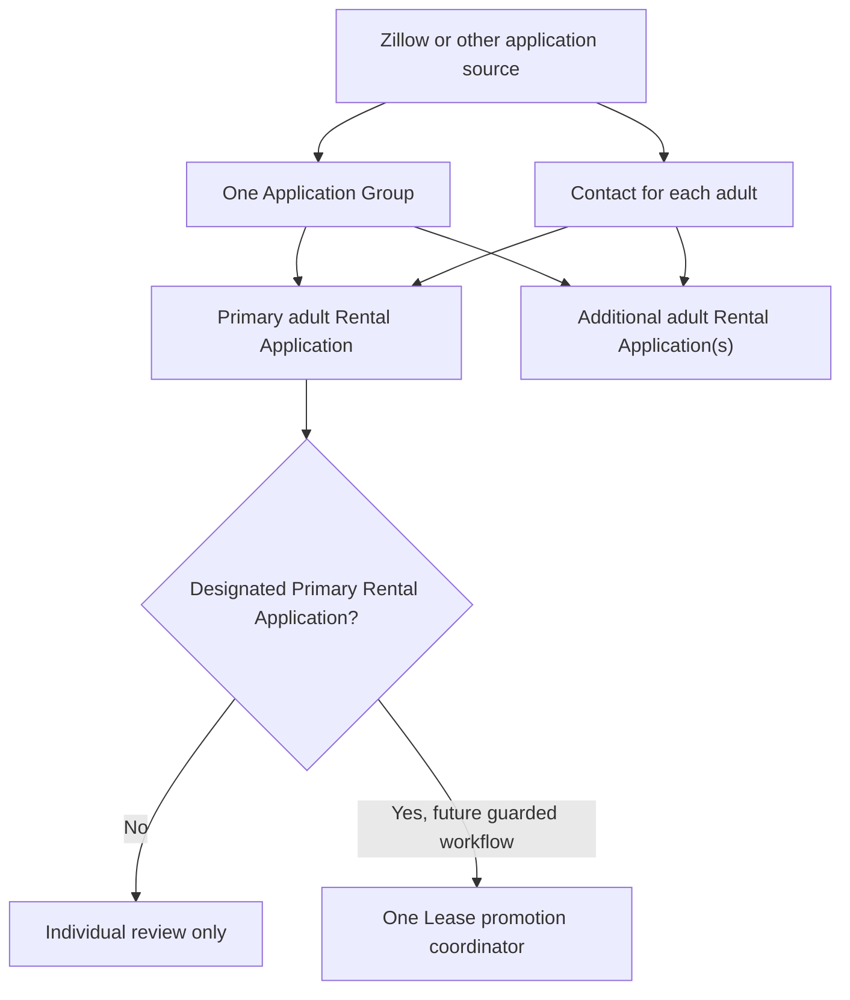

# Zoho CRM Multi-Applicant Application Groups Schema Reconciliation — July 29, 2026

**Runbook ID:** GH-ZOHO-CRM-APPLICATION-GROUPS-2026-07-29

**Status:** Bounded production schema, layout, permission, and layout-rule work completed and read back

**Tool boundary:** Approved Zoho CRM MCP servers only; no Browser control

**Data boundary:** Metadata and configuration only. No CRM records, applicant or tenant PII, application values, screening values, documents, credentials, or financial transactions were read, created, changed, or backfilled.

## 1. Purpose

This runbook records the July 29, 2026 production reconciliation that added an administrator-only Application Groups control module and revised Rental Applications so that each adult applicant owns a separate Rental Application record.

The architecture separates:

- the household/application packet, represented by one Application Group;
- each adult's application, screening provenance, verification state, and decision, represented by one Rental Application in Deals; and
- the one designated primary Rental Application that may eventually coordinate a guarded Lease promotion.

This reconciliation created metadata only. It did not populate records, import a Zillow packet, copy screening data, define a credit threshold, make an eligibility decision, create a Lease, request a Contract, or change a WorkDrive document.

## 2. Source-of-truth and runtime boundaries

Use this precedence:

1. current production metadata and permission readback from the approved CRM MCP servers;
2. the exact governed CSV manifests;
3. this sanitized reconciliation runbook and the lifecycle map;
4. screenshots, workbooks, or historical proposals.

The operating Zillow/Catalyst runtime remains Leads-only. It does not retrieve completed applications or screening reports, create Application Groups, create Rental Applications, populate credit scores, or promote an application to a Lease.

The authoritative field manifests are:

- [`application-groups.csv`](../../src/zoho-crm/field-maps/crm-module-fields/application-groups.csv)
- [`rental-applications.csv`](../../src/zoho-crm/field-maps/crm-module-fields/rental-applications.csv)
- [`rental-applications-layout.json`](../../src/zoho-crm/field-maps/rental-applications-layout.json)

Do not retype the complete 47-field Rental Applications manifest into another document. The CSV preserves exact labels, API names, types, help text, permissions, choice metadata, placement, and readback status without creating a second schema source.

## 3. Governed record model

The operating rules are:

1. Create or reuse one Contact for each adult through the separately governed identity and duplicate controls.
2. Create or reuse one Application Group for the shared household/application packet.
3. Create exactly one Rental Application Deal for each adult application.
4. Link every adult Deal to the same Application Group.
5. Set exactly one adult Deal to `Primary Applicant`; other adult roles remain explicit.
6. Set the Application Group's `Primary_Rental_Application` lookup only after the designated primary Deal exists.
7. Reconcile the number of linked adult Deals to `Expected_Adult_Application_Count`.
8. Never average, combine, minimize, maximize, or otherwise derive a household credit score from adult scores.
9. Never let more than the designated primary Deal coordinate Lease creation.

The group relationship does not turn screening evidence into reusable Contact truth or Lease data. Every score and verification fact remains attached to the adult's application instance.

## 4. Application Groups — Custom module — API `ApplicationGroups`

Application Groups is a custom control module. Its exact live API name is `ApplicationGroups`.

### 4.1 Access boundary

- Administrator profile: read/write.
- Standard profile: hidden.
- The module is not an applicant portal, tenant portal, Contracts, Books, or general staff module.
- No production Application Group records were created during reconciliation.

The platform primary display Name is an Auto-Number using prefix `AG-`, starting at 1. It is a readable system label, not a tenant identifier, Zillow identifier, or substitute for the governed group key.

### 4.2 Governed fields

| Field Label — Field Type | API name | Required control |
|---|---|---|
| Application Group Key — Single Line | `Application_Group_Key` | Text length 255; unique and case-insensitive; store only an opaque non-PII grouping key |
| Expected Adult Application Count — Number | `Expected_Adult_Application_Count` | Whole-number reconciliation target; not a count of children or total occupants |
| Household Application Status — Pick List | `Household_Application_Status` | Local live picklist; no default; history off; exact uncolored values remain in the canonical CSV |
| WorkDrive Group Folder URL — URL | `WorkDrive_Group_Folder_URL` | Internal WorkDrive URL only; never create or store a public link |
| WorkDrive Group Folder Resource ID — Single Line | `WorkDrive_Group_Folder_Resource_ID` | Immutable WorkDrive resource reference; text length 255 |
| Primary Rental Application — Lookup | `Primary_Rental_Application` | Lookup to Rental Applications, API `Deals`; designates the only future Lease-promotion coordinator |

The ordered Household Application Status values are:

1. `Gathering Applications`
2. `Ready for Screening`
3. `Screening In Progress`
4. `Decision Pending`
5. `Approved - Lease Pending`
6. `Lease Created`
7. `Closed - Not Proceeding`

All values read back uncolored, with no default and history tracking off. Those are live facts, not a recommendation that future color/history governance remain unchanged.

## 5. Rental Applications — Standard Deals module renamed — API `Deals`

### 5.1 One Deal per adult

The new application model is one Rental Application Deal per adult applicant. Standard `Contact_Name` identifies that adult. The application is linked to its household through `Application_Group`, a lookup to API `ApplicationGroups`.

`Applicant_Role` has the exact ordered live values:

1. `Primary Applicant`
2. `Co-Applicant`
3. `Guarantor`
4. `Adult Occupant`

The values read back uncolored, with no default and history tracking off.

`Zillow_Application_ID` is a source reference when one is available. `Application_Promotion_Key` is the case-insensitive unique idempotency field for controlled promotion. Neither field proves that Zillow supplied a completed application through the current runtime.

Existing co-applicant lookup fields remain live and unchanged for compatibility. They are not the canonical membership model for newly grouped adult applications, and this reconciliation performed no backfill or retirement.

### 5.2 Exact field count

The reconciliation expected and matched 47 new Rental Applications fields. It
also verified and reused the pre-existing
`WorkDrive_Application_Folder_URL` and
`WorkDrive_Application_Folder_Resource_ID` fields; neither is a 48th created
field. Final Deals field readback returned 103 fields total, with no expected
field missing and no duplicate created.

The complete 47-field specification remains in [`rental-applications.csv`](../../src/zoho-crm/field-maps/crm-module-fields/rental-applications.csv). This runbook records the architecture and high-risk controls rather than duplicating the manifest.

### 5.3 Credit-score provenance bundle

The numeric score is application-scoped and attributable to one adult. The restricted bundle is:

| Field Label — Field Type | API name |
|---|---|
| Credit Score — Number | `Credit_Score` |
| Credit Score Created Date — Date | `Credit_Score_Created_Date` |
| Credit Score Range Minimum — Number | `Credit_Score_Range_Min` |
| Credit Score Range Maximum — Number | `Credit_Score_Range_Max` |
| Credit Score Provider — Single Line | `Credit_Score_Provider` |
| Credit Report Reference ID — Single Line | `Credit_Report_Reference_ID` |
| Credit Report WorkDrive Resource ID — Single Line | `Credit_Report_WorkDrive_Resource_ID` |
| Credit Score Used in Decision — Checkbox | `Credit_Score_Used_In_Decision` |
| Credit Score Reviewed By — User | `Credit_Score_Reviewed_By` |
| Credit Score Reviewed At — Date/Time | `Credit_Score_Reviewed_At` |

Every field in this bundle is Administrator read/write and hidden from the Standard profile.

Score-range values must come from the score model's source evidence. Do not hardcode an assumed 300–850 range or treat a score from one model/date as interchangeable with another.

Schema existence does not authorize data collection or screening use. This reconciliation did not:

- populate a score or provenance value;
- import or backfill any application;
- define a minimum score or decision threshold;
- create a formula, pass/fail field, AI risk score, recommendation, or eligibility automation;
- create an adverse-action notice workflow;
- expose the bundle to Contacts, Leases, Contracts, Books, portals, general list views, dashboards, exports, notifications, or logs; or
- copy the bundle to another adult or a household aggregate.

Before any score is populated or used, GH Real Estate must separately approve a written screening policy, permissible-purpose procedure, access and retention controls, dispute/manual-review handling, fair-housing review, and complete adverse-action workflow.

### 5.4 Data excluded from CRM

The following remain outside CRM:

- raw application, credit, background, criminal-history, eviction, and housing-court reports;
- raw OCR text, report screenshots, and report attachments;
- credit-score key factors or reason-code narratives;
- tradelines, creditor names, account numbers, balances, utilization, payment history, inquiries, collections, bankruptcies, total debt, and monthly debt;
- Social Security numbers, driver's-license or state-ID data, banking information, access credentials, and identity-document images;
- criminal, eviction, or housing-court case narratives;
- prior-landlord report narratives;
- public or token-bearing report URLs;
- AI-generated screening summaries, risk scores, recommendations, or legal conclusions.

Controlled source documents remain in restricted WorkDrive storage. CRM may retain only the approved structured operational fields and immutable evidence references defined by the canonical CSV.

## 6. Rental Applications layout

The active operational layout uses these exact nine sections in order:

1. `Application Identity & Group`
2. `Property & Requested Terms`
3. `Applicant Income & Rental History`
4. `Screening Summary`
5. `Verification & Adverse Action`
6. `Household & Requests — Primary Only`
7. `Lease Promotion Snapshot — Primary Only`
8. `Documents & Integrations`
9. `System & Legacy`

The platform-managed `Rental Application Image` section remains present and unavoidable. It is not one of the nine operational sections and must not be used to upload an application, identity document, credit report, background report, or other screening evidence.

Primary-only sections contain household-level or future Lease-promotion values that must not be independently edited on every adult Deal.

The four verified standard-field labels are:

| API | Live label |
|---|---|
| `Deal_Name` | `Rental Application Name` |
| `Contact_Name` | `Applicant` |
| `Account_Name` | `Property` |
| `Closing_Date` | `Requested Move-In Date` |

The exact sanitized section order, labels, and new rule signatures are frozen
in [`rental-applications-layout.json`](../../src/zoho-crm/field-maps/rental-applications-layout.json).

## 7. Layout rules

Three new active Deals layout rules were created and read back:

| Rule | Trigger | Action |
|---|---|---|
| `Require Vehicle Count When Vehicles Declared` | `Vehicle_Declaration_Status` equals `Vehicle(s) Declared` | Show and set mandatory `Declared_Vehicle_Count` |
| `Require Parking Count When Parking Requested` | `Parking_Request_Status` equals `Requested` | Show and set mandatory `Requested_Parking_Space_Count` |
| `Show Primary Applicant Household and Lease Sections` | `Applicant_Role` equals `Primary Applicant` | Show `Household & Requests — Primary Only` and `Lease Promotion Snapshot — Primary Only` |

Final readback returned seven Deals layout rules total. The pre-existing pet-count and storage-count rules remain active and unchanged. No existing rule was deleted or rewritten merely to reduce the rule count.

The primary-only rule controls presentation. It does not itself prove that a group is complete, authorize Lease creation, enforce one and only one primary across all Deals in an Application Group, or prevent an API from writing a hidden primary-only field. Any future writer must revalidate role and group state server-side.

## 8. Operational legal and privacy references

These pinned authorities are operational references, not legal advice or approval of a screening criterion:

- **15 U.S.C. §§ 1681–1681x — Fair Credit Reporting Act — binding federal statute.** It governs permissible use of consumer reports and adverse action based wholly or partly on report information. See the repository's approved extracts in [`part 01`](../../legal/text/current/authorities/federal/federal-official/15-u-s-c-section-section-1681-1681x-2024-u-s-code-edition-51962ffac6-part-01.md) and [`part 02`](../../legal/text/current/authorities/federal/federal-official/15-u-s-c-section-section-1681-1681x-2024-u-s-code-edition-51962ffac6-part-02.md).
- **16 C.F.R. part 682 — Disposal of Consumer Report Information and Records — binding federal regulation.** Report-derived information requires reasonable disposal safeguards; the rule does not establish a retention duration. See [`16-c-f-r-part-682-c2bee5868c.md`](../../legal/text/current/authorities/federal/federal-official/16-c-f-r-part-682-c2bee5868c.md).
- **42 U.S.C. § 3604 and K.S.A. 44-1016 — binding fair-housing statutes.** Screening policy and operation must not create prohibited discrimination. See the federal [`part 01`](../../legal/text/current/authorities/federal/federal-official/42-u-s-c-section-section-3601-3631-2024-u-s-code-edition-84c5f5dcb6-part-01.md) and [`k-s-a-44-1016-8c156bd9ba.md`](../../legal/text/current/authorities/kansas/fair-housing/k-s-a-44-1016-8c156bd9ba.md).
- **K.S.A. 50-6,139b — binding Kansas personal-information safeguards and disposal statute.** See [`k-s-a-50-6-139b-49c80a253d.md`](../../legal/text/current/authorities/kansas/consumer-protection/k-s-a-50-6-139b-49c80a253d.md).
- **FTC, Using Consumer Reports: What Landlords Need to Know — nonbinding agency guidance.** It explains housing examples and adverse-action operations but does not replace the statute. See [`federal-trade-commission-business-guidance-july-20-2023-34c82563f6.md`](../../legal/text/current/authorities/federal/federal-official/federal-trade-commission-business-guidance-july-20-2023-34c82563f6.md).

Repository legal sources are verified through July 12, 2026 unless a later approved verification is recorded. Before a live score-based screening decision or consumer-report adverse action, recheck the live official source and obtain qualified Kansas counsel review as directed by [`legal/PROJECT_INSTRUCTIONS.md`](../../legal/PROJECT_INSTRUCTIONS.md).

If a score contributes to an adverse action, the future controlled process must generate the required notice from authoritative source evidence, including the applicable score disclosure elements. A CRM checkbox, date, or status alone is not notice or proof of delivery; preserve the immutable notice evidence in restricted WorkDrive.

No pinned authority supplies a numeric retention period for this schema. A written retention schedule, legal-hold rule, access policy, secure disposal procedure, and synchronized removal process must be approved before population.

## 9. Exact readback result

The sanitized production readback established:

- Application Groups custom module API: `ApplicationGroups`;
- Application Groups governed fields: 6 expected, 6 matched;
- Application Groups permissions: Administrator read/write; Standard hidden;
- Rental Applications module API: `Deals`;
- Deals fields: 103 total;
- new Rental Applications fields: 47 expected, 47 matched;
- pre-existing `WorkDrive_Application_Folder_URL` and
  `WorkDrive_Application_Folder_Resource_ID`: verified and reused, not newly
  created;
- standard Deals labels: four expected and matched;
- missing expected fields: none;
- duplicate created fields: none;
- new active Deals layout rules: 3;
- total Deals layout rules after reconciliation: 7; and
- exact nine operational sections plus the unavoidable platform image section.

Tenant-scoped organization, module, layout, field, rule, profile, and record identifiers are intentionally omitted from this repository.

## 10. Explicit unchanged boundaries

This reconciliation did not change:

- the operating Zillow/Catalyst Leads-only runtime;
- Zillow Rental Manager applications or reports;
- CRM Leads or the protected Leads baseline;
- Deals Stage, Pipeline, Probability, `Amount`, or the active Big Deal rule
  definitions, values, semantics, and dependencies; their approved layout
  placement changed to `System & Legacy`;
- existing pet-count or storage-count layout rules;
- Property Assets (`Equipment`), Pets, or Vehicles (`Tenant_Vehicles`);
- Contacts records or identity values;
- Leases fields, layouts, records, status, automation, or snapshots;
- Zoho Contracts configuration, mappings, templates, requests, counterparties, or lifecycle;
- Zoho Sign configuration, recipients, requests, or evidence;
- Zoho Books records or accounting truth;
- WorkDrive folders, files, permissions, names, links, reports, or document contents; or
- any CRM record, record value, application packet, score, report, or backfill.

Application Groups and the new fields are schema only. No Application-to-Lease automation is deployed.

## 11. Operator verification before any later data use

Before populating even one sanitized canary:

1. Confirm the production organization through the approved CRM MCP.
2. Read the Application Groups and Deals module/field metadata again.
3. Confirm Administrator/Standard permission behavior on the module and restricted bundle.
4. Confirm the exact nine operational sections and all seven layout rules.
5. Approve the written screening, retention, access, dispute, adverse-action, and fair-housing controls.
6. Use only a synthetic canary; never use a real applicant as the first test.
7. Verify one group, one Deal per synthetic adult, one primary role, the expected adult count, the designated primary lookup, and idempotency behavior.
8. Confirm no score or screening field reaches Contact, Lease, Contracts, Books, portal, email, export, log, or dashboard surfaces.
9. Remove the synthetic canary through a separately approved record-data cleanup; schema rollback is not a substitute.

## 12. Rollback boundary

Do not delete fields, modules, or records as an immediate rollback.

For a configuration rollback:

1. Re-read current metadata and stop if records, rules, reports, integrations, or values now depend on the schema.
2. Deactivate the three new layout rules and read back their inactive state.
3. Remove new fields and sections non-permanently from the active Deals layout where supported.
4. Hide Application Groups and restricted fields while dependency and value-retention review is completed.
5. Retire rather than delete fields or the custom module unless a separately approved destructive-change plan proves zero dependencies and governs record retention.
6. Revert repository documentation independently and rerun repository validation.

The absence of records at the July 29 reconciliation is not permanent rollback evidence. Always verify current state immediately before acting.

## 13. Completion statement

The bounded Application Groups and per-adult Rental Applications schema reconciliation is complete and read back. It establishes structure and permissions only.

Population, packet extraction, backfill, screening criteria, credit thresholds, adverse-action notices, group-completeness enforcement, one-primary enforcement, Application-to-Lease automation, Contracts/Sign handoff changes, and record workflows remain separately governed and undeployed.
