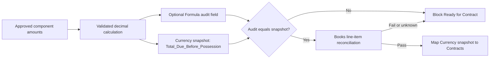

# Lease Initial Amounts and Contract Readiness

**Applies to:** GH Real Estate production

**CRM source module:** Leases -- custom module -- verified API `Leases`

**Contract type:** Residential Lease Agreement

**Status:** Design only; not deployed

**As of:** July 24, 2026

## Purpose

This specification defines the fail-closed design for calculating, reconciling, freezing, and mapping the amount due before possession. The repository field registry and document-field map now include the proposed First Full Month Base Rent Amount destination and its deferred trace; those records are design controls, not evidence of a live Zoho Contracts field or mapping.

It does not create or change a CRM field, formula, workflow, Books transaction, Contracts mapping, contract, signer, or signature request. The available MCP servers do not expose Zoho Contracts or Zoho Sign configuration, so no live formula compatibility, mapping, preview, publication, or send is claimed.

## Source-of-truth boundary

| Concern | Source of truth |
|---|---|
| Approved lease relationships, dates, and charge inputs before authoring | Zoho CRM Lease snapshot |
| Calculation policy and field governance | Approved repository specification plus qualified business/legal/accounting decisions |
| Drafted agreement and frozen legal text/value snapshot | Zoho Contracts |
| Recipients, signatures, and signing evidence | Zoho Sign |
| Invoices, receipts, credits, balances, deposits, liabilities, and payment evidence | Zoho Books |
| Sanitized design, validation rules, and deployment evidence | GitHub |

The CRM amount is a contract-input snapshot. It must never be treated as proof that an amount was invoiced, received, deposited, credited, earned, refunded, or reconciled in Books.

## Current verified state

| Concept | CRM field/type | Current decision |
|---|---|---|
| Total Due Before Possession | `Total_Due_Before_Possession` -- Currency, two decimals | Preserve as the integration snapshot. Do not convert its field type. Do not map or use it until the complete equation and readiness gate pass. |
| Monthly Rent | `Monthly_Rent` -- Currency, two decimals | Blocked: it is not known whether this means base rent or total recurring monthly rent. |
| Prorated Rent | `Prorated_Rent` -- Currency, two decimals | Blocked: it is not known whether this means prorated base rent or a broader total. |
| First Full Month Base Rent Amount | `First_Full_Month_Base_Rent_Amount` -- Currency, two decimals | Created and read back through the approved production CRM MCP on July 24, 2026. The repository registry defines a review-required, design-only Currency destination and the document map records a deferred `section_3_2.first_full_month_base_rent_amount` trace. No live Contracts API name or mapping is verified; the equation, Books reconciliation, readiness, and canary gates remain open. |
| Lease Number | No verified live field | Blocked until the format, starting sequence, and collision review are approved. |
| Lease Status | `Lease_Status` -- Pick List | History is enabled, but order is mixed with legacy values, default is null, and the field is optional. Those controls are not an enforceable readiness gate. |
| Residential Lease Agreement | Draft only | Unpublished, execution-blocked, attorney-review-required, and unsent. All 29 governed production gates remain open unless separately closed with required evidence. |

The exact current field inventory and readback evidence remain in the governed CRM CSVs and the [production reconciliation](../../../docs/runbooks/zoho-crm-lease-system-reconciliation.md). This document does not supersede them.

## Recommended two-field pattern



### Integration snapshot

Keep the verified `Total_Due_Before_Possession` Currency field as the only CRM source eligible for the Contracts merge field after all gates pass.

The snapshot exists because a contract must receive a frozen, two-decimal amount. A mutable formula can recalculate after source fields change, and the current environment has not proved that Zoho Contracts accepts, evaluates, refreshes, or freezes CRM Formula fields correctly.

The future calculation owner must:

1. re-read every source component;
2. validate applicability, currency, dates, and approved semantics;
3. calculate with decimal arithmetic;
4. write the Currency snapshot only after every validation passes;
5. read the saved snapshot back;
6. compare it to the same calculation;
7. record a sanitized success/failure event in the approved integration ledger; and
8. prevent a contract request on any mismatch or unknown result.

The write must be idempotent. Re-running with the same approved inputs may confirm the same snapshot but must not create a duplicate contract, invoice, credit, or payment.

### Optional audit formula

A separate read-only Formula field may be created later as an operator-visible control:

| Field Label -- Field Type | Proposed API | API status | Required | Help text | Contracts use |
|---|---|---|---|---|---|
| Total Due Before Possession Audit -- Formula returning Currency, two decimals | `Total_Due_Before_Possession_Audit` | `proposed_unverified` | No | Read-only audit calculation. It must equal the frozen Total Due Before Possession snapshot before a contract request. | Do not map by default. Test only in the controlled canary. |

The Formula field is not a substitute for a validated automation, Books reconciliation, or frozen Currency snapshot. Do not create it until every referenced source field has verified semantics and an approved live API name. If the formula cannot distinguish null from approved zero, omit it and calculate in the guarded workflow instead.

## Proposed baseline equation

The narrow baseline is:

```text
Gross Initial Amounts =
    Prorated Base Rent Amount
  + First Full Month Base Rent Amount
  + Security Deposit
  + Pet Security Deposit Amount
  + Prorated Pet Rent Amount
  + Prorated Storage Unit Rent Amount

Total Due Before Possession =
    Gross Initial Amounts
  - Holding Deposit Credit Applied
```

This is a proposed implementation equation, not an approved production rule. It remains blocked until the decisions below are approved and reflected in the live field model.

### July 25, 2026 MCP verification

The available production CRM MCP confirmed that
`Total_Due_Before_Possession` is a writable Currency(2) field rather than a
Formula field. The available field-update operation cannot convert its data
type in place, and the configured MCP servers expose neither reusable custom
function deployment nor Zoho Contracts field-mapping read/write operations.
Therefore no partial calculator, replacement Formula, or Contracts mapping was
created.

The approved target remains an automatically calculated Currency snapshot:
validate the component meanings, calculate with fixed-precision decimal
arithmetic in an idempotent readiness workflow, reconcile the result to Books,
freeze the snapshot, and map that Currency value to Contracts only after a
controlled canary succeeds. A Formula field may be used later as a non-mapped
audit control, but it must not replace the integration snapshot.

| Component | Intended CRM source | Gate |
|---|---|---|
| Prorated Base Rent Amount | Resolve whether `Prorated_Rent` has this exact meaning; otherwise approve and create a distinct Currency field. | Required when the tenant owes base rent for a partial month; otherwise an explicit not-applicable decision is required. |
| First Full Month Base Rent Amount | `First_Full_Month_Base_Rent_Amount` -- verified Currency. | Required when a full future month is collected before possession. A blank is never assumed to be zero. |
| Security Deposit | `Security_Deposit` -- Currency. | Required when the approved lease requires it. Accounting treatment must remain separate from rent/fee treatment. |
| Pet Security Deposit Amount | `Pet_Security_Deposit_Amount` -- Currency. | Include only for an approved ordinary-pet deposit. Never infer it for an assistance animal. |
| Prorated Pet Rent Amount | `Prorated_Pet_Rent_Amount` -- Currency. | Include only for approved ordinary-pet rent during the initial partial period. |
| Prorated Storage Unit Rent Amount | `Prorated_Storage_Unit_Rent_Amount` -- Currency. | Include only for approved storage during the initial partial period. |
| Holding Deposit Credit Applied | `Holding_Deposit_Credit_Applied` -- Currency. | Subtract only after the payment/credit and its treatment are verified in Books. The CRM value is not payment evidence. |

### Explicit exclusions and open policy decisions

- Do not include `Monthly_Rent` or `Prorated_Rent` until their meanings are resolved.
- Do not use `Total_Monthly_Pet_Rent_Amount`, `Base_Storage_Unit_Rent_Amount`, or `Total_Monthly_Storage_Rent_Amount` as amounts due before possession merely because they are recurring monthly charges.
- Decide explicitly whether a first full month of pet rent or storage rent is collected before possession. If it is, model each as a separate Currency component and add it to the governed equation; do not hide it in another field.
- Model every approved non-refundable fee as a separately labeled Currency component and identify it as non-refundable in the agreement. No such fee is included in the baseline equation.
- Do not net a concession, waiver, credit, payment, or deposit against another component unless the approved policy and Books evidence define the treatment.
- `Total Monthly Rent Amount` is a separate recurring concept. After the `Monthly_Rent` meaning is resolved, its proposed equation is base monthly rent plus total monthly ordinary-pet rent plus total monthly storage rent. It is not the initial amount due.

## Calculation and validation rules

1. Use fixed-precision decimal arithmetic. Do not use binary floating-point for money.
2. Use the lease currency and two decimal places. Block mixed or unknown currencies.
3. Approve the proration rounding rule before implementation. Until then, do not compute prorated components automatically.
4. Treat null as unknown, never as zero. Zero is valid only when the component is explicitly not applicable or an authorized zero amount is approved.
5. Require each charge and deposit component to be nonnegative.
6. Require the holding-deposit credit to be nonnegative and no greater than Gross Initial Amounts.
7. Require the calculated total and saved snapshot to be nonnegative and exactly equal at two decimals.
8. When proration applies, require both proration dates, require start on or before end, and verify the dates against the approved possession and first-regular-rent dates.
9. Do not calculate from display labels, stale aliases, or proposed API names. Use only APIs verified after the final field decision.
10. Re-read source values immediately before freezing the snapshot. If any value changes before contract creation, invalidate readiness and recalculate.
11. After a contract is generated, changes to CRM must not overwrite the generated or executed agreement. A changed term requires the governed correction, amendment, or regeneration process.

## Ready-for-Contract gate

The Lease may move to the exact live Ready For Contract value only when one atomic validator confirms all applicable conditions:

- the approved Lease Number field exists, its exact API/type/format were read back, and the Lease has one nonblank generated value;
- `Monthly_Rent` and `Prorated_Rent` semantics have been resolved without creating duplicate fields;
- every required relationship, term, premises snapshot, party snapshot, addendum, date, recurring amount, and initial component is complete;
- the proposed baseline equation and every optional first-full-month or fee component have written approval;
- every amount passes the calculation rules;
- the audit calculation, when present, equals `Total_Due_Before_Possession`;
- the Books reconciliation below passes;
- `Attorney_Review_Required` is false or the required qualified approval is recorded;
- `Nonstandard_Terms` is false or the approved nonstandard terms and review evidence are complete;
- the applicable addenda and signer variant are approved;
- current Contracts field metadata and the exact module-wise mappings were verified;
- the Contracts/Sign canary has passed for the deployed configuration; and
- every Residential Lease Agreement production gate is closed by its required evidence.

`Lease_Status` itself does not enforce this gate. Its live field is optional, has no default, and its ordered values are not in the governed target order. A future workflow must validate the complete record first and then perform the transition. It must reject a manual or automated request that relies only on a displayed status label.

## Zoho Books reconciliation

Books remains the financial truth even when the contract value originates from a CRM Lease snapshot.

Before freezing the snapshot:

1. Resolve the correct live Books organization and legal entity.
2. Resolve the tenant/customer and every applicable approved item/account/tax/location/tag mapping by immutable identifier.
3. Build an initial-amount line-item schedule from the same approved components used by the calculation.
4. Keep base rent, pet rent, storage rent, refundable deposits, non-refundable fees, and credits on separate lines and approved accounting treatments.
5. Verify any holding-deposit receipt or credit in Books. Match amount, currency, customer, immutable payment/reference ID, date, application, refund status, and reversal status.
6. Compare the CRM component schedule and total to the approved Books draft or pre-billing schedule. The total may span multiple Books objects; do not force a deposit liability and rent charge into one accounting transaction.
7. Stop on missing mappings, mixed currency, duplicate documents, unapplied or reversed payments, stale balances, or any line/total mismatch.
8. Do not mark the amount paid, post income, create an invoice, apply a credit, or alter a deposit from this calculation alone.

The reconciliation result belongs in a restricted runtime audit ledger. Store operation key, record identifiers, component totals, calculated total, snapshot total, timestamps, version, and pass/fail reason without raw tenant data or payment payloads in GitHub.

## Contracts and Sign compatibility decision

The production-safe decision is to map only verified CRM Currency snapshots, never a Formula field as the default production source. `Total_Due_Before_Possession` is the aggregate snapshot; a component snapshot may be mapped to a separate agreement line only when the template requires it and the same controls pass.

| CRM source | Contracts destination | Decision |
|---|---|---|
| `First_Full_Month_Base_Rent_Amount` -- Currency | First Full Month Base Rent Amount -- proposed Currency; Contracts API name unverified | Repository trace only. Eligible for a separate Section 3.2 component line only after the complete equation, Books reconciliation, readiness gate, Contracts metadata verification, and controlled canary pass. |
| `Total_Due_Before_Possession` -- Currency | Total Due Before Possession -- expected Currency | Eligible only after metadata verification, complete readiness, and canary success. |
| Proposed `Total_Due_Before_Possession_Audit` -- Formula returning Currency | Separate temporary canary destination, if supported | Test-only. Do not make it the production source merely because one preview renders. |

There is no current evidence that a CRM Formula field can be selected, evaluated, formatted, refreshed, and frozen correctly through the Zoho Contracts custom-module mapping. There is also no Contracts or Sign MCP available in this task to test that behavior. Formula portability is therefore unverified.

Even if the canary proves Formula compatibility, the Currency snapshot remains the recommended production source because it is explicit, read-back verifiable, and can be frozen before authoring.

## Controlled Contracts/Sign canary

This is a future manual test plan. It is not authorization to use Browser control, publish the Residential Lease Agreement, access tenant records, or send a signature request.

### Preconditions

- use an approved Zoho sandbox or isolated non-production organization when available;
- use a synthetic Lease, synthetic contacts, test-only email addresses, and nonbinding values;
- record the connected organizations, versions, mappings, and before-state without secrets or record data;
- obtain the authenticated Contracts field metadata and verify `apiName`, `metaType`, `dataType`, and `displayType`;
- close all gates required for the chosen test surface; and
- keep the production Residential Lease Agreement Draft only, unpublished, execution-blocked, and unsent.

If a Sign transmission is necessary to prove recipient behavior, use a separately approved nonbinding canary template. Do not publish or send the production Residential Lease Agreement merely to complete the test.

### Test matrix

Run at least these sanitized cases:

| Case | Inputs | Expected result |
|---|---|---|
| Base only | Prorated base, first full month base, and security deposit; optional pet/storage values explicitly N/A; no holding credit | Snapshot equals the approved component sum and renders with two decimals. |
| Pet and storage | Approved ordinary-pet deposit/rent and storage proration included | Each component appears on the correct contract line; no value is merged into an unrelated fee/deposit line. |
| Holding credit | Verified credit less than Gross Initial Amounts | Credit subtracts once; document shows the approved label/treatment; no duplicate Books application occurs. |
| Exact offset | Verified credit equals Gross Initial Amounts | Total is `0.00`, not blank or negative. |
| Missing required component | One required value is null | Readiness blocks; no contract or envelope is created. |
| Over-credit or negative component | Credit exceeds gross or any component is negative | Readiness blocks; no write/send side effect occurs. |
| Snapshot mismatch | Formula/workflow calculation differs from saved snapshot by any amount | Readiness blocks and records a sanitized mismatch. |
| Source mutation | A component changes after snapshot freeze | Prior readiness is invalidated; the generated contract is not silently overwritten. |

Test the Formula audit field only in a separate mapping attempt. Confirm whether it is selectable, current at request time, formatted as Currency, copied as a fixed contract value, and unchanged by later CRM edits. Any blank, stale, unsupported, reformatted, or mutable result fails Formula compatibility.

For the Sign portion, verify recipient identity/routing separately from merge-field values: only the actual synthetic signers are present, order is contiguous, GH is last, no optional-tenant placeholder exists, and no document field is mistaken for a recipient.

### Acceptance evidence

The canary passes only when:

- the Currency snapshot renders exactly at two decimals and equals the displayed component schedule;
- null and zero remain distinguishable;
- the holding credit appears and subtracts exactly once;
- Contracts stores a frozen value and later CRM edits do not alter the draft/executed document silently;
- Sign recipient routing matches the governed signer variant;
- no unintended Books, CRM, Contracts, email, or signature side effect occurs;
- readback evidence is retained in a sanitized deployment record; and
- rollback restores the captured mapping/configuration state.

One passing happy-path preview is insufficient.

## Lease Number decision

The recommended design is an Auto-Number field with a stable `GH-LEASE-` prefix, a six-digit non-resetting sequence, and no tenant, property, year, or other mutable/business-sensitive data in the identifier.

Do not create it yet. First:

1. audit existing lease names/numbers and external references for collisions;
2. approve the start number and migration/backfill treatment;
3. confirm whether the live module permits the chosen prefix and digit configuration;
4. create and read back the actual API/type/auto-number metadata; and
5. verify Contracts and Books treat the value as text.

The proposed API remains `Lease_Number` with status `blocked_ambiguous` until that readback. Lease Number is a human-facing reference, not the integration idempotency key; use immutable system IDs in the runtime ledger.

## Ambiguous legacy rent fields

Do not relabel, move, map, calculate from, or repurpose `Monthly_Rent` or `Prorated_Rent` until a dependency audit establishes:

- current operator meaning;
- populated-value patterns without exporting values to GitHub;
- reports, formulas, workflows, buttons, functions, APIs, Books mappings, Contracts mappings, and portal dependencies;
- whether the field is base-only or an aggregate; and
- how historical records should be interpreted.

After the audit, choose exactly one path per field:

- if its meaning is proven compatible, reuse the field, preserve its API, update only the display/help text needed to make the meaning explicit, and read the result back; or
- if its meaning is incompatible or mixed, preserve it as legacy, stop new writes, and create one explicitly named Currency field after migration and rollback plans are approved.

Do not create both a new field and a renamed alias for the same concept.

## Deployment sequence

1. Approve the initial-amount component policy, proration/rounding, optional first-full-month pet/storage treatment, fee treatment, and Lease Number format.
2. Resolve `Monthly_Rent` and `Prorated_Rent`.
3. Create only any remaining confirmed Currency/Auto-Number fields and read their metadata back. `First_Full_Month_Base_Rent_Amount` is already verified live and must not be duplicated.
4. Implement the guarded, idempotent calculator and Books reconciliation in an approved test environment.
5. Optionally add the Formula audit field after all source APIs are verified.
6. Implement an atomic readiness validator; do not rely on Lease Status required/default/order behavior.
7. Run the Contracts/Sign canary and retain sanitized evidence.
8. Configure only the approved Currency-snapshot mappings: the aggregate total and any separately required template component such as First Full Month Base Rent Amount. Keep Formula fields out of the production mapping.
9. Close the separate Residential Lease Agreement legal, field, template, typography, signer, and publication gates.
10. Authorize publication/request/send as separate actions. Never combine configuration, canary, publication, and a real signature send into one change.

## Rollback

- Disable the readiness workflow and Contracts mapping before changing any field behavior.
- Restore mapping/configuration from captured before-state; do not guess prior settings.
- Preserve the existing Currency snapshot and all record/audit history. Do not delete values to force recalculation.
- Remove a newly created audit Formula from active layouts only after confirming no report or automation depends on it.
- Correct a generated-but-unsent draft through the governed regeneration process. Do not overwrite an executed agreement.
- Correct Books through an approved compensating transaction or status process, never by deleting evidence.
- A repository revert changes documentation only; it does not reverse CRM, Books, Contracts, or Sign state.

## Current claims boundary

As of this specification:

- no live calculation or formula was created;
- `First_Full_Month_Base_Rent_Amount` exists as a verified CRM Currency input; GitHub now records a review-required destination definition and deferred document-map trace, but no existing live field type or meaning was changed;
- no Lease Number was created;
- no Lease Status order, default, or required control was enforced;
- no Books transaction or record value was read or changed;
- no live Contracts extension, field mapping, button, counterparty, contract, or template was changed, and no Contracts destination API name was verified;
- no Sign recipient or request was created;
- no formula-to-Contracts compatibility was verified; and
- the Residential Lease Agreement remains Draft only, unpublished, execution-blocked, attorney-review-required, and unsent.
