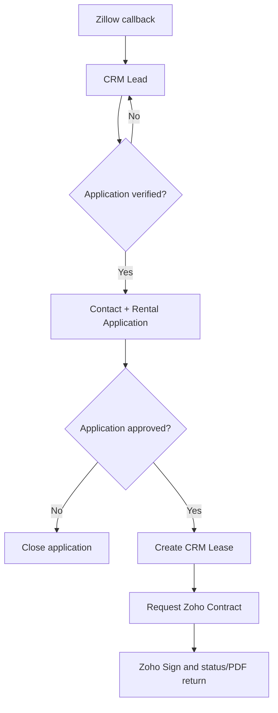

# Zillow to Zoho CRM to Zoho Contracts Field Map

Use sanitized examples only. Do not store real applications, screening reports, IDs, pay stubs, or tenant documents in GitHub.

## Current-state answer

The operating Zillow/Catalyst integration creates or updates CRM Leads only. It does not:

- create or convert Contacts;
- create Rental Applications in the renamed Deals module;
- retrieve a completed Zillow rental application or screening reports;
- create Leases;
- request a Zoho Contract; or
- trigger CRM workflows, approvals, or blueprints under the documented production configuration.

The Zillow Lead API field `leadType=applicationRequest` is only an application-related lead signal. Zillow's public guide does not define it as a completed submission event, and the payload does not contain the complete application, credit report, background report, housing-court report, attachments, report IDs, or report URLs. Completed applications and reports remain in Zillow Rental Manager's Applications tab unless Zillow supplies a separate approved partner integration.

Therefore, a Zillow application does not automatically appear in the CRM Rental Applications module under the current system.

## Governed lifecycle

### 1. Zillow callback to Lead

Zillow is an inquiry and application-interest source. Zoho CRM owns the operational pipeline after intake.

The Catalyst service upserts only:

- Leads — standard module — API `Leads`

It reads Units for routing but does not modify them. Deduplication uses the verified `Zillow_Lead_Key`.

A callback is a prospect signal, not proof of approval, a tenant relationship, or an executable lease.

### 2. Verified application to Contact plus Rental Application

Zoho's native conversion starts from a Lead, not from a Rental Application. It can create a Contact and optionally a Deal in one conversion operation.

For GH Real Estate, the safe operator action is a controlled **Promote to Rental Application** action on the Lead:

1. Confirm the person and whether a completed application actually exists.
2. Check for an existing Contact by approved duplicate rules.
3. Reuse or create the Contact.
4. Create one Rental Application in Deals.
5. Link the Contact, source Lead, requested Property, and requested Unit.
6. Copy only the permitted application-stage data.
7. Record an idempotency link so repeating the action cannot create another Contact or Application.

Properties are the renamed Accounts module. Do not let renter text in Lead Company create a new Account/Property during conversion. Use the already resolved Property record and a controlled B2C conversion path.

If a live custom button currently appears on Rental Applications and says it converts the applicant to a Contact, audit it before reuse. The preferred architecture establishes the Contact when the Lead is promoted and makes the Rental Application reference that Contact.

### 3. Completed Zillow application data

The current public Zillow Lead API cannot populate the complete Rental Application automatically.

Until Zillow provides an approved application-data API, use one of these controlled paths:

- review the completed application and reports in Zillow Rental Manager, then enter only the operational facts and decision results needed in CRM;
- collect the application through an approved Zoho form/application workflow that writes the Rental Application securely; or
- implement a Zillow private-partner interface only after written access, schema, consent, retention, and security review.

Do not scrape Zillow, automate a signed-in browser, share Zillow credentials, or copy screening reports into Contact or Lease records.

### 4. Approved Rental Application to Lease

Contact creation must not create a Lease. A person can exist without an approved application, and one Contact can have multiple applications over time.

Use one guarded **Create Lease** action on the approved Rental Application:

1. Require an approved decision and all approved rent, deposit, date, Property, Unit, and tenant fields.
2. Search for an existing Lease linked to the Rental Application.
3. Stop or return that Lease if one already exists.
4. Create one Lease in Draft status.
5. Copy approved terms and frozen Property/Unit/tenant snapshots.
6. Link the Lease back to its source Rental Application through the Lease lookup.
7. Advance the Application to Lease Record Created only after creation succeeds.

A simple workflow Create Record action may be sufficient only if the live layout supports all required lookups and duplicate protection. Prefer a custom function/button when validation, lookup traversal, snapshotting, or idempotency cannot be proven with the native action.

### 5. Lease to Zoho Contracts

Lease creation and contract creation are separate controls.

From the Lease record:

1. Verify the Lease is Ready for Contract.
2. Use the Zoho Contracts extension's **Request Contract** button.
3. Configure Primary Tenant as the counterparty.
4. Map the Lease snapshot fields to the Residential Lease Agreement.
5. Route any additional signers separately in Zoho Sign.
6. Use the Lease's Zoho Contracts related list for lifecycle status and returned documents.

The public extension workflow is an intentional request action. It does not document automatic contract creation merely because a Lease record was created.

## Data ownership through the lifecycle

| Module/system | Owns | Must not become |
|---|---|---|
| Leads | Raw Zillow identity, contact, inquiry, routing, and enriched profile fields supplied by the Lead API | Completed application or screening source of truth |
| Contacts | Reusable person identity and current contact details | A copy of every application, report, or lease term |
| Rental Applications — Deals | Application instance, screening workflow/status, verification, decision, and proposed/approved terms | Executed lease lifecycle |
| Leases | Approved tenant relationships, Property/Unit links, dates, charges, and frozen contract inputs | Screening-report repository or payment ledger |
| Zoho Contracts | Drafting, approvals, contract lifecycle, and legal agreement snapshot | CRM relationship master |
| Zoho Sign | Recipient routing, signatures, and signing evidence | Lease-term source of truth |
| Zoho Books | Customers, invoices, payments, credits, deposits, and balances | Applicant-screening store |
| Zillow Rental Manager | Complete Zillow application and reports under current public capabilities | CRM lifecycle master |
| GitHub | Sanitized code, schemas, tests, and operating documentation | Tenant/applicant data store |

## CRM Lead field map

| Zillow source field | CRM module | Verified CRM API field | Contracts merge field | Notes |
|---|---|---|---|---|
| Parsed first name from `name` | Leads | `First_Name` | None | Parsed from Zillow renter name. |
| Parsed last name from `name` | Leads | `Last_Name` | None | Required by Zoho Leads. Uses a sanitized fallback only if missing. |
| System company value | Leads | `Company` | None | Runtime placeholder only; never convert it into a Property. |
| `email` | Leads | `Email` | None | Used for follow-up, not as the sole duplicate key. |
| `phone` | Leads | `Mobile` | None | Zillow sends one phone value; GH uses Mobile as primary. |
| Secondary/alternate phone | Leads | `Phone` | None | Runtime compatibility support; not listed in the current public guide. |
| Fixed value Zillow | Leads | `Lead_Source` | None | Source attribution. |
| Intake default | Leads | `Lead_Status` | None | New Zillow Inquiry. |
| Property lookup from routing | Leads | `Requested_Property` | None | Optional lookup from the Unit routing map. |
| Unit lookup from routing | Leads | `Requested_Unit` | None | Optional lookup from the Unit routing map. |
| `movingDate` | Leads | `Requested_Move_In_Date` | None | Zillow `YYYYMMDD` converted to CRM Date. |
| `message` plus `introduction` | Leads | `Inquiry_Message` | None | Zillow inquiry text. |
| Optional renter profile fields | Leads | `Zillow_Renter_Profile_Summary` | None | Includes supplied income/employment/pet/credit-range summaries; it is not a completed application. |
| Generated key | Leads | `Zillow_Lead_Key` | None | Unique idempotent upsert key. |
| Source lead ID if supplied | Leads | `Zillow_Lead_ID` | None | Optional compatibility field. |
| `listingId` | Leads | `Zillow_Listing_ID` | None | Strongest inbound routing key. |
| Source URL if supplied | Leads | `Zillow_Listing_URL` | None | Optional link. |
| `leadType` | Leads | `Zillow_Lead_Type` | None | question, tourRequest, or applicationRequest; not completion proof. |
| `providerModelId` | Leads | `Zillow_Provider_Model_ID` | None | Multifamily/floorplan routing. |
| `moveInTimeframe` | Leads | `Zillow_Move_In_Timeframe` | None | Current documented enum. |
| Combined listing address | Leads | `Zillow_Property_Address_Raw` | None | Raw/composed listing address. |
| `listingStreet` | Leads | `Zillow_Listing_Street` | None | Listing street. |
| `listingUnit` | Leads | `Zillow_Listing_Unit` | None | Listing unit. |
| `listingCity` | Leads | `Zillow_Listing_City` | None | Listing city. |
| `listingState` | Leads | `Zillow_Listing_State` | None | Listing state. |
| `listingPostalCode` | Leads | `Zillow_Listing_Postal_Code` | None | Text preserves formatting. |
| `listingContactEmail` | Leads | `Zillow_Listing_Contact_Email` | None | Routing diagnostics. |
| Receipt timestamp | Leads | `Zillow_Received_At` | None | Date-Time. |
| Last processing timestamp | Leads | `Last_Zillow_Sync_At` | None | Date-Time. |
| Technical intake status | Leads | `Zillow_Intake_Status` | None | Sanitized processing state. |
| Payload hash | Leads | `Zillow_Source_Payload_Hash` | None | One-way audit/debug hash. |
| Received field names | Leads | `Zillow_Raw_Field_Keys` | None | Keys only, not private values. |
| Payload storage flag | Leads | `Zillow_Raw_Payload_Stored` | None | False under the current design. |
| Intake summary | Leads | `Description` | None | Sanitized operational summary. |

Do not create `Desired_Rent`, `Desired_Deposit`, `Manual_Review_Required`, or `Manual_Review_Reason` for Zillow intake.

## Promotion mapping

The actual field API names must be verified against live CRM metadata before implementation.

| Data | Lead to Contact | Lead/application to Rental Application | Approved Application to Lease |
|---|---|---|---|
| Name, email, phone | Copy/reconcile reusable identity | Reference Primary Applicant | Freeze approved tenant/signing snapshots where required |
| Source Lead | Keep conversion trace if approved | Link Source Lead | Do not duplicate unless needed for audit |
| Property/Unit | Do not place on person | Link requested/approved records | Link approved records and freeze premises address |
| Income/employment/profile | Do not make reusable Contact truth | Store only permitted application-stage facts | Do not copy screening facts |
| Screening outcome | None | Application decision/status | Only approval conditions that affect the agreement |
| Dates, rent, deposit | None | Proposed then owner-approved values | Copy owner-approved values only |
| Pets/addenda/nonstandard terms | None | Review/approval fields | Copy only approved contract inputs |

## Separate outbound listing publication

Outbound Zillow listing publication is not part of this inbound Lead-to-Lease service. See [Zillow Listing Publication](../integrations/zillow-listing-publish/README.md).

The recommended current model is:

- Unit controls whether a rentable space is ready for marketing and owns asking rent/availability.
- Property supplies shared building/address data.
- Gabriel approves and publishes manually in Zillow Rental Manager.
- If Zillow later approves a feed, use a separate Catalyst integration and one multifamily property listing with nested unit models, subject to onboarding confirmation.
- Never publish merely because a Unit becomes vacant, and never remove a listing merely because someone applies.

## Verification still required

Before implementing the promotion or Lease actions:

- audit live Lead conversion mappings, workflows, buttons, functions, and duplicate rules;
- verify whether the apparent Rental Application Contact-conversion button exists and what it executes;
- verify the live Deals, Contacts, Properties, Units, and Leases field API names and types;
- confirm required Lease creation lookups and snapshot fields;
- test idempotency with sanitized records;
- configure the Zoho Contracts custom-module extension and field mappings;
- confirm Zillow's exact applicationRequest event semantics or continue treating it as a non-authoritative signal.

## Official sources

Reviewed July 24, 2026:

- [Zillow Rentals Lead API](https://www.zillowgroup.com/developers/api/rentals/lead-api/)
- [Zillow Lead Delivery API Guide](https://s3.amazonaws.com/files.hotpads.com/+guides/Lead+API+Guide.pdf)
- [Zillow completed-application availability](https://help.zillowrentalmanager.com/hc/en-us/articles/360058413213-A-renter-said-they-applied-When-will-I-receive-their-application)
- [Zillow application and report printing](https://help.zillowrentalmanager.com/hc/en-us/articles/360000964667-How-do-I-download-and-print-their-application-for-my-records)
- [Zoho CRM lead conversion](https://help.zoho.com/portal/en/kb/crm/sales-force-automation/leads/articles/convert-leads)
- [Zoho CRM Convert Lead API](https://www.zoho.com/crm/developer/docs/api/v8/convert-lead.html)
- [Zoho CRM workflow record creation](https://help.zoho.com/portal/en/kb/crm/automate-business-processes/workflows/articles/configuring-workflow-rules)
- [Zoho Contracts CRM extension setup](https://help.zoho.com/portal/en/kb/contracts/admin-guide/integrations/zoho-crm/articles/setting-up-zoho-contracts-extension-in-zoho-crm)
- [Requesting contracts from CRM](https://help.zoho.com/portal/en/kb/contracts/user-guide/integrations/zoho-crm/articles/initiating-contract-requests-from-zoho-crm)
