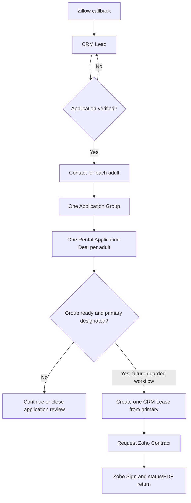

# Zillow to Zoho CRM to Zoho Contracts Field Map

Use sanitized examples only. Do not store real applications, screening reports, IDs, pay stubs, or tenant documents in GitHub.

## Current-state answer

The operating Zillow/Catalyst integration creates or updates CRM Leads only. It does not:

- create or convert Contacts;
- create Rental Applications in the renamed Deals module;
- retrieve a completed Zillow rental application or screening reports;
- create Leases;
- request a Zoho Contract; or
- trigger CRM workflows, approvals, or blueprints under the documented production configuration.

The Zillow Lead API field `leadType=applicationRequest` is only an application-related lead signal. Zillow's public guide does not define it as a completed submission event, and the payload does not contain the complete application, credit report, background report, housing-court report, attachments, report IDs, or report URLs. Completed applications and reports remain in Zillow Rental Manager's Applications tab unless Zillow supplies a separate approved partner integration.

Therefore, a Zillow application does not automatically appear in the CRM Rental Applications module under the current system.

The [July 29, 2026 Application Groups and per-adult Rental Applications schema reconciliation](../../../docs/runbooks/zoho-crm-application-groups-schema-reconciliation-2026-07-29.md) does not change that runtime boundary. The new module, fields, sections, permissions, and layout rules are production metadata only. No Application Group or Rental Application record was created, no Zillow or WorkDrive document was changed, and no application, credit score, report, or screening value was populated or backfilled.

## Governed lifecycle



### 1. Zillow callback to Lead

Zillow is an inquiry and application-interest source. Zoho CRM owns the operational pipeline after intake.

The Catalyst service upserts only:

- Leads — standard module — API `Leads`

It reads Units for routing but does not modify them. Deduplication uses the verified `Zillow_Lead_Key`.

A callback is a prospect signal, not proof of approval, a tenant relationship, or an executable lease.

### 2. Verified multi-adult application to Contacts, Application Group, and Rental Applications

Zoho's native conversion starts from a Lead, not from a Rental Application. It can create a Contact and optionally a Deal in one conversion operation.

For GH Real Estate, the safe operator action is a controlled **Promote to Rental Application** action on the Lead:

1. Confirm that a completed application packet exists and identify every adult applicant without copying private document content into GitHub.
2. Check for an existing Contact for each adult through approved duplicate rules.
3. Reuse or create one Contact per adult.
4. Create or reuse one Application Group using an opaque, unique, non-PII group key.
5. Create one Rental Application Deal per adult and link its standard `Contact_Name`, `Application_Group`, `Applicant_Role`, source Lead when applicable, requested Property, and requested Unit.
6. Assign exactly one adult Deal the role `Primary Applicant`.
7. Set the Application Group's `Primary_Rental_Application` lookup only after the designated primary Deal exists.
8. Reconcile linked adult Deals to `Expected_Adult_Application_Count`.
9. Copy only permitted application-stage structured facts.
10. Use `Application_Promotion_Key` as the unique case-insensitive promotion control so a retry cannot create a duplicate adult application.

Properties are the renamed Accounts module. Do not let renter text in Lead Company create a new Account/Property during conversion. Use the already resolved Property record and a controlled B2C conversion path.

If a live custom button currently appears on Rental Applications and says it converts the applicant to a Contact, audit it before reuse. The governed architecture establishes each Contact before its adult Rental Application and never changes one Deal from one adult to another.

#### Application Groups — Custom module — API `ApplicationGroups`

Application Groups is an administrator-only control module. The Standard profile is hidden. Its platform primary display Name is Auto-Number with prefix `AG-`, starting at 1.

Its six governed custom fields are:

| Field Label — Field Type | API name | Control |
|---|---|---|
| Application Group Key — Single Line | `Application_Group_Key` | Unique, case-insensitive, opaque, and non-PII |
| Expected Adult Application Count — Number | `Expected_Adult_Application_Count` | Reconciles adult application completeness |
| Household Application Status — Pick List | `Household_Application_Status` | Group-level workflow summary |
| WorkDrive Group Folder URL — URL | `WorkDrive_Group_Folder_URL` | Internal URL only; never public |
| WorkDrive Group Folder Resource ID — Single Line | `WorkDrive_Group_Folder_Resource_ID` | Immutable folder reference |
| Primary Rental Application — Lookup to Deals | `Primary_Rental_Application` | Designates the only future Lease-promotion coordinator |

Exact field and picklist metadata remain in
[`crm-module-fields/application-groups.csv`](crm-module-fields/application-groups.csv).
Exact Rental Applications field metadata remains in
[`crm-module-fields/rental-applications.csv`](crm-module-fields/rental-applications.csv);
the sanitized section order, standard-field labels, and rule signatures remain
in [`rental-applications-layout.json`](rental-applications-layout.json).

#### Per-adult credit-score provenance

The restricted adult-application bundle is `Credit_Score`, `Credit_Score_Created_Date`, `Credit_Score_Range_Min`, `Credit_Score_Range_Max`, `Credit_Score_Provider`, `Credit_Report_Reference_ID`, `Credit_Report_WorkDrive_Resource_ID`, `Credit_Score_Used_In_Decision`, `Credit_Score_Reviewed_By`, and `Credit_Score_Reviewed_At`.

These fields are Administrator read/write and hidden from the Standard profile. Their schema presence does not authorize population or screening use. No score, report reference, threshold, formula, decision rule, notice workflow, automation, or backfill was created.

Raw reports, OCR, key factors, reason-code narratives, tradelines, creditor or account data, balances, debt totals, Social Security numbers, license/state-ID data, banking data, criminal or eviction narratives, public or token-bearing report URLs, and AI-generated risk scores or recommendations stay out of CRM. Restricted WorkDrive remains the document/evidence boundary.

### 3. Completed Zillow application data

The current public Zillow Lead API cannot populate the complete Rental Application automatically.

Until Zillow provides an approved application-data API, use one of these controlled paths:

- review the completed application and reports in Zillow Rental Manager, then enter only the operational facts and decision results needed in CRM;
- collect the application through an approved Zoho form/application workflow that writes the Rental Application securely; or
- implement a Zillow private-partner interface only after written access, schema, consent, retention, and security review.

Do not scrape Zillow, automate a signed-in browser, share Zillow credentials, or copy screening reports into Contact or Lease records.

### 4. Approved Rental Application to Lease

Contact creation must not create a Lease. A person can exist without an approved application, and one Contact can have multiple applications over time.

Only the Application Group's designated `Primary_Rental_Application` may eventually coordinate one guarded **Create Lease** action:

1. Confirm the current Deal is the exact `Primary_Rental_Application` on its Application Group.
2. Confirm the expected adult count, linked adult applications, roles, and authorized decisions are reconciled.
3. Require approved rent, deposit, date, Property, Unit, tenant, and contract-control fields on the primary Deal.
4. Search for an existing Lease linked to the primary Rental Application; do not assume the current Lease schema has an Application Group lookup.
5. Stop or return that Lease if one already exists.
6. Create one Lease in Draft status.
7. Copy only approved terms and frozen Property/Unit/tenant snapshots.
8. Link the Lease back through the governed source relationship.
9. Advance the group and primary application only after creation succeeds and readback proves one Lease.

A simple workflow Create Record action may be sufficient only if the live layout supports all required lookups and duplicate protection. Prefer a custom function/button when validation, lookup traversal, snapshotting, or idempotency cannot be proven with the native action.

No grouped Application-to-Lease automation was deployed on July 29. Existing Lease, Contracts, Sign, and Books schemas and records were unchanged.

### 5. Lease to Zoho Contracts

Lease creation and contract creation are separate controls.

From the Lease record:

1. Verify the Lease is Ready for Contract.
2. Use the Zoho Contracts extension's **Request Contract** button.
3. Configure Primary Tenant as the counterparty.
4. Map the Lease snapshot fields to the Residential Lease Agreement.
5. Route any additional signers separately in Zoho Sign.
6. Use the Lease's Zoho Contracts related list for lifecycle status and returned documents.

The public extension workflow is an intentional request action. It does not document automatic contract creation merely because a Lease record was created.

## Data ownership through the lifecycle

| Module/system | Owns | Must not become |
|---|---|---|
| Leads | Raw Zillow identity, contact, inquiry, routing, and enriched profile fields supplied by the Lead API | Completed application or screening source of truth |
| Contacts | Reusable person identity and current contact details | A copy of every application, report, or lease term |
| Application Groups — custom API `ApplicationGroups` | Non-PII group key, expected adult count, household workflow summary, controlled WorkDrive folder reference, and primary Rental Application designation | Screening-report store, person record, Lease, or tenant portal |
| Rental Applications — Deals | One adult's application instance, application-group relationship, screening provenance/status, verification, decision, and proposed/approved terms | Household score aggregate, executed lease lifecycle, or screening-report repository |
| Leases | Approved tenant relationships, Property/Unit links, dates, charges, and frozen contract inputs | Screening-report repository or payment ledger |
| Zoho Contracts | Drafting, approvals, contract lifecycle, and legal agreement snapshot | CRM relationship master |
| Zoho Sign | Recipient routing, signatures, and signing evidence | Lease-term source of truth |
| Zoho Books | Customers, invoices, payments, credits, deposits, and balances | Applicant-screening store |
| Zillow Rental Manager | Complete Zillow application and reports under current public capabilities | CRM lifecycle master |
| GitHub | Sanitized code, schemas, tests, and operating documentation | Tenant/applicant data store |

## CRM Lead field map

| Zillow source field | CRM module | Verified CRM API field | Contracts merge field | Notes |
|---|---|---|---|---|
| Parsed first name from `name` | Leads | `First_Name` | None | Parsed from Zillow renter name. |
| Parsed last name from `name` | Leads | `Last_Name` | None | Required by Zoho Leads. Uses a sanitized fallback only if missing. |
| System company value | Leads | `Company` | None | Runtime placeholder only; never convert it into a Property. |
| `email` | Leads | `Email` | None | Used for follow-up, not as the sole duplicate key. |
| `phone` | Leads | `Mobile` | None | Zillow sends one phone value; GH uses Mobile as primary. |
| Secondary/alternate phone | Leads | `Phone` | None | Runtime compatibility support; not listed in the current public guide. |
| Fixed value Zillow | Leads | `Lead_Source` | None | Source attribution. |
| Intake default | Leads | `Lead_Status` | None | New Zillow Inquiry. |
| Property lookup from routing | Leads | `Requested_Property` | None | Optional lookup from the Unit routing map. |
| Unit lookup from routing | Leads | `Requested_Unit` | None | Optional lookup from the Unit routing map. |
| `movingDate` | Leads | `Requested_Move_In_Date` | None | Zillow `YYYYMMDD` converted to CRM Date. |
| `message` plus `introduction` | Leads | `Inquiry_Message` | None | Zillow inquiry text. |
| Optional renter profile fields | Leads | `Zillow_Renter_Profile_Summary` | None | Includes supplied income/employment/pet/credit-range summaries; it is not a completed application. |
| Generated key | Leads | `Zillow_Lead_Key` | None | Unique idempotent upsert key. |
| Source lead ID if supplied | Leads | `Zillow_Lead_ID` | None | Optional compatibility field. |
| `listingId` | Leads | `Zillow_Listing_ID` | None | Strongest inbound routing key. |
| Source URL if supplied | Leads | `Zillow_Listing_URL` | None | Optional link. |
| `leadType` | Leads | `Zillow_Lead_Type` | None | question, tourRequest, or applicationRequest; not completion proof. |
| `providerModelId` | Leads | `Zillow_Provider_Model_ID` | None | Multifamily/floorplan routing. |
| `moveInTimeframe` | Leads | `Zillow_Move_In_Timeframe` | None | Current documented enum. |
| Combined listing address | Leads | `Zillow_Property_Address_Raw` | None | Raw/composed listing address. |
| `listingStreet` | Leads | `Zillow_Listing_Street` | None | Listing street. |
| `listingUnit` | Leads | `Zillow_Listing_Unit` | None | Listing unit. |
| `listingCity` | Leads | `Zillow_Listing_City` | None | Listing city. |
| `listingState` | Leads | `Zillow_Listing_State` | None | Listing state. |
| `listingPostalCode` | Leads | `Zillow_Listing_Postal_Code` | None | Text preserves formatting. |
| `listingContactEmail` | Leads | `Zillow_Listing_Contact_Email` | None | Routing diagnostics. |
| Receipt timestamp | Leads | `Zillow_Received_At` | None | Date-Time. |
| Last processing timestamp | Leads | `Last_Zillow_Sync_At` | None | Date-Time. |
| Technical intake status | Leads | `Zillow_Intake_Status` | None | Sanitized processing state. |
| Payload hash | Leads | `Zillow_Source_Payload_Hash` | None | One-way audit/debug hash. |
| Received field names | Leads | `Zillow_Raw_Field_Keys` | None | Keys only, not private values. |
| Payload storage flag | Leads | `Zillow_Raw_Payload_Stored` | None | False under the current design. |
| Intake summary | Leads | `Description` | None | Sanitized operational summary. |

Do not create `Desired_Rent`, `Desired_Deposit`, `Manual_Review_Required`, or `Manual_Review_Reason` for Zillow intake.

### Verified Unit routing contract

Dynamic routing queries the production `Units` module. The verified Unit
identifier and status APIs are `Unit_I_D` (Auto-Number, visible label
**Unit I.D.**) and `Unit_Status` (Pick List). Do not create or configure the
retired `Unit_ID` or `Occupancy_Status` proposals. The runtime may override the
module API through `ZOHO_CRM_UNITS_MODULE`, but the production fallback is
`Units`; any override requires a new metadata readback.

This routing read does not authorize Zillow/Catalyst to write Units. Its only
CRM record-write boundary remains Leads.

## Governed promotion architecture

Promotion is a sequence of durable records, not one record changing meaning:

```text
Zillow Inquiry
-> Lead (`Leads`)
-> Contact (`Contacts`) for each adult
-> Application Group (`ApplicationGroups`)
-> one Rental Application (`Deals`) per adult
-> approved group with one designated primary Rental Application
-> one separate Lease (`Leases`)
-> Request Contract from Lease
-> Zoho Contracts
-> Zoho Sign
-> signed status/PDF related back to Lease
-> Books and portal activation as later workflows
```

| Stage | Record owner | Control |
|---|---|---|
| Raw inquiry | `Leads` | Zillow/Catalyst may create/update only the Lead. |
| Qualified person | `Contacts` | Confirm identity and contact channels before conversion. |
| Application grouping | Application Groups, API `ApplicationGroups` | Opaque group identity, expected adult count, household status, WorkDrive folder reference, and one designated primary application. |
| Adult application and screening | Rental Applications, API `Deals` | One Deal per adult. Standard `Stage` plus governed application, provenance, verification, and decision fields own review. Sensitive evidence stays in restricted WorkDrive. |
| Approved contract inputs | Leases, API `Leases` | Create a separate Lease and freeze the approved relationships, dates, premises, charges, additional tenants, and controls. |
| Drafting and lifecycle | Zoho Contracts | Request from the Lease only after every readiness/legal gate is satisfied. |
| Signature evidence | Zoho Sign | Recipients are configured separately from Party C/D document fields. |
| Accounting | Zoho Books | Invoices, payments, balances, deposits, and accounting truth are never derived from raw Zillow inquiry values. |
| Tenant access | Tenant app/portal | Activate later under a separate approved onboarding workflow. |

The grouped Application-to-Lease automation is not deployed. Schema and layout metadata do not enforce group completeness, exactly one primary, screening policy, or duplicate-Lease prevention. Do not use a one-time record create as a substitute.

## Existing Application to Lease crosswalk and new group gate

Only the designated primary approved Rental Application should eventually supply a new Lease. The July 29 schema did not change Lease or Contracts fields, mappings, records, or automation. The existing verified crosswalk remains a compatibility reference until a grouped promotion workflow is separately designed, approved, and read back.

| Rental Application source | API | Lease destination | API | Status/control |
|---|---|---|---|---|
| Applicant on designated primary Deal | `Contact_Name` | Tenant (primary-tenant role) | `Tenant` | Reuse standard/live lookups; live Lease label is `Tenant`, not Primary Tenant. |
| Application Group | `Application_Group` | None in current Lease schema | -- | Use for group validation and idempotency only; no Lease field or mapping was added. |
| Property | `Account_Name` | Property | `Property` | Reuse standard Deals relationship; target lookup is `Accounts`. |
| Requested Move-In Date | `Closing_Date` | None directly | -- | Applicant preference only; do not overwrite approved Lease commencement or possession dates. |
| Unit | `Unit` | Unit | `Unit` | Verified lookup to `Units`. |
| Source Lead | `Source_Lead` | None | -- | Preserve application provenance; do not map to Contracts. |
| Existing Co-Applicant 1 | `Co_Applicant_1` | Tenant 2 | `Tenant_2` | Retained live compatibility field; not canonical group membership for new per-adult applications. |
| Existing Co-Applicant 2 | `Co_Applicant_2` | Tenant 3 | `Tenant_3` | Retained live compatibility field; not canonical group membership for new per-adult applications. |
| Approved Security Deposit | `Approved_Security_Deposit` | Security Deposit | `Security_Deposit` | Approved Lease snapshot only; Books remains accounting truth. |
| Approved Lease Commencement Date | `Approved_Lease_Commencement_Date` | Lease Start Date | `Lease_Start_Date` | Distinct from Lease `Agreement_Date`. |
| Approved Lease Term End Date | `Approved_Lease_Term_End_Date` | Lease End Date | `Lease_End_Date` | Required for fixed terms. |
| Approved Possession Date | `Approved_Possession_Date` | Move-In Date | `Move_In_Date` | Possession snapshot; not automatically a Contracts destination. |
| Addenda Required | `Addenda_Required` | Addenda Required | `Addenda_Required` | Workflow/packet control; not itself legal-text automation. |
| Nonstandard Terms? | `Nonstandard_Terms` | Nonstandard Terms? | `Nonstandard_Terms` | Requires review; do not request/send while unresolved. |
| Nonstandard Terms Notes | `Nonstandard_Terms_Notes` | Nonstandard Terms Notes | `Nonstandard_Terms_Notes` | Copy only with authorized approved wording. |
| Attorney Review Required? | `Attorney_Review_Required` | Attorney Review Required? | `Attorney_Review_Required` | A true value blocks contract use/sending. |
| Approved base rent | Standard `Amount` was not approved for this meaning | Base/Total Monthly Rent | Existing `Monthly_Rent` is ambiguous | Blocked; the active Big Deal Rule depends on Amount/Probability. Reconcile before mapping. |

The Lease must copy premises values into the verified `Premises_*` snapshot fields before a contract request. Related Property/Unit values are operational sources, but the generated agreement must not depend on later mutable address/unit changes.

## Lease to Contracts handoff

- Zoho Contracts extension setup is manual and not yet performed.
- Use the verified Lease module API `Leases` and the live primary-tenant lookup label/API `Tenant`/`Tenant`.
- Map Contacts Full Name (`Full_Name`) to Contracts Contact Name and Contacts Email (`Email`) to Contracts Contact Email Address.
- Party B Address is the counterparty address, not the premises. Never map Premises State to Party B Jurisdiction; that meaning remains unresolved.
- Party C/D Contact Name document fields do not create Tenant 2/Tenant 3 signer recipients.
- Preserve GH process labels R1 Primary Tenant, R2 Tenant 2, R3 Tenant 3, and R4 GH landlord. Configure the actual Zoho signing order contiguously for signers present and keep GH last; optional tenants are later Add Signers, not conditional type-level defaults.
- Do not guess the custom Request Contract button URL tokens.
- Do not request a contract, publish the Residential Lease Agreement, or send a signature request while any production gate is open.

Follow the exact [manual Leases extension runbook](../../zoho-contracts/runbooks/crm-leases-extension-manual-deployment.md). Production CRM readback and rollback evidence are in the [Lease-system reconciliation](../../../docs/runbooks/zoho-crm-lease-system-reconciliation.md).

## Promotion mapping

Use the production-verified APIs in the crosswalk above. Any additional Lead-conversion or promotion field still requires exact live CRM metadata verification before implementation.

| Data | Lead to Contact | Lead/application to Rental Application | Approved Application to Lease |
|---|---|---|---|
| Name, email, phone | Copy/reconcile reusable identity | One adult Contact reference per Deal | Freeze approved tenant/signing snapshots where required |
| Source Lead | Keep conversion trace if approved | Link Source Lead | Do not duplicate unless needed for audit |
| Application group and adult role | None | Link every adult Deal to one Application Group and designate one primary | Validate only; do not copy screening/group metadata into contract text |
| Property/Unit | Do not place on person | Link requested/approved records | Link approved records and freeze premises address |
| Income/employment/profile | Do not make reusable Contact truth | Store only permitted application-stage facts | Do not copy screening facts |
| Screening outcome | None | Application decision/status | Only approval conditions that affect the agreement |
| Dates, rent, deposit | None | Proposed then owner-approved values | Copy owner-approved values only |
| Pets/addenda/nonstandard terms | None | Review/approval fields | Copy only approved contract inputs |

## Separate outbound listing publication

Outbound Zillow listing publication is not part of this inbound Lead-to-Lease service. See [Zillow Listing Publication](../integrations/zillow-listing-publish/README.md).

The recommended current model is:

- Unit controls whether a rentable space is ready for marketing and owns asking rent/availability.
- Property supplies shared building/address data.
- Gabriel approves and publishes manually in Zillow Rental Manager.
- If Zillow later approves a feed, use a separate Catalyst integration and one multifamily property listing with nested unit models, subject to onboarding confirmation.
- Never publish merely because a Unit becomes vacant, and never remove a listing merely because someone applies.

## Verification still required

Before implementing the promotion or Lease actions:

- audit live Lead conversion mappings, workflows, buttons, functions, and duplicate rules;
- verify whether the apparent Rental Application Contact-conversion button exists and what it executes;
- approve and test group-key and adult-promotion idempotency;
- prove expected-adult-count reconciliation and exactly-one-primary enforcement;
- approve score collection, access, retention, dispute, fair-housing, and adverse-action policies before population;
- verify every additional Deals, Contacts, Properties, Units, and Leases field API/type not covered by the governed July 24 production snapshot;
- confirm required Lease creation lookups and snapshot fields;
- test idempotency with sanitized records;
- configure the Zoho Contracts custom-module extension and field mappings;
- confirm Zillow's exact applicationRequest event semantics or continue treating it as a non-authoritative signal.

## Official sources

Reviewed July 24, 2026:

- [Zillow Rentals Lead API](https://www.zillowgroup.com/developers/api/rentals/lead-api/)
- [Zillow Lead Delivery API Guide](https://s3.amazonaws.com/files.hotpads.com/+guides/Lead+API+Guide.pdf)
- [Zillow completed-application availability](https://help.zillowrentalmanager.com/hc/en-us/articles/360058413213-A-renter-said-they-applied-When-will-I-receive-their-application)
- [Zillow application and report printing](https://help.zillowrentalmanager.com/hc/en-us/articles/360000964667-How-do-I-download-and-print-their-application-for-my-records)
- [Zoho CRM lead conversion](https://help.zoho.com/portal/en/kb/crm/sales-force-automation/leads/articles/convert-leads)
- [Zoho CRM Convert Lead API](https://www.zoho.com/crm/developer/docs/api/v8/convert-lead.html)
- [Zoho CRM workflow record creation](https://help.zoho.com/portal/en/kb/crm/automate-business-processes/workflows/articles/configuring-workflow-rules)
- [Zoho Contracts CRM extension setup](https://help.zoho.com/portal/en/kb/contracts/admin-guide/integrations/zoho-crm/articles/setting-up-zoho-contracts-extension-in-zoho-crm)
- [Requesting contracts from CRM](https://help.zoho.com/portal/en/kb/contracts/user-guide/integrations/zoho-crm/articles/initiating-contract-requests-from-zoho-crm)
